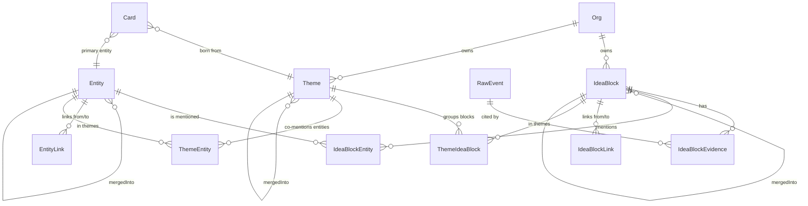

# Data Model

> Модель **по решению** (доку про финальное решение). Финальные миграции и Prisma/SQL-схема будут после ТЗ.

## Сущности первой версии

### User (хост)

```json
{
  "id": "user_abc",
  "external_id": "crossmark_user_42",
  "email": "ivan@firma.ru",
  "name": "Иван Петров",
  "created_at": "2026-05-06T10:00:00Z",
  "last_seen_at": "2026-05-06T15:30:00Z"
}
```

Уникальный индекс на `external_id`. Создаётся при первом вызове API создания встречи от Crossmark — `email` и `name` обновляются при каждом следующем вызове, если изменились (см. [[../01_projects/crossmark-integration]] § Создание пользователей-хостов).

### Meeting

```json
{
  "id": "01HMZP9X2J5K8R3T4Q7Y6N0F",
  "title": "Созвон с клиентом",
  "type": "sales",
  "custom_prompt": null,
  "owner_id": "user_abc",
  "card_id": "ckxxxxxxxxxxxx",
  "room_name": "01HMZP9X2J5K8R3T4Q7Y6N0F",
  "status": "scheduled",
  "started_at": null,
  "ended_at": null,
  "created_at": "2026-05-06T12:00:00Z"
}
```

**Поле `id`** — длинный неугадываемый идентификатор (ULID или UUIDv4). Используется и как внутренний ключ, и как публичный идентификатор в URL `meet.crossmark.ru/m/<id>`.

**Поле `custom_prompt`** — необязательный текст. Если заполнен — AI на этапе анализа использует его вместо стандартного шаблона по `type`. Тип всё равно фиксируется (для статистики и группировки), но содержание отчёта подбирается по своему промпту. См. [[../01_projects/ai-analysis-by-type]] § Кастомный промпт.

**Отдельного `guest_link` нет.** Одна ссылка на встречу = `meet.crossmark.ru/m/<id>` — её и хост, и все гости открывают одинаково (как в Zoom / Google Meet / Яндекс Телемост). Хост узнаётся по cookie (поставленному при первом входе через deep-link из Crossmark); гость без cookie видит форму «Введите имя».

**Поле `type`** — один из 9 типов (см. [[../01_projects/meeting-types]]). От него зависит шаблон AI-анализа.

**Поле `card_id`** — опциональная привязка к CRM-карточке (см. [[../01_projects/cards]]). `onDelete: SetNull` — при удалении карточки встреча сохраняется, привязка обнуляется. Один `card_id` (one-to-many от Card к Meeting). Несколько карточек на встречу — vNext.

### Card (CRM)

```json
{
  "id": "ckxxxxxxxxxxxx",
  "owner_id": "user_abc",
  "name": "Иван Петров",
  "kind": "client",
  "color": "#5EEAD4",
  "contact_name": "Иван Петров",
  "contact_email": "ivan@example.ru",
  "contact_phone": "+7...",
  "pinned": false,
  "summary_cache": "...AI rollup markdown...",
  "summary_updated_at": "2026-05-09T15:00:00Z",
  "meeting_count": 7,
  "last_meeting_at": "2026-05-09T14:00:00Z"
}
```

`kind` — `client | deal | project | topic | custom`. Хранится строкой (а не enum'ом), чтобы можно было дополнять без миграций.

`summary_cache` — кэш AI rollup-сводки по последним 20 встречам карточки. Обновляется воркером `ai.card-rollup` через дебаунс 5 сек. См. [[../01_projects/cards]] §AI-pipeline.

Один primary-контакт полями (`contact_name/email/phone`). Несколько контактов — vNext.

Soft-delete с 30-дневным grace, retention-cron делает hard-delete. Уникальный индекс `[owner_id, name]` — пользователь не может иметь две карточки с одинаковым именем.

### Participant

```json
{
  "id": "participant_123",
  "meeting_id": "meeting_123",
  "name": "Иван",
  "role": "guest",
  "is_registered_user": false,
  "joined_at": null,
  "left_at": null
}
```

**`role`:** `host` | `guest`. Гость = `is_registered_user: false`, имя вводит на странице входа.

### Recording

```json
{
  "id": "recording_123",
  "meeting_id": "meeting_123",
  "main_video_url": "...",
  "audio_tracks": [
    {
      "participant_id": "participant_1",
      "participant_name": "Сергей",
      "audio_url": "..."
    }
  ],
  "status": "ready",
  "retention_days": 30,
  "expires_at": "2026-06-04T12:00:00Z",
  "archived_at": null,
  "deleted_at": null
}
```

**Критично:** `audio_tracks[]` — массив отдельных аудиодорожек на каждого участника. Без них AI-анализ теряет в качестве (общий микс плохо разделяется по спикерам).

**Retention:** `expires_at = meeting.ended_at + retention_days` — снимок тарифа на момент создания. Cron-job обрабатывает истёкшие записи (см. [[../01_projects/recording]] § Retention и `plans/analysis/2026-05-06-recording-retention.md`).

### Recording Actions (новая таблица)

```
recording_actions(
  id,
  recording_id,
  action,        -- 'created' | 'extended' | 'archived' | 'deleted' | 'exported'
  actor,         -- 'user:<id>' | 'cron' | 'admin:<id>'
  reason,        -- свободный текст ('user_request', 'tariff_expired', 'gdpr_request')
  created_at
)
```

Журнал всех действий с записью — для compliance (GDPR-запросы, audit) и для UX «история этой записи».

### AI Result

```json
{
  "meeting_id": "meeting_123",
  "meeting_type": "sales",
  "summary": "...",                    // 2-3 предложения — всегда
  "structured_data": {                  // если использовался шаблон типа
    "pain": "...",
    "budget": "...",
    "decision_maker": "...",
    "objections": [...],
    "next_step": "..."
  },
  "custom_output_md": null,             // или markdown-текст, если использовался custom_prompt
  "follow_up_email": "...",             // для применимых типов
  "tasks": [...]                        // для применимых типов
}
```

**Логика заполнения:**
- Если у `Meeting.custom_prompt` стояло значение → AI применяет этот промпт → результат пишется в `custom_output_md` (markdown-текст), `structured_data` остаётся `null`.
- Если `custom_prompt` был `null` → AI применяет шаблон по `meeting_type` (см. [[../01_projects/ai-analysis-by-type]]) → результат пишется в `structured_data` (JSON-объект полей по типу), `custom_output_md` остаётся `null`.
- `summary` (2-3 предложения, краткое содержание) генерится **всегда** независимо от режима.

## Статусы встречи (FSM)

```
scheduled
  ↓
active
  ↓
completed
  ↓
recording_processing → recording_ready
  ↓
transcription_processing
  ↓
ai_processing → ai_ready
```

Параллельная ветка: `failed` (с любого этапа, с указанием причины).

## Таблицы для аудио-дорожек

Каждый трек хранит:
```
participant_id
participant_name
track_id
audio_file_url
started_at
ended_at
```

Хранится либо как JSON-поле в `Recording.audio_tracks`, либо отдельной таблицей `audio_track`. Решение — на этапе ТЗ; для масштаба и индексации лучше отдельной таблицей.

## Org / Membership / OrgInvitation / LlmModelPrice (Фаза 0 knowledge-core, 2026-05-10)

Подробнее: [[../01_projects/orgs-and-rbac|orgs-and-rbac]] и [[../01_projects/llm-router|llm-router]].

### Org

```
Org {
  id, name, slug @unique, ownerId (FK User),
  visibilityMode: open|strict (default open),
  tier: basic|pro|enterprise (placeholder для Фазы 12),
  createdAt, deletedAt?
  @@index([ownerId]), @@index([deletedAt])
}
```

### Membership

```
Membership {
  orgId, userId, role: owner|admin|manager,
  invitedBy?, joinedAt
  @@unique([orgId, userId])
  @@index([userId]), @@index([orgId, role])
}
```

### OrgInvitation

```
OrgInvitation {
  orgId, email, role,
  token UNIQUE (nanoid 40),
  status: pending|accepted|revoked|expired,
  invitedBy, expiresAt (TTL 7д), acceptedAt?, acceptedByUserId?
  @@index([orgId, status]), @@index([email, status]), @@index([expiresAt])
}
```

### LlmModelPrice (версионируемая прайс-карта)

```
LlmModelPrice {
  id, provider, model,
  inputCostPerMillionTokens, outputCostPerMillionTokens,
  cachedCostPerMillionTokens (default 0),
  currency (default USD),
  effectiveFrom (default now), effectiveTo?
  @@index([provider, model, effectiveFrom])
  @@index([effectiveFrom, effectiveTo])
}
```

### Расширения существующих моделей

**`User.isSuperAdmin: Boolean (default false)`** — флаг владельца Z-Admin (Фаза 7). Bypass RBAC.

**`tenantId String?`** добавлен во все tenant-scoped модели + `@@index([tenantId])`:
- `Meeting`, `Card`, `Task`, `MeetingChapter`, `MeetingHighlight`, `MeetingChatMessage`, `Tag`
- `WebhookSubscription`, `IntegrationDestination`, `Export`, `ApiKey`
- `LlmTaskRoute` (NULL = глобальный дефолт), `AuditLog`, `AiUsageLog`

На Фазе 0 — nullable. После backfill в проде — отдельный push сделает NOT NULL для основных моделей. Скрипт: [backfill-orgs-fase0.ts](../../backend/scripts/backfill-orgs-fase0.ts).

**`AiUsageLog`** дополнительно:
- `cachedTokens Int @default(0)` — кэшированные input-токены (prompt cache hit).
- `sourceRef Json?` — `{ type, id }` для drill-down в Z-Admin.
- `experimentGroup String?` — `'A'|'B'` для A/B-экспериментов LlmTaskRoute.

**`LlmTaskRoute`** дополнительно:
- `tenantId String?` — NULL = глобальный, не-NULL = override на Org.
- `experiment Json?` — конфигурация A/B (Фаза 7).
- Изменён unique: `@@unique([taskType, tenantId])` (было `taskType` UNIQUE).

## knowledge-core: Source / RawEvent (Фаза 1, 2026-05-10)

### Source

```
Source {
  id, tenantId, type: SourceType (meeting|chat|phone_call|bot|email|web_form|external),
  name, config Json?, dataClass: DataClass (public|internal|sensitive|private),
  isActive Boolean (default true), createdAt, updatedAt
  @@unique([tenantId, type, name])
  @@index([tenantId, isActive])
}
```

Дефолтный `Source(type=meeting, name='Встречи Z')` создаётся **автоматически
при создании Org** (см. `OrgsService.createForOwner`). Backfill для
существующих Org: [backfill-meeting-sources-fase1.ts](../../backend/scripts/backfill-meeting-sources-fase1.ts). Управление другими источниками
(telegram/email/...) из UI — Фаза 10.

### RawEvent

```
RawEvent {
  id, tenantId, sourceId, sourceType,
  sourceExternalId? (если null — дедуп по checksum),
  idempotencyKey UNIQUE (sha256(sourceId + ':' + (sourceExternalId ?? checksum) + ':' + occurredAtIso)),
  occurredAt, receivedAt (default now),
  payloadStorage: RawEventPayloadStorage (inline|s3),
  payload Json? (null если payloadStorage=s3),
  payloadS3Key? (не null если payloadStorage=s3),
  payloadChecksum (sha256 от payloadJson, всегда),
  payloadSizeBytes,
  dataClass,
  processingStatus: RawEventProcessingStatus (received|ingested|failed),
  processingError? @db.Text,
  processedAt? (выставляется консумером Фазы 2)
  @@index([tenantId, sourceId, occurredAt])
  @@index([tenantId, processingStatus])
}
```

Иммутабельная запись — главный entry-point в knowledge-core. Inline-payload
до 10 MiB; больше — уезжает в S3 по ключу `raw-events/<tenantId>/<idempotencyKey>.json`.
Идемпотентность — по уникальному `idempotencyKey`.

После создания публикуется job в `core.raw-events` (BullMQ). Consumer
(`block-ingest.worker`) — Фаза 2.

### MeetingTranscriptChunk — @deprecated

Помечена `/// @deprecated knowledge-core Фаза 1: будет заменён `IdeaBlock`
в Фазе 2, удалён в Фазе 6 после `chat-v2`. Не использовать в новом коде.

Сохраняется работающей до Фазы 6 — chat-модуль (per-meeting + cross-meeting RAG)
ещё на ней работает; `transcript-index.worker` продолжает индексировать новые
встречи параллельно с ingest-pipeline.

## Knowledge-core (Фаза 2): IdeaBlock + Entity

Подробно — [[knowledge-core|knowledge-core.md]]. Здесь — сжатые модели и
ER-связи.

### IdeaBlock

```
IdeaBlock {
  id, tenantId, name, criticalQuestion, trustedAnswer,
  tags[], signalType (enum: fact / pain / feature_request / objection /
                      churn_risk / idea / risk / commitment / decision /
                      mood / drift / competitor_move / metric_change /
                      knowledge_gap),
  confidence Decimal(4,3), dataClass,
  embedding vector(1536),                -- text-embedding-3-small
  status (draft | canonical | merged_into | archived),
  mergedIntoId? → IdeaBlock,
  evidenceCount, dynamicScore Decimal(8,4),
  createdAt, updatedAt,
  search_tsv tsvector                    -- generated column (postgres-init.sql)
  @@index([tenantId, status])
  @@index([tenantId, signalType])
  @@index([tenantId, mergedIntoId])
}
```

HNSW индекс на `embedding` через `vector_cosine_ops` + GIN на `search_tsv`.

### IdeaBlockEvidence

```
IdeaBlockEvidence { id, blockId → IdeaBlock, rawEventId → RawEvent,
                    sourceType, sourceTimestamp?, quote @Text,
                    startMs?, endMs?, createdAt }
```

N:1 к IdeaBlock — один блок может агрегировать множество свидетельств.
При merge блока всё его evidence переносится на canonical через
`updateMany`.

### Entity

```
Entity { id, tenantId, type (client | person | project | product |
                              topic | location | custom),
         canonicalName, aliases[],
         embedding vector(1536),
         mergedIntoId? → Entity,
         mentionsCount, metadata Json?,
         createdAt, updatedAt
  @@index([tenantId, type])
  @@index([tenantId, canonicalName])
}
```

HNSW на `embedding` (cosine). `entity-resolver` ищет дубли cron'ом и
on-event.

### IdeaBlockEntity (M:M)

```
IdeaBlockEntity {
  blockId, entityId,
  mentionContext @Text,
  role (subject | object | mentioned),
  createdAt
  @@id([blockId, entityId])
}
```

Composite PK даёт идемпотентность — повторное создание для той же пары
блок↔сущность ловится через `Prisma.PrismaClientKnownRequestError P2002`.

## Knowledge-core (Фаза 3): IdeaBlockLink + EntityLink

Граф знаний поверх IdeaBlock и Entity — типизированные связи. Подробно —
[[knowledge-core|knowledge-core.md]] раздел «Граф (Фаза 3)».

### IdeaBlockLink

```
IdeaBlockLink {
  id                cuid
  tenantId          → Org
  fromBlockId       → IdeaBlock
  toBlockId         → IdeaBlock
  relationType      enum (develops | contradicts | causes | consequences_of |
                          shares_topic | shares_entity | question_answered_by)
  confidence        Decimal(4,3)
  explanation       String @Text
  createdBy         enum (linker | reframing | manual)
  status            enum (active | archived)  @default(active)
  createdAt, updatedAt
  @@unique(fromBlockId, toBlockId, relationType)
  @@index(tenantId, status)
  @@index(fromBlockId, status)
  @@index(toBlockId, status)
}
```

Источник создания — `block-linker.worker` (KNN top-10 + LLM-арбитр) или
`reframing.cron` (ночная рефлексия, может архивировать слабые связи).
Дедупликация через unique-индекс на тройку (from, to, relationType) — повторный
проход линкера обновляет `confidence` и `explanation` через upsert.

### EntityLink

```
EntityLink {
  id                cuid
  tenantId          → Org
  fromEntityId      → Entity
  toEntityId        → Entity
  relationType      enum (works_at | belongs_to | part_of | opposes |
                          depends_on | mentions_with)
  confidence        Decimal(4,3)
  explanation       String @Text
  createdBy         enum (linker | reframing | manual)
  status            enum (active | archived)  @default(active)
  createdAt, updatedAt
  @@unique(fromEntityId, toEntityId, relationType)
  @@index(tenantId, status)
  @@index(fromEntityId, status)
  @@index(toEntityId, status)
}
```

Создаётся `entity-graph-builder.cron` (раз в час, ищет co-mentioned пары
сущностей в одних блоках, минимум `ENTITY_GRAPH_MIN_COMENTIONS=3` упоминаний).

## Knowledge-core (Фаза 4): Theme + Card расширение

### Theme

```
Theme {
  id, tenantId, name, description @Text,
  weight Decimal(4,3) default 0.500,
  dynamic (growing | stable | declining) default 'stable',
  confidence Decimal(4,3) default 0.500,
  status (active | archived | merged_into),
  mergedIntoId? → Theme,
  branch? (strategy | clients | sales | marketing | product | operations |
           team | finance | technology | production | partnerships | legal),
  embedding vector(1536),
  lastSignalAt?, createdAt, updatedAt,

  @@index(tenantId, status)
  @@index(tenantId, branch)
  @@index(tenantId, mergedIntoId)
}
```

AI-кластер canonical IdeaBlock'ов. Создаётся `theme-clusterer.cron` (раз в час
в :15, KNN-greedy на embedding'ах с порогом `THEME_COSINE_THRESHOLD=0.78`,
минимум `THEME_CLUSTER_MIN_SIZE=3` блоков, гейт по Org `THEME_CLUSTERING_MIN_BLOCKS=100`).

Описание/имя/ветка генерируются LLM `theme-classify` (JSON Schema strict).
Embedding темы — `text-embedding-3-small` от `name + ' ' + description`.

### ThemeIdeaBlock (M:M)

```
ThemeIdeaBlock {
  themeId, blockId, weight Decimal(4,3) default 1.000, createdAt
  @@id(themeId, blockId)
  @@index(blockId)
}
```

### ThemeEntity (denormalized)

```
ThemeEntity {
  themeId, entityId, mentionsCount Int default 0, createdAt
  @@id(themeId, entityId)
  @@index(entityId)
}
```

Поддерживается `theme-clusterer` (создание) и `reframing.reflectOnThemes`
(перенос при `themeMerges`).

### Card расширение (Фаза 4)

```
Card {
  ...
  entityId          String?  → Entity     // primary-сущность
  relatedEntityIds  String[] @default([]) // дополнительные сущности
  bornFromThemeId   String?  → Theme      // если создана из темы
  cachedTopThemeIds String[] @default([]) // кэш топ-3 связанных тем
  ...
  @@index(entityId)
  @@index(bornFromThemeId)
}
```

Заполнение:
- `entityId` / `relatedEntityIds` — пользователь редактирует через UI
  карточки (Фаза 5/6 — frontend).
- `bornFromThemeId` — выставляет endpoint `POST /knowledge/themes/:id/save-as-card`.
- `cachedTopThemeIds` — `card-rollup-v2.worker` пересчитывает на каждом тике.

### ER (knowledge-core)



[[../index|← index]]
