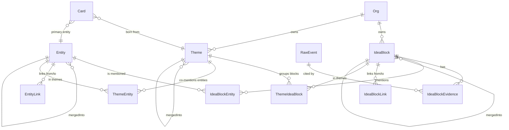

# Data Model

> Модель **по решению** (доку про финальное решение). Финальные миграции и Prisma/SQL-схема будут после ТЗ.

## Сущности первой версии

### User (хост)

```json
{
  "id": "user_abc",
  "external_id": "crossmark_user_42",
  "email": "ivan@firma.ru",
  "name": "Иван Петров",
  "created_at": "2026-05-06T10:00:00Z",
  "last_seen_at": "2026-05-06T15:30:00Z"
}
```

Уникальный индекс на `external_id`. Создаётся при первом вызове API создания встречи от Crossmark — `email` и `name` обновляются при каждом следующем вызове, если изменились (см. [[../01_projects/crossmark-integration]] § Создание пользователей-хостов).

### Meeting

```json
{
  "id": "01HMZP9X2J5K8R3T4Q7Y6N0F",
  "title": "Созвон с клиентом",
  "type": "sales",
  "custom_prompt": null,
  "owner_id": "user_abc",
  "card_id": "ckxxxxxxxxxxxx",
  "room_name": "01HMZP9X2J5K8R3T4Q7Y6N0F",
  "status": "scheduled",
  "started_at": null,
  "ended_at": null,
  "created_at": "2026-05-06T12:00:00Z"
}
```

**Поле `id`** — длинный неугадываемый идентификатор (ULID или UUIDv4). Используется и как внутренний ключ, и как публичный идентификатор в URL `meet.crossmark.ru/m/<id>`.

**Поле `custom_prompt`** — необязательный текст. Если заполнен — AI на этапе анализа использует его вместо стандартного шаблона по `type`. Тип всё равно фиксируется (для статистики и группировки), но содержание отчёта подбирается по своему промпту. См. [[../01_projects/ai-analysis-by-type]] § Кастомный промпт.

**Отдельного `guest_link` нет.** Одна ссылка на встречу = `meet.crossmark.ru/m/<id>` — её и хост, и все гости открывают одинаково (как в Zoom / Google Meet / Яндекс Телемост). Хост узнаётся по cookie (поставленному при первом входе через deep-link из Crossmark); гость без cookie видит форму «Введите имя».

**Поле `type`** — один из 9 типов (см. [[../01_projects/meeting-types]]). От него зависит шаблон AI-анализа.

**Поле `card_id`** — опциональная привязка к CRM-карточке (см. [[../01_projects/cards]]). `onDelete: SetNull` — при удалении карточки встреча сохраняется, привязка обнуляется. Один `card_id` (one-to-many от Card к Meeting). Несколько карточек на встречу — vNext.

### Card (CRM)

```json
{
  "id": "ckxxxxxxxxxxxx",
  "owner_id": "user_abc",
  "name": "Иван Петров",
  "kind": "client",
  "color": "#5EEAD4",
  "contact_name": "Иван Петров",
  "contact_email": "ivan@example.ru",
  "contact_phone": "+7...",
  "pinned": false,
  "summary_cache": "...AI rollup markdown...",
  "summary_updated_at": "2026-05-09T15:00:00Z",
  "meeting_count": 7,
  "last_meeting_at": "2026-05-09T14:00:00Z"
}
```

`kind` — `client | deal | project | topic | custom`. Хранится строкой (а не enum'ом), чтобы можно было дополнять без миграций.

`summary_cache` — кэш AI rollup-сводки по последним 20 встречам карточки. Обновляется воркером `ai.card-rollup` через дебаунс 5 сек. См. [[../01_projects/cards]] §AI-pipeline.

Один primary-контакт полями (`contact_name/email/phone`). Несколько контактов — vNext.

Soft-delete с 30-дневным grace, retention-cron делает hard-delete. Уникальный индекс `[owner_id, name]` — пользователь не может иметь две карточки с одинаковым именем.

### Participant

```json
{
  "id": "participant_123",
  "meeting_id": "meeting_123",
  "name": "Иван",
  "role": "guest",
  "is_registered_user": false,
  "joined_at": null,
  "left_at": null
}
```

**`role`:** `host` | `guest`. Гость = `is_registered_user: false`, имя вводит на странице входа.

### Recording

```json
{
  "id": "recording_123",
  "meeting_id": "meeting_123",
  "main_video_url": "...",
  "audio_tracks": [
    {
      "participant_id": "participant_1",
      "participant_name": "Сергей",
      "audio_url": "..."
    }
  ],
  "status": "ready",
  "retention_days": 30,
  "expires_at": "2026-06-04T12:00:00Z",
  "archived_at": null,
  "deleted_at": null
}
```

**Критично:** `audio_tracks[]` — массив отдельных аудиодорожек на каждого участника. Без них AI-анализ теряет в качестве (общий микс плохо разделяется по спикерам).

**Retention:** `expires_at = meeting.ended_at + retention_days` — снимок тарифа на момент создания. Cron-job обрабатывает истёкшие записи (см. [[../01_projects/recording]] § Retention и `plans/analysis/2026-05-06-recording-retention.md`).

### Recording Actions (новая таблица)

```
recording_actions(
  id,
  recording_id,
  action,        -- 'created' | 'extended' | 'archived' | 'deleted' | 'exported'
  actor,         -- 'user:<id>' | 'cron' | 'admin:<id>'
  reason,        -- свободный текст ('user_request', 'tariff_expired', 'gdpr_request')
  created_at
)
```

Журнал всех действий с записью — для compliance (GDPR-запросы, audit) и для UX «история этой записи».

### AI Result

```json
{
  "meeting_id": "meeting_123",
  "meeting_type": "sales",
  "summary": "...",                    // 2-3 предложения — всегда
  "structured_data": {                  // если использовался шаблон типа
    "pain": "...",
    "budget": "...",
    "decision_maker": "...",
    "objections": [...],
    "next_step": "..."
  },
  "custom_output_md": null,             // или markdown-текст, если использовался custom_prompt
  "follow_up_email": "...",             // для применимых типов
  "tasks": [...]                        // для применимых типов
}
```

**Логика заполнения:**
- Если у `Meeting.custom_prompt` стояло значение → AI применяет этот промпт → результат пишется в `custom_output_md` (markdown-текст), `structured_data` остаётся `null`.
- Если `custom_prompt` был `null` → AI применяет шаблон по `meeting_type` (см. [[../01_projects/ai-analysis-by-type]]) → результат пишется в `structured_data` (JSON-объект полей по типу), `custom_output_md` остаётся `null`.
- `summary` (2-3 предложения, краткое содержание) генерится **всегда** независимо от режима.

## Статусы встречи (FSM)

```
scheduled
  ↓
active
  ↓
completed
  ↓
recording_processing → recording_ready
  ↓
transcription_processing
  ↓
ai_processing → ai_ready
```

Параллельная ветка: `failed` (с любого этапа, с указанием причины).

## Таблицы для аудио-дорожек

Каждый трек хранит:
```
participant_id
participant_name
track_id
audio_file_url
started_at
ended_at
```

Хранится либо как JSON-поле в `Recording.audio_tracks`, либо отдельной таблицей `audio_track`. Решение — на этапе ТЗ; для масштаба и индексации лучше отдельной таблицей.

## Org / Membership / OrgInvitation / LlmModelPrice (Фаза 0 knowledge-core, 2026-05-10)

Подробнее: [[../01_projects/orgs-and-rbac|orgs-and-rbac]] и [[../01_projects/llm-router|llm-router]].

### Org

```
Org {
  id, name, slug @unique, ownerId (FK User),
  visibilityMode: open|strict (default open),
  tier: basic|pro|enterprise (placeholder для Фазы 12),
  createdAt, deletedAt?
  @@index([ownerId]), @@index([deletedAt])
}
```

### Membership

```
Membership {
  orgId, userId, role: owner|admin|manager,
  invitedBy?, joinedAt
  @@unique([orgId, userId])
  @@index([userId]), @@index([orgId, role])
}
```

### OrgInvitation

```
OrgInvitation {
  orgId, email, role,
  token UNIQUE (nanoid 40),
  status: pending|accepted|revoked|expired,
  invitedBy, expiresAt (TTL 7д), acceptedAt?, acceptedByUserId?
  @@index([orgId, status]), @@index([email, status]), @@index([expiresAt])
}
```

### LlmModelPrice (версионируемая прайс-карта)

```
LlmModelPrice {
  id, provider, model,
  inputCostPerMillionTokens, outputCostPerMillionTokens,
  cachedCostPerMillionTokens (default 0),
  currency (default USD),
  effectiveFrom (default now), effectiveTo?
  @@index([provider, model, effectiveFrom])
  @@index([effectiveFrom, effectiveTo])
}
```

### Расширения существующих моделей

**`User.isSuperAdmin: Boolean (default false)`** — флаг владельца Z-Admin (Фаза 7). Bypass RBAC.

**`tenantId String?`** добавлен во все tenant-scoped модели + `@@index([tenantId])`:
- `Meeting`, `Card`, `Task`, `MeetingChapter`, `MeetingHighlight`, `MeetingChatMessage`, `Tag`
- `WebhookSubscription`, `IntegrationDestination`, `Export`, `ApiKey`
- `LlmTaskRoute` (NULL = глобальный дефолт), `AuditLog`, `AiUsageLog`

На Фазе 0 — nullable. После backfill в проде — отдельный push сделает NOT NULL для основных моделей. Скрипт: [backfill-orgs-fase0.ts](../../backend/scripts/backfill-orgs-fase0.ts).

**`AiUsageLog`** дополнительно:
- `cachedTokens Int @default(0)` — кэшированные input-токены (prompt cache hit).
- `sourceRef Json?` — `{ type, id }` для drill-down в Z-Admin.
- `experimentGroup String?` — `'A'|'B'` для A/B-экспериментов LlmTaskRoute.

**`LlmTaskRoute`** дополнительно:
- `tenantId String?` — NULL = глобальный, не-NULL = override на Org.
- `experiment Json?` — конфигурация A/B (Фаза 7).
- Изменён unique: `@@unique([taskType, tenantId])` (было `taskType` UNIQUE).

## knowledge-core: Source / RawEvent (Фаза 1, 2026-05-10)

### Source

```
Source {
  id, tenantId, type: SourceType (meeting|chat|phone_call|bot|email|web_form|external),
  name, config Json?, dataClass: DataClass (public|internal|sensitive|private),
  isActive Boolean (default true), createdAt, updatedAt
  @@unique([tenantId, type, name])
  @@index([tenantId, isActive])
}
```

Дефолтный `Source(type=meeting, name='Встречи Z')` создаётся **автоматически
при создании Org** (см. `OrgsService.createForOwner`). Backfill для
существующих Org: [backfill-meeting-sources-fase1.ts](../../backend/scripts/backfill-meeting-sources-fase1.ts). Управление другими источниками
(telegram/email/...) из UI — Фаза 10.

### RawEvent

```
RawEvent {
  id, tenantId, sourceId, sourceType,
  sourceExternalId? (если null — дедуп по checksum),
  idempotencyKey UNIQUE (sha256(sourceId + ':' + (sourceExternalId ?? checksum) + ':' + occurredAtIso)),
  occurredAt, receivedAt (default now),
  payloadStorage: RawEventPayloadStorage (inline|s3),
  payload Json? (null если payloadStorage=s3),
  payloadS3Key? (не null если payloadStorage=s3),
  payloadChecksum (sha256 от payloadJson, всегда),
  payloadSizeBytes,
  dataClass,
  processingStatus: RawEventProcessingStatus (received|ingested|failed),
  processingError? @db.Text,
  processedAt? (выставляется консумером Фазы 2)
  @@index([tenantId, sourceId, occurredAt])
  @@index([tenantId, processingStatus])
}
```

Иммутабельная запись — главный entry-point в knowledge-core. Inline-payload
до 10 MiB; больше — уезжает в S3 по ключу `raw-events/<tenantId>/<idempotencyKey>.json`.
Идемпотентность — по уникальному `idempotencyKey`.

После создания публикуется job в `core.raw-events` (BullMQ). Consumer
(`block-ingest.worker`) — Фаза 2.

### MeetingTranscriptChunk — @deprecated

Помечена `/// @deprecated knowledge-core Фаза 1: будет заменён `IdeaBlock`
в Фазе 2, удалён в Фазе 6 после `chat-v2`. Не использовать в новом коде.

Сохраняется работающей до Фазы 6 — chat-модуль (per-meeting + cross-meeting RAG)
ещё на ней работает; `transcript-index.worker` продолжает индексировать новые
встречи параллельно с ingest-pipeline.

## Knowledge-core (Фаза 2): IdeaBlock + Entity

Подробно — [[knowledge-core|knowledge-core.md]]. Здесь — сжатые модели и
ER-связи.

### IdeaBlock

```
IdeaBlock {
  id, tenantId, name, criticalQuestion, trustedAnswer,
  tags[], signalType (enum: fact / pain / feature_request / objection /
                      churn_risk / idea / risk / commitment / decision /
                      mood / drift / competitor_move / metric_change /
                      knowledge_gap),
  confidence Decimal(4,3), dataClass,
  embedding vector(1536),                -- text-embedding-3-small
  status (draft | canonical | merged_into | archived),
  mergedIntoId? → IdeaBlock,
  evidenceCount, dynamicScore Decimal(8,4),
  createdAt, updatedAt,
  search_tsv tsvector                    -- generated column (postgres-init.sql)
  @@index([tenantId, status])
  @@index([tenantId, signalType])
  @@index([tenantId, mergedIntoId])
}
```

HNSW индекс на `embedding` через `vector_cosine_ops` + GIN на `search_tsv`.

### IdeaBlockEvidence

```
IdeaBlockEvidence { id, blockId → IdeaBlock, rawEventId → RawEvent,
                    sourceType, sourceTimestamp?, quote @Text,
                    startMs?, endMs?, createdAt }
```

N:1 к IdeaBlock — один блок может агрегировать множество свидетельств.
При merge блока всё его evidence переносится на canonical через
`updateMany`.

### Entity

```
Entity { id, tenantId, type (client | person | project | product |
                              topic | location | custom),
         canonicalName, aliases[],
         embedding vector(1536),
         mergedIntoId? → Entity,
         mentionsCount, metadata Json?,
         createdAt, updatedAt
  @@index([tenantId, type])
  @@index([tenantId, canonicalName])
}
```

HNSW на `embedding` (cosine). `entity-resolver` ищет дубли cron'ом и
on-event.

### IdeaBlockEntity (M:M)

```
IdeaBlockEntity {
  blockId, entityId,
  mentionContext @Text,
  role (subject | object | mentioned),
  createdAt
  @@id([blockId, entityId])
}
```

Composite PK даёт идемпотентность — повторное создание для той же пары
блок↔сущность ловится через `Prisma.PrismaClientKnownRequestError P2002`.

## Knowledge-core (Фаза 3): IdeaBlockLink + EntityLink

Граф знаний поверх IdeaBlock и Entity — типизированные связи. Подробно —
[[knowledge-core|knowledge-core.md]] раздел «Граф (Фаза 3)».

### IdeaBlockLink

```
IdeaBlockLink {
  id                cuid
  tenantId          → Org
  fromBlockId       → IdeaBlock
  toBlockId         → IdeaBlock
  relationType      enum (develops | contradicts | causes | consequences_of |
                          shares_topic | shares_entity | question_answered_by)
  confidence        Decimal(4,3)
  explanation       String @Text
  createdBy         enum (linker | reframing | manual)
  status            enum (active | archived)  @default(active)
  createdAt, updatedAt
  @@unique(fromBlockId, toBlockId, relationType)
  @@index(tenantId, status)
  @@index(fromBlockId, status)
  @@index(toBlockId, status)
}
```

Источник создания — `block-linker.worker` (KNN top-10 + LLM-арбитр) или
`reframing.cron` (ночная рефлексия, может архивировать слабые связи).
Дедупликация через unique-индекс на тройку (from, to, relationType) — повторный
проход линкера обновляет `confidence` и `explanation` через upsert.

### EntityLink

```
EntityLink {
  id                cuid
  tenantId          → Org
  fromEntityId      → Entity
  toEntityId        → Entity
  relationType      enum (works_at | belongs_to | part_of | opposes |
                          depends_on | mentions_with)
  confidence        Decimal(4,3)
  explanation       String @Text
  createdBy         enum (linker | reframing | manual)
  status            enum (active | archived)  @default(active)
  createdAt, updatedAt
  @@unique(fromEntityId, toEntityId, relationType)
  @@index(tenantId, status)
  @@index(fromEntityId, status)
  @@index(toEntityId, status)
}
```

Создаётся `entity-graph-builder.cron` (раз в час, ищет co-mentioned пары
сущностей в одних блоках, минимум `ENTITY_GRAPH_MIN_COMENTIONS=3` упоминаний).

## Knowledge-core (Фаза 4): Theme + Card расширение

### Theme

```
Theme {
  id, tenantId, name, description @Text,
  weight Decimal(4,3) default 0.500,
  dynamic (growing | stable | declining) default 'stable',
  confidence Decimal(4,3) default 0.500,
  status (active | archived | merged_into),
  mergedIntoId? → Theme,
  branch? (strategy | clients | sales | marketing | product | operations |
           team | finance | technology | production | partnerships | legal),
  embedding vector(1536),
  lastSignalAt?, createdAt, updatedAt,

  @@index(tenantId, status)
  @@index(tenantId, branch)
  @@index(tenantId, mergedIntoId)
}
```

AI-кластер canonical IdeaBlock'ов. Создаётся `theme-clusterer.cron` (раз в час
в :15, KNN-greedy на embedding'ах с порогом `THEME_COSINE_THRESHOLD=0.78`,
минимум `THEME_CLUSTER_MIN_SIZE=3` блоков, гейт по Org `THEME_CLUSTERING_MIN_BLOCKS=100`).

Описание/имя/ветка генерируются LLM `theme-classify` (JSON Schema strict).
Embedding темы — `text-embedding-3-small` от `name + ' ' + description`.

### ThemeIdeaBlock (M:M)

```
ThemeIdeaBlock {
  themeId, blockId, weight Decimal(4,3) default 1.000, createdAt
  @@id(themeId, blockId)
  @@index(blockId)
}
```

### ThemeEntity (denormalized)

```
ThemeEntity {
  themeId, entityId, mentionsCount Int default 0, createdAt
  @@id(themeId, entityId)
  @@index(entityId)
}
```

Поддерживается `theme-clusterer` (создание) и `reframing.reflectOnThemes`
(перенос при `themeMerges`).

### Card расширение (Фаза 4)

```
Card {
  ...
  entityId          String?  → Entity     // primary-сущность
  relatedEntityIds  String[] @default([]) // дополнительные сущности
  bornFromThemeId   String?  → Theme      // если создана из темы
  cachedTopThemeIds String[] @default([]) // кэш топ-3 связанных тем
  ...
  @@index(entityId)
  @@index(bornFromThemeId)
}
```

Заполнение:
- `entityId` / `relatedEntityIds` — пользователь редактирует через UI
  карточки (Фаза 5/6 — frontend).
- `bornFromThemeId` — выставляет endpoint `POST /knowledge/themes/:id/save-as-card`.
- `cachedTopThemeIds` — `card-rollup-v2.worker` пересчитывает на каждом тике.

## Knowledge-core (Фаза 5): расширения Task / MeetingChapter / MeetingHighlight / AiResult / Meeting

Фаза 5 переписывает Tasks/Chapters/Summary поверх IdeaBlock'ов через `MeetingAnalyzeV2Worker` (`core.meeting-analyze-v2`, debounce 2 мин). Legacy `tasks-extract.worker` / `chapters.worker` НЕ удалены — V2 пишет в новые поля параллельно для A/B-сравнения.

**`Task` дополнительно:**
- `evidenceBlockIds: String[]` (default `[]`) — id IdeaBlock'ов, породивших задачу.
- `extractorVersion: String?` — `'v2'` если задача создана `meeting-analyze-v2.worker`'ом, NULL = legacy.
- `assigneeUserId: String?` — жёсткая связь с `User.id` (relation `assignee`, `onDelete: SetNull`). Заполняется AI-pipeline после ТЗ 2026-05-25 `hard-participant-identification`: `ParticipantContextService.loadForMeeting` отдаёт participants → промпт (`tasks-v2` / `tasks-structured`) → LLM возвращает `assigneeUserId` → `TaskAssigneeResolverService` валидирует против participants (галлюцинации режутся, ≥2 кандидатов → null + метрика `z_task_assignee_ambiguous_total`). `assigneeRaw` сохраняется ВСЕГДА — для UI fallback и гостей. Index `@@index([assigneeUserId])` — для фильтра «мои задачи».

**`MeetingChapter` дополнительно:**
- `evidenceBlockIds: String[]` (default `[]`) — id блоков главы.
- `extractorVersion: String?` — `'v2'` или NULL (legacy).

**`MeetingHighlight` дополнительно:**
- `evidenceBlockId: String?` — ссылка на породивший блок (для будущего highlights-v2-генератора). NULL для ручных и legacy.

**`AiResult` дополнительно:**
- `summaryV2: String?` — альтернативная сводка от `summary-extractor-v2.service.ts` (markdown поверх блоков).
- `summaryV2Model: String?` — `<provider>:<model>`.
- `summaryV2GeneratedAt: DateTime?`.
- `summary` (legacy) НЕ перезаписывается — UI остаётся на legacy до решения владельца про переключение.

**`Meeting` дополнительно (статус v2-агентов):**
- `analyzeV2Status: String?` — `null | 'queued' | 'processing' | 'ready' | 'partial' | 'failed'` (строкой, не enum'ом — проще расширять).
- `analyzeV2GeneratedAt: DateTime?`.
- `analyzeV2Error: String?` — текст ошибки (multi-line) на failed/partial.

ENV: `KNOWLEDGE_CORE_V2_AGENTS_ENABLED` (default `false`) — мастер-флаг включения cron'а v2-агентов. `MEETING_ANALYZE_V2_CRON='*/10 * * * *'`. `MEETING_ANALYZE_V2_DEBOUNCE_MS=120000`.

### ER (knowledge-core)



## Дельта Фаз 7–12 (закрыты 2026-05-10)

### Phase 7 — Admin

- **`User.isSuperAdmin: Boolean @default(false)`** — глобальная роль super_admin (вне Membership). Назначается только UPDATE в БД.
- **`Org.workersEnabled: Json @default("{}")`** — карта тумблеров воркеров. `{}` = все включены. Структура `{[workerName]: false}`. Воркеры читают через `WorkerOrgGate.checkOrThrow`.
- **`SuperAdminAccessLog`** — новая таблица: `id, superAdminUserId, accessedTenantId?, route, method, params jsonb, createdAt`. Пишется `SuperAdminAuditInterceptor` для каждого запроса под `SuperAdminGuard`.
- **`IdeaBlockLink.deletedAt/deletedBy`** + `@@index([tenantId, deletedAt])` — soft-delete из Org-Admin.
- **`EntityLink.deletedAt/deletedBy`** + index — то же.
- **`AiUsageLog.requestPreview/responsePreview: Text?`** — обрезанные до 8 KB UTF-8 промпт/ответ для drill-down в Z-Admin. Пишется `LlmRouter` после каждого вызова.

### Phase 9 — Goals

- **`Goal`** — цель Org. Поля: `tenantId, name, description (Text), targetDate?, status (GoalStatus), weight (Decimal(4,3)), createdById, archivedAt?, cachedAlignment? (Int 0..100), cachedAlignmentAt?, cachedAlignmentDelta?, cachedSnapshotId?`. Индексы `(tenantId, status)`, `(tenantId, archivedAt)`.
- **`GoalTheme`** — M:M Goal↔Theme. `source: GoalThemeSource (manual|ai)`, `weight Decimal`. PK `(goalId, themeId)`.
- **`GoalAlignmentSnapshot`** — иммутабельный снапшот. `score (Int 0..100), delta? (Int), explanation (Text), signals jsonb, windowDays, themesCount, blocksCount, aiUsageLogId?, alertPending Boolean`. Индексы `(goalId, createdAt)`, `(tenantId, alertPending)`.
- Enum'ы: **`GoalStatus { active, paused, achieved, abandoned }`**, **`GoalThemeSource { manual, ai }`**.
- **`Org.strategicAlignmentWindowDays: Int @default(30)`** — окно расчёта (мин 7, макс 90).

### Phase 10 — Adapters

- **`ApiKey.scope: String @default("api")`** — расширение под `'ingest'`. Префикс `zik_*`. Используется per-Org для внешних webhook'ов.

### Phase 11 — Retention + 152-ФЗ

- **`OrgRetentionPolicy`** — per-Org политика. `tenantId @unique, rawEventDays (default 2555 = 7 лет), archivedBlockDays (365), chatMessageDays (90), auditLogDays (730), archivedBlockAction (default 'archive_then_delete'), lastSweepAt?`.
- **`LlmTaskRoute.requiredDataClass: DataClass?`** — минимальный класс данных, который маршрут поддерживает. `null` = `internal`.

### Phase 12 — Entitlements

- **`OrgEntitlement`** — `tenantId @unique, tier (String, default 'tier_pro' — намеренно строка, не enum), featureOverrides jsonb?, quotaOverrides jsonb?, notes (Text)?`.

## Фаза 0 — каркас компании (Z 2026-05-21)

### Группа А (с UI)
- `Department(id, tenantId, name, parentDepartmentId?, deletedAt?)` — иерархия в схеме, UI плоский.
- `Role(id, tenantId, name, departmentId?, tags[], deletedAt?)` — бизнес-должность.
- `Person(id, tenantId, userId?, name, email, primaryDepartmentId?, entityId?, deletedAt?)` — сотрудник ЛК.
- `PersonRole(id, tenantId, personId, roleId, validFrom, validTo?)` — M:M Person↔Role с временем.
- `JobDescription(id, tenantId, roleId, contentMd, sourceDocumentId?, version, deletedAt?)`.
- `Skill(id, tenantId, name, description?, deletedAt?)`.
- `Document(id, tenantId, uploaderId, kind, name, s3Key?, inlineContent?, parsedText?, status, attachedRoleId?, deletedAt?)`.
- `RoleProfile(id, tenantId, roleId UNIQUE, summaryCache Json, status, lastBuildAt?, buildVersion)`.

### Группа Б (без UI в Фазе 0)
- `Mission, Vision, Strategy` — Уровень 1.
- `Process, ProcessStep, Regulation, Policy` — Уровень 3. **SBA α-7** (2026-05-22) расширил эти модели in-place: `entityId @unique?`, `scope`, `ownerPersonId` (для Regulation/Policy), `currentVersionId → CardVersion`, `sourceBlockIds[]`, `personSubjectIds[]`, `dataClass`, `embedding Unsupported("vector(1536)")?`, `lastConfirmedAt`. Для `Regulation` дополнительно — `statement` (структурированное утверждение, альтернатива `contentMd` для дедупа/chat-v2), `supersedesId` (self-relation для версионирования). Для `Process` — `inputs`/`outputs`/`metricsJson` (JSON, не путать с моделью `Metric`). UI на `/regulations` (master-detail с фильтром `kind`).
- `Tool` — Уровень 4.
- `Metric` — Уровень 5.
- `Decision` — миграционный долг.

### Расширения existing
- `Goal.horizon GoalHorizon @default(quarterly)`, `Goal.parentGoalId?` (self-relation).
- `MeetingType` enum + `review`, `retrospective`.
- `IdeaBlock.roleRelevant Boolean`, `IdeaBlock.roleId?`.
- `EntityLink` полиморфизована: `fromType?`, `toType?`, `validFrom`, `validTo?`, `properties Json`. Composite unique включает fromType/toType. FK на Entity убраны.
- `EntityLinkType` enum +17 типов рёбер (см. `plans/tz/2026-05-21-phase-0a-data-model-and-graph-infra.md` §4.4).
- `Membership.personId?`, `OrgInvitation.personId?`, `User.persons[]`.

### Графовая инфраструктура
- Apache AGE 1.5.0 (PG16) — `infra/postgres/Dockerfile` (dev), Yandex Managed (prod).
- Граф `z_graph`.
- `GraphService` в `backend/src/common/graph/` — единая точка двойной записи Postgres EntityLink + AGE.
- Запрет прямого Cypher — см. [[code-pitfalls]].

## Tracker модуль (2026-05-24, Sprint 1)

Полное описание модуля и API: [[../01_projects/tracker]]. Модели Prisma (20 новых, в конце `backend/prisma/schema.prisma` после строки 6044).

### Project
- `id String @id @default(cuid())`, `tenantId String`, `slug String` (unique per tenant), `identifier String` (короткий префикс задач: PROJ, SALES — до 5 симв.), `name`, `description? @db.Text`, `ownerId`, `defaultAssigneeId?`, `defaultStateId?`, `network Int @default(0)` (0=Private, 2=Public-внутри-org), `archivedAt?`, `timezone @default("Europe/Moscow")`.
- Feature-flags: `cycleViewEnabled`, `intakeViewEnabled`, `gantViewEnabled @default(false)`, `timeTrackingEnabled @default(false)`.
- `teamTemplateId?` FK на TeamTemplate (создан из шаблона).
- `entityId?` для графа знаний.
- Soft-delete `deletedAt?`.

### ProjectMember (M2M)
- `projectId, userId, role Int` (20=Admin, 15=Member, 5=Guest), `joinedAt`.

### IssueState (статусы задач)
- `tenantId, projectId, name, color, category` (backlog/unstarted/started/completed/cancelled), `sequence Int`, `isDefault`.

### Cycle (недели работы)
- `tenantId, projectId, name, startDate, endDate, ownedById?, description?`.
- `progressSnapshot Json?` — агрегированный снимок (обновляется cron'ом).
- `version Int @default(1)`, `timezone`, `completedAt?`.
- **Sprints (2026-05-27)** — обратные relations: `linkedMeetings Meeting[]` (через `Meeting.linkedCycleId`, name="MeetingLinkedCycle"), `sprintHints SprintHint[]`. Индекс `(tenantId, completedAt)` — для cron'а активных циклов.

### SprintHint (Sprints, 2026-05-27)
- `tenantId, cycleId` (Cascade), `kind SprintHintKind` (10 значений: no_due_date / no_description / no_assignee / due_date_at_risk / recurring_carry_over / no_recent_mentions / conflicts_with_goal / can_be_split / similar_to_past_task / generic).
- `severity SprintHintSeverity` (info/warning/critical), `status SprintHintStatus @default(active)` (active/dismissed/resolved).
- `title VarChar(300), body @db.Text, affectedIssueIds String[], sourceBlockIds String[]`.
- `dismissedByUserId?, dismissedAt?`.
- `confidence Decimal(4,3)`, `contentHash VarChar(64)` (SHA-1 от title+body — для дедупа воркером).
- Индексы: `(tenantId, cycleId, status)`, `(tenantId, status, createdAt)`, `(cycleId, kind, contentHash)`.

### Project — Sprints scope-расширения (2026-05-27)
- 4 опциональных FK-поля на привязку спринта-проекта (взаимоисключающие):
  - `customerCardId String? → Card` (relation "ProjectCustomerCard");
  - `vendorId String? → Vendor` (relation "ProjectVendor");
  - `subjectPersonId String? → Person` (relation "ProjectSubjectPerson");
  - `departmentId String? → Department` (relation "ProjectDepartment").
- Инвариант: не более одного заполненного. Валидируется в `CreateProjectSchema.superRefine` и `ProjectsService.update`.
- Если все NULL — «Спринт компании».

### Meeting — Sprints (2026-05-27)
- `linkedCycleId String?` + relation `linkedCycle Cycle?` ("MeetingLinkedCycle", onDelete: SetNull). Создаётся `POST /api/v1/cycles/:id/start-meeting` (см. [sprints.md](../01_projects/sprints.md)).
- `MeetingType.sprint_review` — встреча «Итоги спринта». Промпты: `prompts/index.ts` → retrospective fallback + специализированные секции в `meeting-report-fast.prompt.ts` и `summary-v2.prompt.ts`.

### Issue (расширение функционала задачи)
- `tenantId, projectId, identifier String` (KORA-123, unique per tenant), `sequenceId Int` (123, unique per project).
- `title, description? @db.Text` (rich-text JSON), `descriptionHtml?`, `descriptionStripped?` (plain text для поиска / индексации AI).
- `priority @default("none")` (urgent/high/medium/low/none), `stateId?`.
- `parentId?` — иерархия подзадач (self-relation IssueSubtasks).
- `estimatePoints Int?`, `sortOrder Int @default(0)`.
- `startDate?, dueDate?, completedAt?, cycleId?`.
- Связи с другими системами: `goalId?` (FK на Goal), `meetingId?` (legacy), `linkedMeetingIds String[]` (видеовстречи из задачи).
- AI metadata: `sourceBlockIds String[]`, `confidence Decimal(4,3)?`, `createdManually @default(true)`.
- Внешний источник: `externalSource?` (email/telegram/checkin/meeting/api/manual), `externalId?`.
- `entityId?` для графа, `createdById String`, soft-delete `deletedAt?`.

### IssueAssignee (M2M), IssueSubscriber, IssueMention (с commentId? FK), Label (per-project или global), IssueLabel
- Стандартные M2M структуры, см. schema.prisma.

### IssueComment
- `issueId, authorId, parentCommentId?` (threading).
- `content @db.Text` (rich-text JSON), `contentHtml?, contentStripped?` (plain для AI).
- `access @default("internal")` (internal/external для гостя).
- Voice: `voiceUrl?, voiceDuration Int? (секунды), voiceTranscript? @db.Text` (от Vox/GigaAM ASR).
- `editedAt?, deletedAt?` (soft).

### IssueAttachment
- `issueId, commentId?` (если приложен к комментарию), `uploaderId, fileName, fileUrl, fileSize Int, mimeType, thumbnailUrl?` (для картинок).

### IssueLink
- Внешние ссылки: `issueId, title, url, addedById`.

### IssueRelation
- `sourceIssueId, targetIssueId, relationType` (blocks/blocked_by/duplicates/duplicated_by/relates_to), `createdById`.
- Уникальность: `@@unique([sourceIssueId, targetIssueId, relationType])`.
- Автоматически создаётся обратная relation в RelationsService.create (blocks ↔ blocked_by, duplicates ↔ duplicated_by, relates_to ↔ relates_to).

### IssueActivity (audit-trail)
- `tenantId, issueId, actorUserId?, actorType` (user/ai_agent/system), `agentName?` (если actor — AI).
- `verb` (created/updated/status_changed/assigned/commented/linked/related/unrelated/meeting_started/...), `field?` (если updated), `oldValue Json?, newValue Json?, metadata Json?`.
- `epoch BigInt` — микросекунды для сортировки (`BigInt(Date.now() * 1000)`).

### IssueVersion (исторические снимки)
- `issueId, versionNumber, snapshot Json` (полный снимок Issue + связей), `createdByUserId`.

### IntakeIssue (входящие задачи перед триажем)
- `tenantId, projectId?` (если уже определён, иначе AI suggest).
- `status @default("pending")` (pending/snoozed/accepted/rejected/duplicate), `source` (in_app/email/telegram/checkin/meeting/api/concierge/mobile_voice), `sourceEmail?, externalSource?, externalId?`.
- `rawContent @db.Text` (исходный текст), `extractedTitle?, extractedDescription?`.
- AI-предложения: `suggestedProjectId?, suggestedAssigneeId?, suggestedGoalId?, suggestedPriority?, suggestedDueDate?, suggestedLabels String[], confidence Decimal(4,3)?`.
- Триаж: `triagedByUserId?, triagedAt?, rejectedReason?, snoozedUntil?`.
- Если accept — создаётся Issue, ссылка в `createdIssueId?`.

### IssueWebhook (исходящие webhooks для внешних интеграций)
- `tenantId, name, url, secretKey String` (с префиксом `kora_wh_` + 32 байта random).
- `events String[]` (issue.created, issue.updated, comment.created, cycle.completed, ...).
- `isActive @default(true)`, `isInternal @default(false)`, `version Int @default(1)`.

### IssueWebhookLog
- `webhookId, eventType, requestMethod, requestUrl, requestHeaders Json, requestBody Json`.
- `responseStatus?, responseBody? @db.Text` (truncate 10KB), `responseTime Int?` (ms).
- `retryCount Int @default(0)`, `success Boolean`, `errorMessage?`.

### TeamTemplate (10 шаблонов команд)
- `tenantId?` (null = системный платформенный шаблон), `slug` (sales/development/installation/marketing/management/customer_support/hr/finance/operations/product), `name, description @db.Text, category`.
- `definition Json` — { roles[], states[], laneTemplates[], typicalTasks[], regulationStubs[], kpiTemplates[] }.
- `isPublic @default(true), usageCount Int @default(0)`.

### Расширения существующих моделей
- `Meeting.linkedIssueId String?` + relation `linkedIssue Issue? @relation("MeetingLinkedIssue", ...)` — для `POST /issues/:id/start-meeting`.
- `Goal.linkedIssues Issue[] @relation("IssueGoal")` — стратегическое согласование с Фазы 1.
- `MeetingType.task_discussion` — новое значение enum.

### SignalType (расширение 38 → 56)
- 8 task_*: для tracker.adapter в knowledge-core (Sprint 3 B1-3.1).
- 7 helpfulness: для Specialist 3.8 Helpfulness Agent (Wave 2). `question_unanswered` и `question_acknowledged_no_action` — only-private-to-admin (этическая защита).
- 3 gamification: для Recognition Agent (Wave 2) — helped_by, helped_to, thanks_explicit.

### ER-связи tracker
```
Project 1 ─── N ProjectMember N ─── 1 User
Project 1 ─── N Issue N ─── M Goal
Project 1 ─── N Cycle 1 ─── N Issue
Issue 1 ─── N IssueComment 1 ─── N IssueAttachment
Issue 1 ─── N IssueActivity
Issue 1 ─── N IssueVersion
Issue N ─── M Label (через IssueLabel)
Issue N ─── M User (через IssueAssignee)
Issue 1 ─── N IssueSubscriber
Issue 1 ─── N IssueLink
Issue N ─── N Issue (через IssueRelation с relationType + auto-обратная)
Issue 1 ─── N MeetingLinkedIssue (Meeting)
IntakeIssue → Issue (созданная)
IssueWebhook 1 ─── N IssueWebhookLog
TeamTemplate 1 ─── N Project (опц.)
```

## Финальный handoff Wave 1-3 (2026-05-25)

7 тикетов из [`plans/sprints/2026-05-25-handoff-full-close.md`](../../plans/sprints/2026-05-25-handoff-full-close.md). Push'нуты 11 коммитов.

### Project — email-to-task (T5)

Расширение модели `Project`:
- `emailInboxAlias String? @unique` — короткий уникальный псевдоним для входящих писем (адрес `<alias>@inbox.kora.app` или прод-домена). Уникален в рамках всего deployment.
- `emailInboxEnabled Boolean @default(false)` — флаг включения IMAP polling для проекта.

При создании письма на адрес `<alias>@inbox.kora.app` — IMAP-консумер парсит и создаёт `IntakeIssue` (если включена авто-маршрутизация по `external_inbox`) или сразу `Issue`.

### MailInboundLog (T5)

Журнал всех входящих писем для идемпотентности и audit'а.

```
MailInboundLog {
  id                cuid
  tenantId          String  → Org
  projectId?        String  → Project           // null если не удалось маршрутизировать
  toAlias           String                       // email-inbox alias (или RFC822 to-адрес)
  fromAddress       String
  subject?          String  @db.Text
  messageId         String  @unique              // RFC822 Message-ID (для идемпотентности)
  bodyText?         String  @db.Text             // text/plain часть после mailparser
  bodyHtmlPreview?  String  @db.Text             // truncated HTML preview
  status            MailInboundStatus            // received | parsed | routed | rejected | failed | duplicate
  errorMessage?     String  @db.Text
  attachmentCount   Int     @default(0)
  attachmentsJson   Json?                        // [{filename, s3Key, size, mime}]
  createdIssueId?   String  → Issue              // если status='routed'
  createdIntakeId?  String  → IntakeIssue        // если попало в triage
  receivedAt        DateTime @default(now())
  processedAt?      DateTime
  @@unique([messageId])
  @@index([tenantId, status])
  @@index([tenantId, projectId, receivedAt])
}

enum MailInboundStatus {
  received    // принято IMAP-консумером
  parsed      // mailparser отработал
  routed      // успешно создан Issue / IntakeIssue
  rejected    // нет проекта с таким aliasом ИЛИ unsubscribed
  failed      // ошибка обработки
  duplicate   // Message-ID уже был
}
```

**Идемпотентность** — `@@unique([messageId])`. Повторный IMAP-pull одного и того же письма (после рестарта или re-fetch) ловится по этому ключу и помечается `duplicate` без побочных эффектов.

**Attachments** — каждое вложение мейла загружается в S3 (тот же bucket что и `IssueAttachment`), и потом линкуется к созданному `Issue` через `IssueAttachment`. Лимит и MIME whitelist — те же что и у трекера (25 MB).

### ChatV2Scope — добавлено значение `'issue'` (T6b)

`ChatV2Scope` enum (Prisma + DTO) расширен: значения `org | card | project | issue`. Теперь чат-в-задаче (`IssueChat`) работает на родном scope, а не через workaround scope=`'card'` (как было в Wave 2). Маппинг scope→specialist'ы — в `SynthesisService.mapScope` + новый specialist в `card-specialist-registry.service.ts`.

### SBA β-8.1 — DailyCheckIn.sentiment + WeeklyOperationsDigest (2026-05-25)

**Источник:** [`plans/tz/2026-05-24-sba-beta-8-1-coo-dobivka.md`](../../plans/tz/2026-05-24-sba-beta-8-1-coo-dobivka.md).

**`DailyCheckIn` (расширение, β-8 + β-8.1):**

```prisma
sentiment             String?   @db.VarChar(10)  // 'green' | 'yellow' | 'red' | null
sentimentRationale    String?   @db.Text          // короткое обоснование от LLM
sentimentVersion      String?   @db.VarChar(120)  // 'prompt-v1+deepseek-chat'
sentimentDeterminedAt DateTime?
@@index([tenantId, sentiment, dateLocal])         // для виджета «Температура команды»
```

⚠ **Privacy:** поля `sentiment*` отдаются только ролям `coo` / `owner` / `admin` / `super_admin`. Маппер `stripSentimentForRole` (см. `backend/src/modules/operations/dto/daily-check-in.dto.ts`) удаляет их у остальных. В `/me/check-ins` маппер вызывается с `role=null` всегда — сотрудник своего настроения никогда не увидит.

**`WeeklyOperationsDigest` (новая):**

```prisma
model WeeklyOperationsDigest {
  id              String   @id @default(cuid())
  tenantId        String
  weekStart       String   // YYYY-MM-DD, понедельник недели в локали Org
  weekEnd         String   // YYYY-MM-DD, воскресенье
  bodyMarkdown    String   @db.Text
  metricsJson     Json     // структурированные показатели для виджетов
  sourcesJson     Json     // провенанс: id блокеров/инсайтов/целей/решений
  llmTaskRouteId  String?
  createdAt       DateTime @default(now())
  @@unique([tenantId, weekStart])                 // идемпотентность cron'а
  @@map("weekly_operations_digests")
}
```

**`Org` (расширение):** добавлено поле `timezone String? @default("Europe/Moscow")`. Backfill — `backend/scripts/patch-org-timezone-default.ts`.

### SBA β-8.3 — DailyOperationsDigest (2026-05-25)

**Источник:** [`plans/tz/2026-05-25-sba-beta-8-3-coo-daily-and-doelka.md`](../../plans/tz/2026-05-25-sba-beta-8-3-coo-daily-and-doelka.md).

**`DailyOperationsDigest` (новая, зеркало `WeeklyOperationsDigest` в окне 1 день МСК):**

```prisma
model DailyOperationsDigest {
  id              String   @id @default(cuid())
  tenantId        String
  dateLocal       String   // YYYY-MM-DD в локали Org (Europe/Moscow)
  bodyMarkdown    String   @db.Text
  shortSummary    String?  @db.Text   // короткая выжимка для Telegram-доставки
  metricsJson     Json     // структурированные показатели для виджетов/деталей
  sourcesJson     Json     // провенанс: id блокеров/инсайтов/целей/решений за день
  llmTaskRouteId  String?
  deliveredAt     DateTime?            // когда отправили в Telegram (если включено)
  createdAt       DateTime @default(now())
  @@unique([tenantId, dateLocal])     // идемпотентность глобального cron'а
  @@map("daily_operations_digests")
}
```

Глобальный cron `operations-daily-digest` (`0 22 * * *` UTC = 01:00 МСК, см. [[../01_projects/workers-queues|workers-queues]]) собирает запись на каждую `Org` за вчера. Тумблеры через `AdminSetting`: `operations.daily_digest.enabled`, `operations.daily_digest.deliver_to_telegram` (default false). Telegram-рассылка через `ConversationalService.sendNotification(eventType='operations.daily_digest')` — получатели **только `coo+owner`** (admin исключён). Метрики Prometheus: `coo_daily_digest_generated_total`, `coo_daily_digest_failed_total{reason}`, `coo_daily_digest_delivered_total{channel}`, `coo_daily_digest_age_seconds` (gauge).

### SBA β-8.2 — IdeaBlock.commitment* + ребро `resolves` (2026-05-25)

**Источник:** [`plans/tz/2026-05-24-sba-beta-8-2-promise-keeper.md`](../../plans/tz/2026-05-24-sba-beta-8-2-promise-keeper.md), [`plans/analysis/2026-05-24-zamykanie-obeschanij.md`](../../plans/analysis/2026-05-24-zamykanie-obeschanij.md).

**`IdeaBlock` (расширение для `signalType='commitment'`):**

```prisma
commitmentDueDate           DateTime?     // срок (из текста или резерв createdAt + 5 рабочих дней)
commitmentStatus            String?       // 'open' | 'asked' | 'fulfilled' | 'missed' | 'cancelled' | 'superseded'
commitmentRecipientPersonId String?
commitmentAskedAt           DateTime?     // когда отправили followup-probe
commitmentEscalatedAt       DateTime?     // когда эскалировали (после COMMITMENT_ESCALATION_DAYS молчания)
commitmentRecipient Person? @relation("CommitmentRecipient", fields: [commitmentRecipientPersonId], references: [id], onDelete: SetNull)
@@index([tenantId, signalType, commitmentStatus, commitmentDueDate])
@@index([tenantId, signalType, commitmentStatus])
```

Backfill — `backend/scripts/backfill-commitment-due-dates.ts` (`--dry-run` поддерживается).

**`Person` (обратная связь):** `commitmentsToMe IdeaBlock[] @relation("CommitmentRecipient")` — обещания, адресованные этому человеку.

**`IdeaBlockLinkType` (новое значение):** `resolves` — запись `signalType='commitment_status'` закрывает исходное `commitment` через `IdeaBlockLink`.

## Feedback — канал обратной связи + AI-кластеризация (2026-05-25)

**Источник:** [`plans/tz/2026-05-25-user-feedback-with-ai-clustering.md`](../../plans/tz/2026-05-25-user-feedback-with-ai-clustering.md). Полная заметка фичи — [[../01_projects/feedback]].

Фича **глобальная (не tenant-bound)** — фидбэк адресован команде Z, а не конкретной `Org`. Поля `tenantId` в моделях нет.

### FeedbackMessage

Каждое сообщение пользователя через форму `/feedback`. Один user может сабмитить до 5 сообщений в сутки UTC (rate-limit через Redis).

```prisma
model FeedbackMessage {
  id          String    @id @default(cuid())
  userId      String    @index
  user        User      @relation(fields: [userId], references: [id])
  text        String    @db.Text
  createdAt   DateTime  @default(now()) @index
  processedAt DateTime? @index             // выставляется ночным digest'ом
  failedRuns  Int       @default(0)        // на 3 → выпадает из выборки

  items       FeedbackItem[]               // 0..N — что AI извлёк из сообщения
}
```

### FeedbackTopic

Смысловой блок (кластер) предложений. AI создаёт новые блоки или докладывает items в существующие на ночном прогоне.

```prisma
model FeedbackTopic {
  id           String              @id @default(cuid())
  title        String              @db.VarChar(200)
  description  String              @db.Text
  status       FeedbackTopicStatus @default(ACTIVE)
  mergedIntoId String?             @index          // куда смерджен (если status=MERGED)
  createdAt    DateTime            @default(now())
  updatedAt    DateTime            @updatedAt

  items        FeedbackItem[]
  mergedInto   FeedbackTopic?  @relation("FeedbackTopicMerge", fields: [mergedIntoId], references: [id])
  mergedFrom   FeedbackTopic[] @relation("FeedbackTopicMerge")
}

enum FeedbackTopicStatus {
  ACTIVE      // активный блок
  ARCHIVED    // спрятан из дашборда, не докладывается
  MERGED      // склеен в другой topic (mergedIntoId)
}
```

### FeedbackItem

Атомарное наблюдение, извлечённое AI из одного `FeedbackMessage`. Одно сообщение может породить несколько items (если LLM решил, что в нём несколько разных идей) или 0 items с `discarded=true`.

```prisma
model FeedbackItem {
  id            String   @id @default(cuid())
  messageId     String   @index
  message       FeedbackMessage @relation(fields: [messageId], references: [id])
  topicId       String?  @index           // null когда discarded=true
  topic         FeedbackTopic? @relation(fields: [topicId], references: [id])
  text          String   @db.Text         // нормализованная формулировка от LLM
  discarded     Boolean  @default(false)  // мусор / off-topic
  discardReason String?  @db.VarChar(100) // 'agent_marked' и т.п.
  createdAt     DateTime @default(now())
}
```

### Redis ключи (вне Prisma)

- `feedback:ratelimit:{userId}:{YYYY-MM-DD-UTC}` — счётчик сабмитов на сутки, TTL до конца UTC-суток. Cap 5/сутки.
- `feedback:digest:lock` — SET NX EX 1800 (30 минут). Только один прогон ночного digest'а на весь кластер одновременно.

## Clones v2 — CloneAccessGrant (Фаза 7 §9, 2026-05-26)

**Источник:** [`plans/tz/2026-05-25-llm-architecture-changes-from-experiments.md`](../../plans/tz/2026-05-25-llm-architecture-changes-from-experiments.md) — Фаза 7 §9 (clone-respond v2) + расширение из [`plans/tz/2026-05-26-clone-access-grant-admin-api.md`](../../plans/tz/2026-05-26-clone-access-grant-admin-api.md) (admin CRUD + soft-revoke + срок действия). Связь с UI/политикой ролевых клонов — [[../01_projects/skill-and-clone]] §«Доработки 2026-05-26».

Многотуровый чат с клоном (persona или role) теперь требует явного гранта доступа — раньше доступ резолвился чисто RBAC-правилом owner/admin/self/manager, теперь добавляется per-pair (grantee × clone) ACL для коллабораций «дай мне поговорить с твоим клоном».

### Реальная схема (источник — `backend/prisma/schema.prisma:2218`, после ТЗ 2026-05-26)

```prisma
model CloneAccessGrant {
  id              String    @id @default(cuid())
  tenantId        String
  grantedToUserId String                              // кому выдано
  cloneType       String                              // 'person' | 'role' — двойная природа без формального FK
  cloneRefId      String                              // personId или roleId
  grantedById     String                              // кто выдал
  grantedAt       DateTime  @default(now())

  // ТЗ 2026-05-26 — soft-revoke + опц. срок действия:
  revokedAt       DateTime?
  revokedBy       String?
  expiresAt       DateTime?

  tenant     Org   @relation(...)
  grantedTo  User  @relation("CloneAccessGrant_grantedTo", ...)
  grantedBy  User  @relation("CloneAccessGrant_grantedBy", ...)
  revokedByU User? @relation("CloneAccessGrant_revokedBy", ...)

  @@unique([tenantId, grantedToUserId, cloneType, cloneRefId])
  @@index([tenantId, grantedToUserId])
  @@index([tenantId, cloneType, cloneRefId])
  @@index([revokedAt])                                // фильтр активности
  @@index([expiresAt])                                // фильтр срока
}
```

### Доработки 2026-05-26 (коммиты `fc3d6fe` + `c96505a` + `87fef5d`)

- **Поля `revokedAt` / `revokedBy` / `expiresAt`** — soft-revoke (запись остаётся в таблице как audit-trail; при re-grant старая revoked-запись удаляется в транзакции, чтобы не падать на unique-индексе) + опц. срок действия. По умолчанию из UI — `null` (бессрочно).
- **Индексы `@@index([revokedAt])` и `@@index([expiresAt])`** — нужны фильтру активности грантов в RbacService.
- **Скрытый баг RBAC исправлен**: `RbacService.canAccessPersonClone` / `canAccessRoleClone` раньше делали `findUnique` и не отсеивали revoked/expired гранты. Теперь это `findFirst` с фильтром `revokedAt IS NULL AND (expiresAt IS NULL OR expiresAt > now())` (helpers `RbacService.buildActiveGrantWhere` для SQL и `isGrantActive` для in-memory). Покрыто 14 кейсами в `rbac-clone-access.spec.ts`.
- **Идемпотентный patch-скрипт первичной миграции** — `backend/scripts/patch-migrate-clone-access.ts`. Правила B: носитель роли получает свой role-клон; manager того же department (`Membership.role='manager'` + `primaryDepartmentId`) — клоны подчинённых; owner/admin Org — все активные role-клоны. **Person-клоны (`cloneType='person'`) НЕ выдаются** — клоны ролевые. Через `createMany({ skipDuplicates: true })` (повторный запуск = no-op). На пустом проде — 0 записей.

### Где используется

- В guard'ах endpoint'ов `POST /clones/persons/:id/conversations` и `POST /clones/roles/:id/conversations` (см. [[../01_projects/api-layer]] §Clones) и `GET /api/v1/clones/conversations` / `GET /api/v1/me/clone-access` (user-side).
- В admin CRUD `/api/v1/admin/clones/access-grants` (5 endpoints: list/create/revoke/extend/per-clone-view).
- В UI `/admin/clones` (модалы CreateGrantDialog / RevokeGrantDialog / ExtendGrantDialog) — управляет полем `expiresAt` и переводом гранта в revoked-состояние.

Старые one-shot `POST /clones/.../ask` остаются на прежнем RBAC. Флаг включения цепочки v2 — `CLONE_V2_ENABLED` (default off, A/B параллельно со старым clone-respond).

[[../index|← index]]
