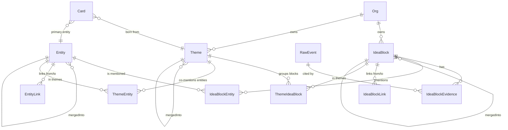

# Data Model

> Модель **по решению** (доку про финальное решение). Финальные миграции и Prisma/SQL-схема будут после ТЗ.

> **⚙️ Применение схемы (с 2026-06-05).** Источник правды о схеме БД — версионируемые **файловые миграции Prisma** (`backend/prisma/migrations/`), на прод применяются через `prisma migrate deploy`. Упоминания «Применяется `prisma db push`» ниже по тексту — **исторические** (описывают прежний механизм); теперь любое изменение схемы оформляется миграцией (`prisma migrate dev`). Правила: skill `prisma-db-push-rules`; контракт перехода: [`plans/tz/2026-06-05-prisma-migrations-switch.md`](../../plans/tz/2026-06-05-prisma-migrations-switch.md).

## Сущности первой версии

### User (хост)

```json
{
  "id": "user_abc",
  "external_id": "crossmark_user_42",
  "email": "ivan@firma.ru",
  "name": "Иван Петров",
  "created_at": "2026-05-06T10:00:00Z",
  "last_seen_at": "2026-05-06T15:30:00Z"
}
```

Уникальный индекс на `external_id`. Создаётся при первом вызове API создания встречи от Crossmark — `email` и `name` обновляются при каждом следующем вызове, если изменились (см. [[../01_projects/crossmark-integration]] § Создание пользователей-хостов).

### Meeting

```json
{
  "id": "01HMZP9X2J5K8R3T4Q7Y6N0F",
  "title": "Созвон с клиентом",
  "type": "sales",
  "custom_prompt": null,
  "owner_id": "user_abc",
  "card_id": "ckxxxxxxxxxxxx",
  "room_name": "01HMZP9X2J5K8R3T4Q7Y6N0F",
  "status": "scheduled",
  "started_at": null,
  "ended_at": null,
  "created_at": "2026-05-06T12:00:00Z"
}
```

**Поле `id`** — длинный неугадываемый идентификатор (ULID или UUIDv4). Используется и как внутренний ключ, и как публичный идентификатор в URL `meet.crossmark.ru/m/<id>`.

**Поле `custom_prompt`** — необязательный текст. Если заполнен — AI на этапе анализа использует его вместо стандартного шаблона по `type`. Тип всё равно фиксируется (для статистики и группировки), но содержание отчёта подбирается по своему промпту. См. [[../01_projects/ai-analysis-by-type]] § Кастомный промпт.

**Отдельного `guest_link` нет.** Одна ссылка на встречу = `meet.crossmark.ru/m/<id>` — её и хост, и все гости открывают одинаково (как в Zoom / Google Meet / Яндекс Телемост). Хост узнаётся по cookie (поставленному при первом входе через deep-link из Crossmark); гость без cookie видит форму «Введите имя».

**Поле `type`** — один из 9 типов (см. [[../01_projects/meeting-types]]). От него зависит шаблон AI-анализа.

**Поле `card_id`** — опциональная привязка к CRM-карточке (см. [[../01_projects/cards]]). `onDelete: SetNull` — при удалении карточки встреча сохраняется, привязка обнуляется. Один `card_id` (one-to-many от Card к Meeting). Несколько карточек на встречу — vNext.

**Поле `visibilityScope String @default("participants") @db.VarChar(16)`** (миграция `20260610130000_meeting_visibility`, ТЗ meeting-visibility-who-can-see) — «Кому видно» встречу: кто видит её страницу (а с ней — видео/запись/расшифровку/отчёт). Значения: `owner_only` (только создатель + bypass-роли) · `participants` (ДЕФОЛТ — создатель + участники с `Participant.userId`) · `custom` (участники + явные гранты `MeetingAccessGrant`) · `org` (вся компания одного tenant). Источник правды доступа к READ-поверхностям встречи (предикат `MeetingVisibilityService.canView`). **Отдельная подсистема от графа знаний** — `visibilityScope` НЕ читается ingest-конвейером/`block-access-deriver` (тот читает `closedGroupKind`/тип/участников). Управление встречей остаётся host-only. Kill-switch `MEETING_VISIBILITY_ENABLED` (=false → legacy owner-only). Back-relation: `accessGrants MeetingAccessGrant[]`.

### MeetingAccessGrant

```json
{
  "id": "ckxxxxxxxxxxxx",
  "tenantId": "cmp...",
  "meetingId": "meeting_123",
  "granteeType": "person",
  "granteeId": "person_456",
  "grantedById": "user_abc",
  "created_at": "2026-06-10T12:00:00Z"
}
```

Явный грант доступа к встрече при `visibilityScope='custom'` — кому хост открыл руками (миграция `20260610130000_meeting_visibility`).
- `granteeType String @db.VarChar(8)` — `'person'` (грант человеку, `granteeId` = `Person.id`) или `'group'` (грант группе, `granteeId` = `KnowledgeGroup.id`; срабатывает по **ПРЯМОМУ** членству, БЕЗ матрицы видимости отделов).
- `grantedById` — `User.id` хоста, выдавшего доступ.
- `tenantId` — денормализован скаляром для индекса `(tenantId, meetingId)`; FK/каскад идёт через `Meeting` (`onDelete: Cascade` — при удалении встречи гранты удаляются), НЕ через `Org`.
- Индексы: unique `(meetingId, granteeType, granteeId)` (идемпотентность PATCH), `(tenantId, meetingId)`, `(granteeType, granteeId)`.

### Card (CRM)

```json
{
  "id": "ckxxxxxxxxxxxx",
  "owner_id": "user_abc",
  "name": "Иван Петров",
  "kind": "client",
  "color": "#5EEAD4",
  "contact_name": "Иван Петров",
  "contact_email": "ivan@example.ru",
  "contact_phone": "+7...",
  "pinned": false,
  "summary_cache": "...AI rollup markdown...",
  "summary_updated_at": "2026-05-09T15:00:00Z",
  "meeting_count": 7,
  "last_meeting_at": "2026-05-09T14:00:00Z"
}
```

`kind` — `client | deal | project | topic | custom`. Хранится строкой (а не enum'ом), чтобы можно было дополнять без миграций.

`summary_cache` — кэш AI rollup-сводки по последним 20 встречам карточки. Обновляется воркером `ai.card-rollup` через дебаунс 5 сек. См. [[../01_projects/cards]] §AI-pipeline.

Один primary-контакт полями (`contact_name/email/phone`). Несколько контактов — vNext.

Soft-delete с 30-дневным grace, retention-cron делает hard-delete. Уникальный индекс `[owner_id, name]` — пользователь не может иметь две карточки с одинаковым именем.

### Participant

```json
{
  "id": "participant_123",
  "meeting_id": "meeting_123",
  "name": "Иван",
  "role": "guest",
  "is_registered_user": false,
  "joined_at": null,
  "left_at": null
}
```

**`role`:** `host` | `guest`. Гость = `is_registered_user: false`, имя вводит на странице входа.

**Identity-фундамент (МТЗ №1 Фаза 0, 2026-06-05, коммит `158a33d8`).** Чтобы «чей голос» и «Настя → задача» работали для приглашённых, `Participant` связывается с реальными `User` / `Person`:

- `userId String?` + relation `user → User?` (`@relation("ParticipantUser")`, `onDelete: SetNull`). `participant-context.service.ts loadForMeeting` теперь отдаёт `userId` **всем** `isRegisteredUser`, а не только хосту (раньше обнулялся для не-host — см. [[code-pitfalls]]).
- `personId String?` + relation `person → Person?` (`@relation("ParticipantPerson")`, `onDelete: SetNull`) — связь участника с карточкой сотрудника.
- `invitationStatus ParticipantInvitationStatus @default(none)` — новый enum **`ParticipantInvitationStatus { none invited joined }`**: `invited` — pre-seeded приглашённый (ещё не вошёл), `joined` — вошёл.
- `inviteToken String? @unique` — одноразовый `nanoid` для входа по ссылке `/m/<id>?inv=<token>`; `invitedAt DateTime?` — когда приглашён.
- Back-relations: `User.participantsAsUser[]`, `Person.participantsAsPerson[]`.

Pre-seed приглашённых создаётся в транзакции `meetings.service.createForUser` (`role:'guest'`, `isRegisteredUser`, `livekitIdentity='invitee:<token>'`); единый join по `inviteToken`/pre-seed `userId` (`participants.service.joinAsInvited`) переиспользует существующую запись, а не плодит дубль. Доставка приглашений — см. [[../01_projects/api-layer]] §invitees.

**Speaker identity в транскрипте.** `DialogTurn` (тип в `ai/services/prompts/common.ts`, не Prisma-модель) теперь несёт `speakerParticipantId` / `speakerLivekitIdentity`. Идентичность спикера протянута через `merger.ts` → `merge.worker.ts` → `meeting.adapter.ts` до `DialogTurn` и payload ingest — чтобы граф знал, **кто** автор реплики (фундамент `role:'subject'` атрибуции, см. [[knowledge-core]]).

### Recording

```json
{
  "id": "recording_123",
  "meeting_id": "meeting_123",
  "main_video_url": "...",
  "audio_tracks": [
    {
      "participant_id": "participant_1",
      "participant_name": "Сергей",
      "audio_url": "..."
    }
  ],
  "status": "ready",
  "retention_days": 30,
  "expires_at": "2026-06-04T12:00:00Z",
  "archived_at": null,
  "deleted_at": null
}
```

**Критично:** `audio_tracks[]` — массив отдельных аудиодорожек на каждого участника. Без них AI-анализ теряет в качестве (общий микс плохо разделяется по спикерам).

**Retention:** `expires_at = meeting.ended_at + retention_days` — снимок тарифа на момент создания. Cron-job обрабатывает истёкшие записи (см. [[../01_projects/recording]] § Retention и `plans/analysis/2026-05-06-recording-retention.md`).

### Recording Actions (новая таблица)

```
recording_actions(
  id,
  recording_id,
  action,        -- 'created' | 'extended' | 'archived' | 'deleted' | 'exported'
  actor,         -- 'user:<id>' | 'cron' | 'admin:<id>'
  reason,        -- свободный текст ('user_request', 'tariff_expired', 'gdpr_request')
  created_at
)
```

Журнал всех действий с записью — для compliance (GDPR-запросы, audit) и для UX «история этой записи».

### AI Result

```json
{
  "meeting_id": "meeting_123",
  "meeting_type": "sales",
  "summary": "...",                    // 2-3 предложения — всегда
  "structured_data": {                  // если использовался шаблон типа
    "pain": "...",
    "budget": "...",
    "decision_maker": "...",
    "objections": [...],
    "next_step": "..."
  },
  "custom_output_md": null,             // или markdown-текст, если использовался custom_prompt
  "follow_up_email": "...",             // для применимых типов
  "tasks": [...]                        // для применимых типов
}
```

**Логика заполнения:**
- Если у `Meeting.custom_prompt` стояло значение → AI применяет этот промпт → результат пишется в `custom_output_md` (markdown-текст), `structured_data` остаётся `null`.
- Если `custom_prompt` был `null` → AI применяет шаблон по `meeting_type` (см. [[../01_projects/ai-analysis-by-type]]) → результат пишется в `structured_data` (JSON-объект полей по типу), `custom_output_md` остаётся `null`.
- `summary` (2-3 предложения, краткое содержание) генерится **всегда** независимо от режима.

## Статусы встречи (FSM)

```
scheduled
  ↓
active
  ↓
completed
  ↓
recording_processing → recording_ready
  ↓
transcription_processing
  ↓
ai_processing → ai_ready
```

Параллельная ветка: `failed` (с любого этапа, с указанием причины в `failureReason`). Известные коды `failureReason` для «встреча технически не состоялась» (2026-06-10, ТЗ [`meeting-stuck-and-team-roster-fixes`](../../plans/tz/2026-06-10-meeting-stuck-and-team-roster-fixes.md)):
- **`ended_before_start`** — хост нажал «Завершить», когда встреча ещё в `scheduled` (вебхук `room_started` потерян, записи нет): `finish` переводит `scheduled → failed`, отвечает 200 (не 409); UI показывает нейтральный текст «Встреча завершена (запись не велась)», не «ошибка» (`host-controls.service.finish`, Р1).
- **`never_activated`** — брошенную `scheduled` старше `max(idle.timeoutMinutes, 30)` мин подбирает idle-cron: если LiveKit-room пуста/нет — `scheduled → failed('never_activated')`; если в room есть живые участники (значит `room_started` потерян, но встреча идёт) — наоборот `scheduled → active` + попытка стартовать запись (recovery) (`idle-meeting.cron`, Р2).

## Таблицы для аудио-дорожек

Каждый трек хранит:
```
participant_id
participant_name
track_id
audio_file_url
started_at
ended_at
```

Хранится либо как JSON-поле в `Recording.audio_tracks`, либо отдельной таблицей `audio_track`. Решение — на этапе ТЗ; для масштаба и индексации лучше отдельной таблицей.

## Org / Membership / OrgInvitation / LlmModelPrice (Фаза 0 knowledge-core, 2026-05-10)

Подробнее: [[../01_projects/rbac-access-control|rbac-access-control]] и [[../01_projects/llm-router|llm-router]].

### Org

```
Org {
  id, name, slug @unique, ownerId (FK User),
  visibilityMode: open|strict (default open),
  tier: basic|pro|enterprise (placeholder для Фазы 12),
  // ── Демо-кабинет «ТехноСтрим» ──
  demoWorkspaceSeededAt: DateTime?           // когда был залит демо-seed
  demoUserIds: String[] @default([])         // 5 демо-User'ов (для cleanup)
  createdAt, deletedAt?
  @@index([ownerId]), @@index([deletedAt])
}
```

> `demoUserIds` — точечный список id-шников демо-User'ов («Морозов»,
> «Волкова», «Козлов», «Соколова», «Петрова»). Их Helpfulness/Contribution-
> записи ссылаются на `User.id`, а сам `User` не tenant-scoped. Поле
> позволяет `resetDemoWorkspace` снести именно их при сбросе демо-кабинета,
> не задевая реальных пользователей.

### Membership

```
Membership {
  orgId, userId, role: owner|admin|manager,
  invitedBy?, joinedAt
  @@unique([orgId, userId])
  @@index([userId]), @@index([orgId, role])
}
```

### OrgInvitation

```
OrgInvitation {
  orgId, email, role,
  token UNIQUE (nanoid 40),
  status: pending|accepted|revoked|expired,
  invitedBy, expiresAt (TTL 7д), acceptedAt?, acceptedByUserId?
  @@index([orgId, status]), @@index([email, status]), @@index([expiresAt])
}
```

### LlmModelPrice (версионируемая прайс-карта)

```
LlmModelPrice {
  id, provider, model,
  inputCostPerMillionTokens, outputCostPerMillionTokens,
  cachedCostPerMillionTokens (default 0),
  currency (default USD),
  effectiveFrom (default now), effectiveTo?
  @@index([provider, model, effectiveFrom])
  @@index([effectiveFrom, effectiveTo])
}
```

### Расширения существующих моделей

**`User.isSuperAdmin: Boolean (default false)`** — флаг владельца Z-Admin (Фаза 7). Bypass RBAC.

**`tenantId String?`** добавлен во все tenant-scoped модели + `@@index([tenantId])`:
- `Meeting`, `Card`, `Task`, `MeetingChapter`, `MeetingHighlight`, `MeetingChatMessage`, `Tag`
- `WebhookSubscription`, `IntegrationDestination`, `Export`, `ApiKey`
- `LlmTaskRoute` (NULL = глобальный дефолт), `AuditLog`, `AiUsageLog`

На Фазе 0 — nullable. После backfill в проде — отдельный push сделает NOT NULL для основных моделей. Скрипт: [backfill-orgs-fase0.ts](../../backend/scripts/backfill-orgs-fase0.ts).

**`AiUsageLog`** дополнительно:
- `cachedTokens Int @default(0)` — кэшированные input-токены (prompt cache hit).
- `sourceRef Json?` — `{ type, id }` для drill-down в Z-Admin.
- `experimentGroup String?` — `'A'|'B'` для A/B-экспериментов LlmTaskRoute.

**`LlmTaskRoute`** дополнительно:
- `tenantId String?` — NULL = глобальный, не-NULL = override на Org.
- `experiment Json?` — конфигурация A/B (Фаза 7).
- Изменён unique: `@@unique([taskType, tenantId])` (было `taskType` UNIQUE).

## knowledge-core: Source / RawEvent (Фаза 1, 2026-05-10)

### Source

```
Source {
  id, tenantId, type: SourceType (meeting|chat|phone_call|bot|email|web_form|external
                                  |conversational|tracker_event|chatbox|daily_checkin|meeting_report),
  name, config Json?, dataClass: DataClass (public|internal|sensitive|private),
  isActive Boolean (default true), createdAt, updatedAt
  @@unique([tenantId, type, name])
  @@index([tenantId, isActive])
}
```

> **`SourceType.meeting_report`** (2026-06-11, миграция `source_type_meeting_report`) — вторичный источник графа: чистая выжимка AI-отчёта встречи (см. [[knowledge-core]] §«Отчёт встречи → граф»). Дефолтный `Source(type='meeting_report', name='Отчёты встреч Z')` lazy-upsert'ится `ReportIngestAdapter`. Enum-значение добавлено **отдельным файлом миграции** перед миграцией поля `IdeaBlock.primarySource` (`ALTER TYPE ... ADD VALUE` не выполняется в одной транзакции с другим DDL в части версий PG).

Дефолтный `Source(type=meeting, name='Встречи Z')` создаётся **автоматически
при создании Org** (см. `OrgsService.createForOwner`). Backfill для
существующих Org: [backfill-meeting-sources-fase1.ts](../../backend/scripts/backfill-meeting-sources-fase1.ts). Управление другими источниками
(telegram/email/...) из UI — Фаза 10.

### RawEvent

```
RawEvent {
  id, tenantId, sourceId, sourceType,
  sourceExternalId? (если null — дедуп по checksum),
  idempotencyKey UNIQUE (sha256(sourceId + ':' + (sourceExternalId ?? checksum) + ':' + occurredAtIso)),
  occurredAt, receivedAt (default now),
  payloadStorage: RawEventPayloadStorage (inline|s3),
  payload Json? (null если payloadStorage=s3),
  payloadS3Key? (не null если payloadStorage=s3),
  payloadChecksum (sha256 от payloadJson, всегда),
  payloadSizeBytes,
  dataClass,
  processingStatus: RawEventProcessingStatus (received|ingested|failed),
  processingError? @db.Text,
  processedAt? (выставляется консумером Фазы 2)
  @@index([tenantId, sourceId, occurredAt])
  @@index([tenantId, processingStatus])
}
```

Иммутабельная запись — главный entry-point в knowledge-core. Inline-payload
до 10 MiB; больше — уезжает в S3 по ключу `raw-events/<tenantId>/<idempotencyKey>.json`.
Идемпотентность — по уникальному `idempotencyKey`.

После создания публикуется job в `core.raw-events` (BullMQ). Consumer
(`block-ingest.worker`) — Фаза 2.

### MeetingTranscriptChunk — @deprecated

Помечена `/// @deprecated knowledge-core Фаза 1: будет заменён `IdeaBlock`
в Фазе 2, удалён в Фазе 6 после `chat-v2`. Не использовать в новом коде.

Сохраняется работающей до Фазы 6 — chat-модуль (per-meeting + cross-meeting RAG)
ещё на ней работает; `transcript-index.worker` продолжает индексировать новые
встречи параллельно с ingest-pipeline.

## Knowledge-core (Фаза 2): IdeaBlock + Entity

Подробно — [[knowledge-core|knowledge-core.md]]. Здесь — сжатые модели и
ER-связи.

### IdeaBlock

```
IdeaBlock {
  id, tenantId, name, criticalQuestion, trustedAnswer,
  tags[], signalType (enum: fact / pain / feature_request / objection /
                      churn_risk / idea / risk / commitment / decision /
                      mood / drift / competitor_move / metric_change /
                      knowledge_gap / action_item /* 2026-06-23, миграция
                      add_signaltype_action_item — спайн-извлечение задач,
                      роутится в специалист 3-15-tasks */ ),
  confidence Decimal(4,3), dataClass,
  embedding vector(1536),                -- text-embedding-3-small
  status (draft | canonical | merged_into | archived),
  mergedIntoId? → IdeaBlock,
  primarySource? VARCHAR(16),            -- 'transcript' | 'report' | null=transcript (2026-06-11, миграция idea_block_primary_source)
  evidenceCount, dynamicScore Decimal(8,4),
  createdAt, updatedAt,
  search_tsv tsvector                    -- generated column (postgres-init.sql)
  @@index([tenantId, status])
  @@index([tenantId, signalType])
  @@index([tenantId, mergedIntoId])
}
```

HNSW индекс на `embedding` через `vector_cosine_ops` + GIN на `search_tsv`.

**Поле `primarySource String? @db.VarChar(16)`** (миграция `idea_block_primary_source`, ТЗ [`report-to-graph-phase2`](../../plans/tz/2026-06-11-report-to-graph-phase2.md)) — провенанс блока на уровне самого блока: `'transcript'` (дословный транскрипт, первичный) | `'report'` (вторичный — из AI-отчёта встречи, источник `SourceType.meeting_report`) | `null` (исторические блоки трактуются как `'transcript'`). Нужно на уровне блока (а не только evidence), т.к. LLM-арбитр дедупа слеп к источнику, а evidence бывает мульти-source. Детерминированный признак для merge/distill-гардов: транскрипт всегда побеждает report при дедупе; report-блок — capped confidence (≤ `knowledge.reportBlockConfidenceCap`, default 0.6) + заниженный dynamicScore. Поле nullable, backfill не нужен. Подробно — [[knowledge-core]] §«Отчёт встречи → граф».

### IdeaBlockEvidence

```
IdeaBlockEvidence { id, blockId → IdeaBlock, rawEventId → RawEvent,
                    sourceType, sourceTimestamp?, quote @Text,
                    startMs?, endMs?, sourceMessageExternalId?, createdAt }
```

N:1 к IdeaBlock — один блок может агрегировать множество свидетельств.
При merge блока всё его evidence переносится на canonical через
`updateMany`.

**Провенанс — денорм-снимок (2026-06-20, миграция `20260620113751_provenance_preview_snapshot`):** для рендера СПИСКОВ без join вглубь (анти-N+1; полный резолв — on-demand через `ProvenanceService.resolve` с фильтром прав зрителя). `Decision`/`Issue`/`Regulation` получили `previewQuote String? @db.Text` + `previewSourceRef Json?` (`{evidenceId, blockId, sourceType, refId, startMs, deepLink, attribution, label}`); `Task` — только `previewSourceRef` (цитата уже в `sourceQuote`/`sourceStartMs`). Заполняет `backfill-provenance-preview.ts` из первого `IdeaBlockEvidence` (идемпотентно). `attribution` = `primarySource==='report' ? 'inferred' : 'quoted'`. Подробно — [[knowledge-core]] / [[module-map]] (`ProvenanceService`).

**Деноль-снимок теперь читается list-DTO (2026-06-20, provenance-probe-followups A1):** `previewQuote`/`previewSourceRef` (Decision/Issue/Regulation/Task) выводятся в DTO списков решений/регламентов/задач — фронт рисует сниппет цитаты-источника прямо на карточке списка без on-demand резолва (полный `ProvenanceService.resolve` остаётся по клику «Откуда это»).

**Soft-delete карточек знаний (2026-06-22, миграция `20260622065212_add_softdelete_to_knowledge_cards`, qa-fixes Ф5–Ф7):** `Regulation`/`Process`/`Policy`/`Instruction`/`Decision` получили `deletedAt DateTime?` + `deletedById String?` + `@@index([tenantId, deletedAt])`. Owner/admin удаляет (`@Delete(:id)` → `softDelete`, `deletedAt=now`) и восстанавливает (`@Post(:id/restore)`) в течение grace-окна (30 дней, по образцу `cards`). Удалённые исчезают из ВСЕХ выдач — все чтения (list/search/count/getById/провенанс/специалисты/дашборды/дайджесты) фильтруют `deletedAt: null`; list-эндпоинты регламентов/решений принимают `deleted: true` для показа удалённых (UI-тумблер «Удалённые»). Аддитивно (nullable = «не удалён»). Подробно — [[knowledge-core]].

**Поле `sourceMessageExternalId String?`** (2026-06-20, миграция `20260620181013_add_evidence_source_message`, provenance-probe-followups B1) — внешний id конкретного сообщения чата, из которого взято свидетельство. Аддитивно (nullable, backfill не обязателен). Нужно для chatbox deep-link на сообщение: `ProvenanceService.buildDeepLink` строит `/chats/<chatId>?m=<msg>` (раньше вёл только на чат целиком). Заполняется на ingest chatbox-evidence; исторические записи — `null` (deep-link на чат без якоря сообщения).

### Entity

```
Entity { id, tenantId, type (client | person | project | product |
                              topic | location | custom),
         canonicalName, aliases[],
         embedding vector(1536),
         mergedIntoId? → Entity,
         mentionsCount, metadata Json?,
         createdAt, updatedAt
  @@index([tenantId, type])
  @@index([tenantId, canonicalName])
}
```

HNSW на `embedding` (cosine). `entity-resolver` ищет дубли cron'ом и
on-event.

### IdeaBlockEntity (M:M)

```
IdeaBlockEntity {
  blockId, entityId,
  mentionContext @Text,
  role (subject | object | mentioned),
  createdAt
  @@id([blockId, entityId])
}
```

Composite PK даёт идемпотентность — повторное создание для той же пары
блок↔сущность ловится через `Prisma.PrismaClientKnownRequestError P2002`.

## Knowledge-core (Фаза 3): IdeaBlockLink + EntityLink

Граф знаний поверх IdeaBlock и Entity — типизированные связи. Подробно —
[[knowledge-core|knowledge-core.md]] раздел «Граф (Фаза 3)».

### IdeaBlockLink

```
IdeaBlockLink {
  id                cuid
  tenantId          → Org
  fromBlockId       → IdeaBlock
  toBlockId         → IdeaBlock
  relationType      enum (develops | contradicts | causes | consequences_of |
                          shares_topic | shares_entity | question_answered_by)
  confidence        Decimal(4,3)
  explanation       String @Text
  createdBy         enum (linker | reframing | manual)
  status            enum (active | archived)  @default(active)
  createdAt, updatedAt
  @@unique(fromBlockId, toBlockId, relationType)
  @@index(tenantId, status)
  @@index(fromBlockId, status)
  @@index(toBlockId, status)
}
```

Источник создания — `block-linker.worker` (KNN top-10 + LLM-арбитр) или
`reframing.cron` (ночная рефлексия, может архивировать слабые связи).
Дедупликация через unique-индекс на тройку (from, to, relationType) — повторный
проход линкера обновляет `confidence` и `explanation` через upsert.

### EntityLink

```
EntityLink {
  id                cuid
  tenantId          → Org
  fromEntityId      → Entity
  toEntityId        → Entity
  relationType      enum (works_at | belongs_to | part_of | opposes |
                          depends_on | mentions_with)
  confidence        Decimal(4,3)
  explanation       String @Text
  createdBy         enum (linker | reframing | manual)
  status            enum (active | archived)  @default(active)
  createdAt, updatedAt
  @@unique(fromEntityId, toEntityId, relationType)
  @@index(tenantId, status)
  @@index(fromEntityId, status)
  @@index(toEntityId, status)
}
```

Создаётся `entity-graph-builder.cron` (раз в час, ищет co-mentioned пары
сущностей в одних блоках, минимум `ENTITY_GRAPH_MIN_COMENTIONS=3` упоминаний).

## Knowledge-core (Фаза 4): Theme + Card расширение

### Theme

```
Theme {
  id, tenantId, name, description @Text,
  weight Decimal(4,3) default 0.500,
  dynamic (growing | stable | declining) default 'stable',
  confidence Decimal(4,3) default 0.500,
  status (active | archived | merged_into),
  mergedIntoId? → Theme,
  branch? (strategy | clients | sales | marketing | product | operations |
           team | finance | technology | production | partnerships | legal),
  embedding vector(1536),
  lastSignalAt?, createdAt, updatedAt,

  @@index(tenantId, status)
  @@index(tenantId, branch)
  @@index(tenantId, mergedIntoId)
}
```

AI-кластер canonical IdeaBlock'ов. Создаётся `theme-clusterer.cron` (раз в час
в :15, KNN-greedy на embedding'ах с порогом `THEME_COSINE_THRESHOLD=0.78`,
минимум `THEME_CLUSTER_MIN_SIZE=3` блоков, гейт по Org `THEME_CLUSTERING_MIN_BLOCKS=100`).

Описание/имя/ветка генерируются LLM `theme-classify` (JSON Schema strict).
Embedding темы — `text-embedding-3-small` от `name + ' ' + description`.

### ThemeIdeaBlock (M:M)

```
ThemeIdeaBlock {
  themeId, blockId, weight Decimal(4,3) default 1.000, createdAt
  @@id(themeId, blockId)
  @@index(blockId)
}
```

### ThemeEntity (denormalized)

```
ThemeEntity {
  themeId, entityId, mentionsCount Int default 0, createdAt
  @@id(themeId, entityId)
  @@index(entityId)
}
```

Поддерживается `theme-clusterer` (создание) и `reframing.reflectOnThemes`
(перенос при `themeMerges`).

### Card расширение (Фаза 4)

```
Card {
  ...
  entityId          String?  → Entity     // primary-сущность
  relatedEntityIds  String[] @default([]) // дополнительные сущности
  bornFromThemeId   String?  → Theme      // если создана из темы
  cachedTopThemeIds String[] @default([]) // кэш топ-3 связанных тем
  ...
  @@index(entityId)
  @@index(bornFromThemeId)
}
```

Заполнение:
- `entityId` / `relatedEntityIds` — пользователь редактирует через UI
  карточки (Фаза 5/6 — frontend).
- `bornFromThemeId` — выставляет endpoint `POST /knowledge/themes/:id/save-as-card`.
- `cachedTopThemeIds` — `card-rollup-v2.worker` пересчитывает на каждом тике.

## Knowledge-core (Фаза 5): расширения Task / MeetingChapter / MeetingHighlight / AiResult / Meeting

Фаза 5 переписывает Tasks/Chapters/Summary поверх IdeaBlock'ов через `MeetingAnalyzeV2Worker` (`core.meeting-analyze-v2`, debounce 2 мин). Legacy `tasks-extract.worker` / `chapters.worker` НЕ удалены — V2 пишет в новые поля параллельно для A/B-сравнения.

**`Task` дополнительно:**
- `evidenceBlockIds: String[]` (default `[]`) — id IdeaBlock'ов, породивших задачу.
- `extractorVersion: String?` — `'v2'` если задача создана `meeting-analyze-v2.worker`'ом, NULL = legacy.
- `assigneeUserId: String?` — жёсткая связь с `User.id` (relation `assignee`, `onDelete: SetNull`). Заполняется AI-pipeline после ТЗ 2026-05-25 `hard-participant-identification`: `ParticipantContextService.loadForMeeting` отдаёт participants → промпт (`tasks-v2` / `tasks-structured`) → LLM возвращает `assigneeUserId` → `TaskAssigneeResolverService` валидирует против participants (галлюцинации режутся, ≥2 кандидатов → null + метрика `z_task_assignee_ambiguous_total`). `assigneeRaw` сохраняется ВСЕГДА — для UI fallback и гостей. Index `@@index([assigneeUserId])` — для фильтра «мои задачи».

**`Task` — source-поля (миграция `20260611110000_chatbox_tasks_and_customer_link`, ТЗ chatbox-memory-finishing Ф5/Ф6):** задача больше не обязана быть из встречи.
- `meetingId: String?` — **стал nullable** (был NOT NULL): задача может родиться из переписки ChatBox или трекера. ⚠ Каскад на view-типы: все читатели «задач встречи» (`where:{meetingId}`) и UI-мапперы должны допускать `meetingId=null` (см. [[code-pitfalls]] §«meetingId nullable»).
- `sourceType: String @default("meeting")` (FK на модель `TaskSource`) — `'meeting'` | `'chatbox'` | … : откуда пришла задача. Backfill пустых → `'meeting'`: `scripts/backfill-task-source-type.ts` (safety no-op, колонка с дефолтом).
- `sourceChatSessionId: String?` / `sourceChatId: String?` — для `sourceType='chatbox'`: на какую сессию/чат переписки опирается задача (извлечена `chatbox` task-extractor'ом Ф5, гейт `CHATBOX_TASK_EXTRACTION_ENABLED`).
- **Межисточниковый дедуп (Ф6):** задача из переписки, семантически совпадающая (cosine ≥ `tasks.cross_source_dedupe_threshold`, дефолт 0.85) с задачей из встречи/трекера, не плодит дубль. Гейт `TASKS_CROSS_SOURCE_DEDUPE_ENABLED`.

**`TaskSource`** — новая справочная модель/enum источника задачи (значения `meeting`/`chatbox`/…), на которую ссылается `Task.sourceType`.

**`TaskSource` — провенанс-связь с `Issue` (миграция `20260623130000_tasksource_issue_link`, ТЗ unified-task-extraction Ф3/Ф4):** одна задача — N источников; источник теперь может указывать на `Issue` напрямую (LINK-семантика спайн-дедупа), а не только на `Task`.
- `taskId: String?` — **стал nullable** (был NOT NULL): запись может относиться к `Issue`, а не к `Task`.
- `issueId: String?` — FK на `Issue` (`onDelete: Cascade`): дубль задачи линкуется к существующему `Issue` без создания дубль-Issue (спайн-специалист `3-15-tasks` на вердикт дедупа 'same'; промоут Task→Issue пишет провенанс при accept).
- `@@unique([issueId, sourceType, sourceRefId])` + `@@index([tenantId, issueId])` (идемпотентность провенанса: повтор `create` глотается P2002).

**ChatBox: связка клиента переписки с графом (та же миграция).** `ChatboxCustomer` и `ChatboxChannelClient` (`ChannelClient`) получили:
- `linkedPersonId: String?` — связь клиента/контакта переписки с `Person` графа знаний.
- `linkMode: String?` — как установлена связка (ручная/по email/нечёткий матчинг по имени, гейт `chatbox.match.name_fuzzy_enabled`).
Это снимает прежнее ограничение «`ChatboxCustomer` не связан с `Person`/`Entity`» (см. реестр не-сделанного).

**`MeetingChapter` дополнительно:**
- `evidenceBlockIds: String[]` (default `[]`) — id блоков главы.
- `extractorVersion: String?` — `'v2'` или NULL (legacy).

**`MeetingHighlight` дополнительно:**
- `evidenceBlockId: String?` — ссылка на породивший блок (для будущего highlights-v2-генератора). NULL для ручных и legacy.

**`AiResult` дополнительно:**
- `summaryV2: String?` — альтернативная сводка от `summary-extractor-v2.service.ts` (markdown поверх блоков).
- `summaryV2Model: String?` — `<provider>:<model>`.
- `summaryV2GeneratedAt: DateTime?`.
- `summary` (legacy) НЕ перезаписывается — UI остаётся на legacy до решения владельца про переключение.

**`Meeting` дополнительно (статус v2-агентов):**
- `analyzeV2Status: String?` — `null | 'queued' | 'processing' | 'ready' | 'partial' | 'failed'` (строкой, не enum'ом — проще расширять).
- `analyzeV2GeneratedAt: DateTime?`.
- `analyzeV2Error: String?` — текст ошибки (multi-line) на failed/partial.

ENV: `KNOWLEDGE_CORE_V2_AGENTS_ENABLED` (default `false`) — мастер-флаг включения cron'а v2-агентов. `MEETING_ANALYZE_V2_CRON='*/10 * * * *'`. `MEETING_ANALYZE_V2_DEBOUNCE_MS=120000`.

### ER (knowledge-core)



## Дельта Фаз 7–12 (закрыты 2026-05-10)

### Phase 7 — Admin

- **`User.isSuperAdmin: Boolean @default(false)`** — глобальная роль super_admin (вне Membership). Назначается только UPDATE в БД.
- **`Org.workersEnabled: Json @default("{}")`** — карта тумблеров воркеров. `{}` = все включены. Структура `{[workerName]: false}`. Воркеры читают через `WorkerOrgGate.checkOrThrow`.
- **`SuperAdminAccessLog`** — новая таблица: `id, superAdminUserId, accessedTenantId?, route, method, params jsonb, createdAt`. Пишется `SuperAdminAuditInterceptor` для каждого запроса под `SuperAdminGuard`.
- **`IdeaBlockLink.deletedAt/deletedBy`** + `@@index([tenantId, deletedAt])` — soft-delete из Org-Admin.
- **`EntityLink.deletedAt/deletedBy`** + index — то же.
- **`AiUsageLog.requestPreview/responsePreview: Text?`** — обрезанные до 8 KB UTF-8 промпт/ответ для drill-down в Z-Admin. Пишется `LlmRouter` после каждого вызова.

### Phase 9 — Goals

- **`Goal`** — цель Org. Поля: `tenantId, name, description (Text), targetDate?, status (GoalStatus), weight (Decimal(4,3)), createdById, archivedAt?, cachedAlignment? (Int 0..100), cachedAlignmentAt?, cachedAlignmentDelta?, cachedSnapshotId?`. Индексы `(tenantId, status)`, `(tenantId, archivedAt)`.
- **`GoalTheme`** — M:M Goal↔Theme. `source: GoalThemeSource (manual|ai)`, `weight Decimal`. PK `(goalId, themeId)`.
- **`GoalAlignmentSnapshot`** — иммутабельный снапшот. `score (Int 0..100), delta? (Int), explanation (Text), signals jsonb, windowDays, themesCount, blocksCount, aiUsageLogId?, alertPending Boolean`. Индексы `(goalId, createdAt)`, `(tenantId, alertPending)`.
- Enum'ы: **`GoalStatus { active, paused, achieved, abandoned }`**, **`GoalThemeSource { manual, ai }`**.
- **`Org.strategicAlignmentWindowDays: Int @default(30)`** — окно расчёта (мин 7, макс 90).

### Phase 10 — Adapters

- **`ApiKey.scope: String @default("api")`** — расширение под `'ingest'`. Префикс `zik_*`. Используется per-Org для внешних webhook'ов.

### Phase 11 — Retention + 152-ФЗ

- **`OrgRetentionPolicy`** — per-Org политика. `tenantId @unique, rawEventDays (default 2555 = 7 лет), archivedBlockDays (365), chatMessageDays (90), auditLogDays (730), archivedBlockAction (default 'archive_then_delete'), lastSweepAt?`.
- **`LlmTaskRoute.requiredDataClass: DataClass?`** — минимальный класс данных, который маршрут поддерживает. `null` = `internal`.

### Phase 12 — Entitlements

- **`OrgEntitlement`** — `tenantId @unique, tier (String, default 'tier_pro' — намеренно строка, не enum), featureOverrides jsonb?, quotaOverrides jsonb?, notes (Text)?`.

## Фаза 0 — каркас компании (Z 2026-05-21)

### Группа А (с UI)
- `Department(id, tenantId, name, parentDepartmentId?, deletedAt?)` — иерархия в схеме, UI плоский.
- `Role(id, tenantId, name, departmentId?, tags[], deletedAt?)` — бизнес-должность.
- `Person(id, tenantId, userId?, name, email, primaryDepartmentId?, entityId?, deletedAt?)` — сотрудник ЛК. **Partial unique по email (2026-06-10, в `postgres-init.sql`, не в schema):** `persons_tenant_email_active_uniq ON "persons" ("tenantId", lower("email")) WHERE "deletedAt" IS NULL AND "email" <> ''` — не более одной активной карточки на email в Org. (Schema-уровневый `@@unique([tenantId, email, deletedAt])` бесполезен: `NULL ≠ NULL` в PG пропускает несколько активных дублей с `deletedAt IS NULL`.) Индекс с **self-skip** при существующих дублях (встаёт после backfill `backfill-merge-duplicate-persons.ts`); при создании `Person` дедуп по email идёт ещё до вставки (`persons.service.create` → 409 `person_email_taken` либо линковка безличной карточки). ТЗ [`meeting-stuck-and-team-roster-fixes`](../../plans/tz/2026-06-10-meeting-stuck-and-team-roster-fixes.md) Ф2–Ф4.
- `PersonRole(id, tenantId, personId, roleId, validFrom, validTo?)` — M:M Person↔Role с временем.
- `JobDescription(id, tenantId, roleId, contentMd, sourceDocumentId?, version, deletedAt?)`.
- `Skill(id, tenantId, name, description?, deletedAt?)`.
- `Document(id, tenantId, uploaderId, kind, name, s3Key?, inlineContent?, parsedText?, status, attachedRoleId?, deletedAt?)`.
- `RoleProfile(id, tenantId, roleId UNIQUE, summaryCache Json, status, lastBuildAt?, buildVersion)`.

### Группа Б (без UI в Фазе 0)
- `Mission, Vision, Strategy` — Уровень 1.
- `Process, ProcessStep, Regulation, Policy` — Уровень 3. **SBA α-7** (2026-05-22) расширил эти модели in-place: `entityId @unique?`, `scope`, `ownerPersonId` (для Regulation/Policy), `currentVersionId → CardVersion`, `sourceBlockIds[]`, `personSubjectIds[]`, `dataClass`, `embedding Unsupported("vector(1536)")?`, `lastConfirmedAt`. Для `Regulation` дополнительно — `statement` (структурированное утверждение, альтернатива `contentMd` для дедупа/chat-v2), `supersedesId` (self-relation для версионирования). Для `Process` — `inputs`/`outputs`/`metricsJson` (JSON, не путать с моделью `Metric`). UI на `/regulations` (master-detail с фильтром `kind`).
- **`Instruction`** (мастер-ТЗ промптов, Волна 6 A10, миграция `20260610120000_add_instruction`, `@@map("instructions")`) — first-class сущность **«Инструкция»**: пошаговое руководство «как сделать X» для **одной** роли. Полностью **зеркалит `Regulation`** + добавляет single-role признак `forRole String? @db.VarChar(120)`. Поля как у Regulation: `name @db.VarChar(300)`, `contentMd @db.Text`, `status ProcessStatus`, `version`, `confidence?`, `statement?` (структурированная суть для дедупа/retrieval), `scope?`, `ownerPersonId?` (FK Person, relation `InstructionOwnerPerson`), `supersedesId?` (self-relation `InstructionSupersedes` — версионирование), `currentVersionId? → CardVersion` (`InstructionCurrentVersion`), `entityId @unique?` (связка с графом), `sourceBlockIds[]`, `personSubjectIds[]`, `dataClass`, `dataClassAudit Json?`, `embedding Unsupported("vector(1536)")?` (name+statement, для KNN-дедупа), `lastConfirmedAt?`. Индексы btree: `@@unique([tenantId, name])`, `[tenantId, status]`, `[tenantId, forRole]`, `[tenantId, ownerPersonId]`, `[tenantId, scope]` (2026-06-23, миграция `20260623021934` — для точного фильтра `scope='role:<id>'` в retrieval регламентов клона, см. ниже §«Указатель регламентов в клоне роли»; у `Regulation/Process/Policy` индекс по `scope` уже был), `[currentVersionId]`. HNSW `instructions_embedding_hnsw_cosine_idx` (cosine, `WHERE embedding IS NOT NULL`) — в `postgres-init.sql`, не в schema. Читается через тот же `/regulations` API с `kind=instruction` (см. api-layer.md). Извлечение/storage-роутинг — specialist-3-1-regulations + specialists-combined (`forRole` из `scope=role:<id>` или `roles[0]`).
- `Tool` — Уровень 4.
- `Metric` — Уровень 5.
- `Decision` — миграционный долг.

### Расширения existing
- `Goal.horizon GoalHorizon @default(quarterly)`, `Goal.parentGoalId?` (self-relation).
- `MeetingType` enum + `review`, `retrospective`.
- `IdeaBlock.roleRelevant Boolean`, `IdeaBlock.roleId?`.
- `EntityLink` полиморфизована: `fromType?`, `toType?`, `validFrom`, `validTo?`, `properties Json`. Composite unique включает fromType/toType. FK на Entity убраны.
- `EntityLinkType` enum +17 типов рёбер (см. `plans/archive/2026-05-21-phase-0a-data-model-and-graph-infra.md` §4.4).
- `Membership.personId?`, `OrgInvitation.personId?`, `User.persons[]`.

### Графовая инфраструктура
- Apache AGE 1.5.0 (PG16) — `infra/postgres/Dockerfile` (dev), Yandex Managed (prod).
- Граф `z_graph`.
- `GraphService` в `backend/src/common/graph/` — единая точка двойной записи Postgres EntityLink + AGE.
- Запрет прямого Cypher — см. [[code-pitfalls]].

## Tracker модуль (2026-05-24, Sprint 1)

Полное описание модуля и API: [[../01_projects/tracker]]. Модели Prisma (20 новых, в конце `backend/prisma/schema.prisma` после строки 6044).

### Project
- `id String @id @default(cuid())`, `tenantId String`, `slug String` (unique per tenant), `identifier String` (короткий префикс задач: PROJ, SALES — до 5 симв.), `name`, `description? @db.Text`, `ownerId`, `defaultAssigneeId?`, `defaultStateId?`, `network Int @default(0)` (0=Private, 2=Public-внутри-org), `archivedAt?`, `timezone @default("Europe/Moscow")`.
- `systemGenerated Boolean @default(false)` (2026-06-06) — помечает системно-сгенерированные проекты-контейнеры (org-scope «Спринт компании», который `quickCreate` создаёт, когда не указан ни один scope). Скрыты из `GET /projects` (фильтр `systemGenerated:false` в `ProjectsService.findAll`), но доступны через раздел «Спринты». Миграция `20260606071402_project_system_generated` (аддитивная: `ALTER TABLE "Project" ADD COLUMN "systemGenerated" BOOLEAN NOT NULL DEFAULT false`). Backfill для legacy-контейнеров: `scripts/backfill-system-generated-projects.ts`.
- Feature-flags: `cycleViewEnabled`, `intakeViewEnabled`, `gantViewEnabled @default(false)`, `timeTrackingEnabled @default(false)`.
- `teamTemplateId?` FK на TeamTemplate (создан из шаблона).
- `entityId?` для графа знаний.
- Soft-delete `deletedAt?`.

### ProjectMember (M2M)
- `projectId, userId, role Int` (20=Admin, 15=Member, 5=Guest), `joinedAt`.

### IssueState (статусы задач)
- `tenantId, projectId, name, color, category` (backlog/unstarted/started/completed/cancelled), `sequence Int`, `isDefault`.

### Cycle (недели работы)
- `tenantId, projectId, name, startDate, endDate, ownedById?, description?`.
- `progressSnapshot Json?` — агрегированный снимок (обновляется cron'ом).
- `version Int @default(1)`, `timezone`, `completedAt?`.
- **Sprints (2026-05-27)** — обратные relations: `linkedMeetings Meeting[]` (через `Meeting.linkedCycleId`, name="MeetingLinkedCycle"), `sprintHints SprintHint[]`. Индекс `(tenantId, completedAt)` — для cron'а активных циклов.

### SprintHint (Sprints, 2026-05-27)
- `tenantId, cycleId` (Cascade), `kind SprintHintKind` (10 значений: no_due_date / no_description / no_assignee / due_date_at_risk / recurring_carry_over / no_recent_mentions / conflicts_with_goal / can_be_split / similar_to_past_task / generic).
- `severity SprintHintSeverity` (info/warning/critical), `status SprintHintStatus @default(active)` (active/dismissed/resolved).
- `title VarChar(300), body @db.Text, affectedIssueIds String[], sourceBlockIds String[]`.
- `dismissedByUserId?, dismissedAt?`.
- `confidence Decimal(4,3)`, `contentHash VarChar(64)` (SHA-1 от title+body — для дедупа воркером).
- Индексы: `(tenantId, cycleId, status)`, `(tenantId, status, createdAt)`, `(cycleId, kind, contentHash)`.

### Project — Sprints scope-расширения (2026-05-27)
- 4 опциональных FK-поля на привязку спринта-проекта (взаимоисключающие):
  - `customerCardId String? → Card` (relation "ProjectCustomerCard");
  - `vendorId String? → Vendor` (relation "ProjectVendor");
  - `subjectPersonId String? → Person` (relation "ProjectSubjectPerson");
  - `departmentId String? → Department` (relation "ProjectDepartment").
- Инвариант: не более одного заполненного. Валидируется в `CreateProjectSchema.superRefine` и `ProjectsService.update`.
- Если все NULL — «Спринт компании».

### Meeting — Sprints (2026-05-27)
- `linkedCycleId String?` + relation `linkedCycle Cycle?` ("MeetingLinkedCycle", onDelete: SetNull). Создаётся `POST /api/v1/cycles/:id/start-meeting` (см. [sprints.md](../01_projects/sprints.md)).
- `MeetingType.sprint_review` — встреча «Итоги спринта». Промпты: `prompts/index.ts` → retrospective fallback + специализированные секции в `meeting-report-fast.prompt.ts` и `summary-v2.prompt.ts`.

### Issue (расширение функционала задачи)
- `tenantId, projectId, identifier String` (KORA-123, unique per tenant), `sequenceId Int` (123, unique per project).
- `title, description? @db.Text` (rich-text JSON), `descriptionHtml?`, `descriptionStripped?` (plain text для поиска / индексации AI).
- `priority @default("none")` (urgent/high/medium/low/none), `stateId?`.
- `parentId?` — иерархия подзадач (self-relation IssueSubtasks).
- `estimatePoints Int?`, `sortOrder Int @default(0)`.
- `startDate?, dueDate?, completedAt?, cycleId?`.
- Связи с другими системами: `goalId?` (FK на Goal), `meetingId?` (legacy), `linkedMeetingIds String[]` (видеовстречи из задачи).
- AI metadata: `sourceBlockIds String[]`, `confidence Decimal(4,3)?`, `createdManually @default(true)`.
- Внешний источник: `externalSource?` (email/telegram/checkin/meeting/api/manual), `externalId?`.
- `entityId?` для графа, `createdById String`, soft-delete `deletedAt?`.
- **task-dedup Ф4 (knowledge-core MASTER, 2026-06-16, миграция `20260617002427_issue_closure_review`):** `closureReviewState String? @db.VarChar(24)` (null | `superseded_decision`), `closureReviewReason? @db.Text`, `closureReviewAt DateTime?` — задача попадает «под вопрос», когда supersede связанного решения (`specialist-3-3-decisions`) ставит её на пересмотр. Индекс `@@index([tenantId, closureReviewState])`. Поднимается в Action Center провайдером `TaskReviewPendingProvider` («задача под вопросом»).

### IssueAssignee (M2M), IssueSubscriber, IssueMention (с commentId? FK), Label (per-project или global), IssueLabel
- Стандартные M2M структуры, см. schema.prisma.

### IssueComment
- `issueId, authorId, parentCommentId?` (threading).
- `content @db.Text` (rich-text JSON), `contentHtml?, contentStripped?` (plain для AI).
- `access @default("internal")` (internal/external для гостя).
- Voice: `voiceUrl?, voiceDuration Int? (секунды), voiceTranscript? @db.Text` (от Vox/GigaAM ASR).
- `editedAt?, deletedAt?` (soft).

### IssueAttachment
- `issueId, commentId?` (если приложен к комментарию), `uploaderId, fileName, fileUrl, fileSize Int, mimeType, thumbnailUrl?` (для картинок).

### IssueLink
- Внешние ссылки: `issueId, title, url, addedById`.

### IssueRelation
- `sourceIssueId, targetIssueId, relationType` (blocks/blocked_by/duplicates/duplicated_by/relates_to), `createdById`.
- Уникальность: `@@unique([sourceIssueId, targetIssueId, relationType])`.
- Автоматически создаётся обратная relation в RelationsService.create (blocks ↔ blocked_by, duplicates ↔ duplicated_by, relates_to ↔ relates_to).

### IssueActivity (audit-trail)
- `tenantId, issueId, actorUserId?, actorType` (user/ai_agent/system), `agentName?` (если actor — AI).
- `verb` (created/updated/status_changed/assigned/commented/linked/related/unrelated/meeting_started/...), `field?` (если updated), `oldValue Json?, newValue Json?, metadata Json?`.
- `epoch BigInt` — микросекунды для сортировки (`BigInt(Date.now() * 1000)`).

### IssueVersion (исторические снимки)
- `issueId, versionNumber, snapshot Json` (полный снимок Issue + связей), `createdByUserId`.

### Трекер Волна 2/3 — паритет (TZ `tracker-card-redesign-and-progress`)
- **IssueProgressUpdate** (Ф5, миграция `issue_progress_update`) — датированное обновление прогресса (Asana/Linear Project Update-стиль): `health String` (on_track/at_risk/off_track), `body @db.Text`, `doneText?/nextText?`, `authorType @default("human")` (human/ai_agent), `draftState?` (null=опубликовано|pending|accepted|edited|rejected — для авто-черновика), провенанс `sourceBlockIds/evidenceQuote/confidence`, снимок `previewQuote/previewSourceRef`. Авто-черновик готовит `ProgressAutoDraftCron`.
- **IssueFieldDef / IssueFieldValue** (Ф9, миграция `issue_custom_fields`) — кастом-поля задач: `IssueFieldDef` (`type`, `config Json`, фракционный `order Decimal(20,10)`, `projectId?`=null на всю Org) + `IssueFieldValue` (`value Json`, `@@unique(issueId, fieldId)`).
- **IssueAutomationRule** (Ф10, миграция `issue_automation_rules`) — правила «если — то»: `trigger/conditions/actions Json`, `enabled @default(true)`, `projectId?`=null на всю Org. Движок `AutomationEngineService` на `tracker.event_occurred`.
- **IssueRecurrence / IssueTemplate** (Ф11, миграция `20260621073857_issue_recurrence_templates`):
  - `IssueRecurrence` — материализация задачи по расписанию: `rrule String` (сериализованный `{ freq:'daily'|'weekly'|'monthly', interval, byweekday? }`, **без библиотеки rrule**), `config Json` (снимок задачи), `nextRunAt`, `lastRunAt?`, `enabled @default(true)`, `projectId`, индекс `@@index([tenantId, enabled, nextRunAt])`. Cron `RecurrenceMaterializeCron` (`@Cron('0 6 * * *')`, kill-switch `tracker.recurrenceEnabled`): `nextRunAt<=now & enabled` → `Issue` из config → сдвиг `nextRunAt` по rrule → `lastRunAt`; идемпотентность по дате `lastRunAt` + Redis-dedup.
  - `IssueTemplate` — заготовка задачи для ручного создания: `config Json` (title/description/checklist/labels/priority/estimate/assigneeRole?), `projectId?`=null на всю Org, индекс `@@index([tenantId, projectId])`. Создание задачи из шаблона — `POST /api/v1/issue-templates/:id/instantiate` (через `IssueMaterializeService`).
- **IssueWorklog** (Ф12, миграция `20260621080305_issue_worklog`) — датированный учёт минут: `minutes Int`, `startedAt DateTime` (дата работы), `description?`, `userId`; индексы `@@index([tenantId, issueId, startedAt])` + `@@index([userId, startedAt])`, FK Cascade. Доступен ТОЛЬКО при `Project.timeTrackingEnabled` (иначе 403 `time_tracking_disabled`); запись `IssueActivity verb='time_logged'`. Без денег/ставок (vNext).

### IntakeIssue (входящие задачи перед триажем)
- `tenantId, projectId?` (если уже определён, иначе AI suggest).
- `status @default("pending")` (pending/snoozed/accepted/rejected/duplicate), `source` (in_app/email/telegram/checkin/meeting/api/concierge/mobile_voice), `sourceEmail?, externalSource?, externalId?`.
- `rawContent @db.Text` (исходный текст), `extractedTitle?, extractedDescription?`.
- AI-предложения: `suggestedProjectId?, suggestedAssigneeId?, suggestedGoalId?, suggestedPriority?, suggestedDueDate?, suggestedLabels String[], confidence Decimal(4,3)?`.
- Триаж: `triagedByUserId?, triagedAt?, rejectedReason?, snoozedUntil?`.
- Если accept — создаётся Issue, ссылка в `createdIssueId?`.
- `meetingId String?` (миграция `add_intake_issue_meeting_id`, 2026-06-18, ТЗ [`intake-issue-linked-meeting-ids-fix`](../../plans/tz/2026-06-16-intake-issue-linked-meeting-ids-fix.md)) — встреча-источник кандидата в задачу. При accept протягивается в `Issue.linkedMeetingIds`, чтобы задача была видна в карточке встречи (раньше связь терялась). Backfill существующих — `scripts/backfill-meeting-linked-ids.ts` (только `meeting:`-формат `externalId`).
- **task-dedup Ф1 (knowledge-core MASTER, 2026-06-16, миграция `20260616233329_task_dedup_intake_suggested_duplicate`):** `suggestedDuplicateOfIssueId String?` — кандидат-дубль, найденный дедупом (`TaskDedupService`: embedding-KNN-кандидаты + LLM-арбитр `task-dedup-arbiter` в серой зоне) ещё на входе в трекер.

### TaskClosureCandidate (task-dedup Ф2 — петля разговор→кандидат закрытия)
**knowledge-core MASTER, 2026-06-16, миграция `20260617000614_task_closure_candidate`, `@map`-имя по умолчанию.**
- `tenantId, issueId, sourceBlockId` — задача и блок графа, который предположительно её закрывает.
- `status @db.VarChar(16) @default("pending")`, `matchSimilarity Decimal(4,3)?`, `confidence Decimal(4,3)?`, `rationale? @db.Text`, `evidenceQuote? @db.Text`.
- Решение: `decidedByUserId?`, `decidedAt?`, `expiresAt?` + `createdAt/updatedAt`.
- Индексы: `@@unique([tenantId, issueId, sourceBlockId])` (идемпотентность кандидата), `@@index([tenantId, status])`, `@@index([issueId])`.
- Создаётся `TaskCompletionHandler` (`@OnEvent('task.completion_signalled')`, эмитит `RouterService` на блоках `signalType='task_completed'`/ручном закрытии) после верификации taskType `task-closure-verify`. Поднимается в Action Center провайдером `TaskClosurePendingProvider` («задача к закрытию»).

### IssueWebhook (исходящие webhooks для внешних интеграций)
- `tenantId, name, url, secretKey String` (с префиксом `kora_wh_` + 32 байта random).
- `events String[]` (issue.created, issue.updated, comment.created, cycle.completed, ...).
- `isActive @default(true)`, `isInternal @default(false)`, `version Int @default(1)`.

### IssueWebhookLog
- `webhookId, eventType, requestMethod, requestUrl, requestHeaders Json, requestBody Json`.
- `responseStatus?, responseBody? @db.Text` (truncate 10KB), `responseTime Int?` (ms).
- `retryCount Int @default(0)`, `success Boolean`, `errorMessage?`.

### TeamTemplate (10 шаблонов команд)
- `tenantId?` (null = системный платформенный шаблон), `slug` (sales/development/installation/marketing/management/customer_support/hr/finance/operations/product), `name, description @db.Text, category`.
- `definition Json` — { roles[], states[], laneTemplates[], typicalTasks[], regulationStubs[], kpiTemplates[] }.
- `isPublic @default(true), usageCount Int @default(0)`.

### Расширения существующих моделей
- `Meeting.linkedIssueId String?` + relation `linkedIssue Issue? @relation("MeetingLinkedIssue", ...)` — для `POST /issues/:id/start-meeting`.
- `Goal.linkedIssues Issue[] @relation("IssueGoal")` — стратегическое согласование с Фазы 1.
- `MeetingType.task_discussion` — новое значение enum.

### SignalType (расширение 38 → 56)
- 8 task_*: для tracker.adapter в knowledge-core (Sprint 3 B1-3.1).
- 7 helpfulness: для Specialist 3.8 Helpfulness Agent (Wave 2). `question_unanswered` и `question_acknowledged_no_action` — only-private-to-admin (этическая защита).
- 3 gamification: для Recognition Agent (Wave 2) — helped_by, helped_to, thanks_explicit.

### ER-связи tracker
```
Project 1 ─── N ProjectMember N ─── 1 User
Project 1 ─── N Issue N ─── M Goal
Project 1 ─── N Cycle 1 ─── N Issue
Issue 1 ─── N IssueComment 1 ─── N IssueAttachment
Issue 1 ─── N IssueActivity
Issue 1 ─── N IssueVersion
Issue N ─── M Label (через IssueLabel)
Issue N ─── M User (через IssueAssignee)
Issue 1 ─── N IssueSubscriber
Issue 1 ─── N IssueLink
Issue N ─── N Issue (через IssueRelation с relationType + auto-обратная)
Issue 1 ─── N MeetingLinkedIssue (Meeting)
IntakeIssue → Issue (созданная)
IssueWebhook 1 ─── N IssueWebhookLog
TeamTemplate 1 ─── N Project (опц.)
```

## Финальный handoff Wave 1-3 (2026-05-25)

7 тикетов из [`plans/sprints/2026-05-25-handoff-full-close.md`](../../plans/sprints/2026-05-25-handoff-full-close.md). Push'нуты 11 коммитов.

### Project — email-to-task (T5)

Расширение модели `Project`:
- `emailInboxAlias String? @unique` — короткий уникальный псевдоним для входящих писем (адрес `<alias>@inbox.kora.app` или прод-домена). Уникален в рамках всего deployment.
- `emailInboxEnabled Boolean @default(false)` — флаг включения IMAP polling для проекта.

При создании письма на адрес `<alias>@inbox.kora.app` — IMAP-консумер парсит и создаёт `IntakeIssue` (если включена авто-маршрутизация по `external_inbox`) или сразу `Issue`.

### MailInboundLog (T5)

Журнал всех входящих писем для идемпотентности и audit'а.

```
MailInboundLog {
  id                cuid
  tenantId          String  → Org
  projectId?        String  → Project           // null если не удалось маршрутизировать
  toAlias           String                       // email-inbox alias (или RFC822 to-адрес)
  fromAddress       String
  subject?          String  @db.Text
  messageId         String  @unique              // RFC822 Message-ID (для идемпотентности)
  bodyText?         String  @db.Text             // text/plain часть после mailparser
  bodyHtmlPreview?  String  @db.Text             // truncated HTML preview
  status            MailInboundStatus            // received | parsed | routed | rejected | failed | duplicate
  errorMessage?     String  @db.Text
  attachmentCount   Int     @default(0)
  attachmentsJson   Json?                        // [{filename, s3Key, size, mime}]
  createdIssueId?   String  → Issue              // если status='routed'
  createdIntakeId?  String  → IntakeIssue        // если попало в triage
  receivedAt        DateTime @default(now())
  processedAt?      DateTime
  @@unique([messageId])
  @@index([tenantId, status])
  @@index([tenantId, projectId, receivedAt])
}

enum MailInboundStatus {
  received    // принято IMAP-консумером
  parsed      // mailparser отработал
  routed      // успешно создан Issue / IntakeIssue
  rejected    // нет проекта с таким aliasом ИЛИ unsubscribed
  failed      // ошибка обработки
  duplicate   // Message-ID уже был
}
```

**Идемпотентность** — `@@unique([messageId])`. Повторный IMAP-pull одного и того же письма (после рестарта или re-fetch) ловится по этому ключу и помечается `duplicate` без побочных эффектов.

**Attachments** — каждое вложение мейла загружается в S3 (тот же bucket что и `IssueAttachment`), и потом линкуется к созданному `Issue` через `IssueAttachment`. Лимит и MIME whitelist — те же что и у трекера (25 MB).

### ChatV2Scope — добавлено значение `'issue'` (T6b)

`ChatV2Scope` enum (Prisma + DTO) расширен: значения `org | card | project | issue`. Теперь чат-в-задаче (`IssueChat`) работает на родном scope, а не через workaround scope=`'card'` (как было в Wave 2). Маппинг scope→specialist'ы — в `SynthesisService.mapScope` + новый specialist в `card-specialist-registry.service.ts`.

### SBA β-8.1 — DailyCheckIn.sentiment + WeeklyOperationsDigest (2026-05-25)

**Источник:** [`plans/archive/2026-05-24-sba-beta-8-1-coo-dobivka.md`](../../plans/archive/2026-05-24-sba-beta-8-1-coo-dobivka.md).

**`DailyCheckIn` (расширение, β-8 + β-8.1):**

```prisma
sentiment             String?   @db.VarChar(10)  // 'green' | 'yellow' | 'red' | null
sentimentRationale    String?   @db.Text          // короткое обоснование от LLM
sentimentVersion      String?   @db.VarChar(120)  // 'prompt-v1+deepseek-chat'
sentimentDeterminedAt DateTime?
@@index([tenantId, sentiment, dateLocal])         // для виджета «Температура команды»
```

⚠ **Privacy:** поля `sentiment*` отдаются только ролям `coo` / `owner` / `admin` / `super_admin`. Маппер `stripSentimentForRole` (см. `backend/src/modules/operations/dto/daily-check-in.dto.ts`) удаляет их у остальных. В `/me/check-ins` маппер вызывается с `role=null` всегда — сотрудник своего настроения никогда не увидит.

> **`DailyCheckInSource` += 5 значений + `sourceContributions` (Универсальный фиксатор, 2026-06-21).** Enum `DailyCheckInSource` расширен `meeting`/`bitrix`/`chatbox`/`email`/`phone_call` (было `cron_prompted`/`self_initiated`/`manual`) — чтобы чек-ин фиксировался из любого источника, а не только лички Telegram/веб-кабинета. Поле `DailyCheckIn.sourceContributions Json?` — массив вкладов `Array<{source, at, rank}>` для audit + merge (победитель содержимого = максимальный `sourceRank`; явный личный ответ перепиской не понижается). Миграция `20260621104106_daily_checkin_universal_sources` (аддитивная). ТЗ [`plans/tz/2026-06-21-universal-daily-checkin-fixator-tz.md`](../../plans/tz/2026-06-21-universal-daily-checkin-fixator-tz.md); детектор и cron — [[../01_projects/ai-jobs]] §«Универсальный фиксатор чек-инов», [[../01_projects/workers-queues]].

**`WeeklyOperationsDigest` (новая):**

```prisma
model WeeklyOperationsDigest {
  id              String   @id @default(cuid())
  tenantId        String
  weekStart       String   // YYYY-MM-DD, понедельник недели в локали Org
  weekEnd         String   // YYYY-MM-DD, воскресенье
  bodyMarkdown    String   @db.Text
  metricsJson     Json     // структурированные показатели для виджетов
  sourcesJson     Json     // провенанс: id блокеров/инсайтов/целей/решений
  llmTaskRouteId  String?
  createdAt       DateTime @default(now())
  @@unique([tenantId, weekStart])                 // идемпотентность cron'а
  @@map("weekly_operations_digests")
}
```

**`Org` (расширение):** добавлено поле `timezone String? @default("Europe/Moscow")`. Backfill — `backend/scripts/patch-org-timezone-default.ts`.

### SBA β-8.3 — DailyOperationsDigest (2026-05-25)

**Источник:** [`plans/archive/2026-05-25-sba-beta-8-3-coo-daily-and-doelka.md`](../../plans/archive/2026-05-25-sba-beta-8-3-coo-daily-and-doelka.md).

**`DailyOperationsDigest` (новая, зеркало `WeeklyOperationsDigest` в окне 1 день МСК):**

```prisma
model DailyOperationsDigest {
  id              String   @id @default(cuid())
  tenantId        String
  dateLocal       String   // YYYY-MM-DD в локали Org (Europe/Moscow)
  bodyMarkdown    String   @db.Text
  shortSummary    String?  @db.Text   // короткая выжимка для Telegram-доставки
  metricsJson     Json     // структурированные показатели для виджетов/деталей
  sourcesJson     Json     // провенанс: id блокеров/инсайтов/целей/решений за день
  llmTaskRouteId  String?
  deliveredAt     DateTime?            // когда отправили в Telegram (если включено)
  createdAt       DateTime @default(now())
  @@unique([tenantId, dateLocal])     // идемпотентность глобального cron'а
  @@map("daily_operations_digests")
}
```

Глобальный cron `operations-daily-digest` (`0 22 * * *` UTC = 01:00 МСК, см. [[../01_projects/workers-queues|workers-queues]]) собирает запись на каждую `Org` за вчера. Тумблеры через `AdminSetting`: `operations.daily_digest.enabled`, `operations.daily_digest.deliver_to_telegram` (default false). Telegram-рассылка через `ConversationalService.sendNotification(eventType='operations.daily_digest')` — получатели **только `coo+owner`** (admin исключён). Метрики Prometheus: `coo_daily_digest_generated_total`, `coo_daily_digest_failed_total{reason}`, `coo_daily_digest_delivered_total{channel}`, `coo_daily_digest_age_seconds` (gauge).

### SBA β-8.2 — IdeaBlock.commitment* + ребро `resolves` (2026-05-25)

**Источник:** [`plans/archive/2026-05-24-sba-beta-8-2-promise-keeper.md`](../../plans/archive/2026-05-24-sba-beta-8-2-promise-keeper.md), [`plans/analysis/2026-05-24-zamykanie-obeschanij.md`](../../plans/analysis/2026-05-24-zamykanie-obeschanij.md).

**`IdeaBlock` (расширение для `signalType='commitment'`):**

```prisma
commitmentDueDate           DateTime?     // срок (из текста или резерв createdAt + 5 рабочих дней)
commitmentStatus            String?       // 'open' | 'asked' | 'fulfilled' | 'missed' | 'cancelled' | 'superseded'
commitmentRecipientPersonId String?
commitmentAskedAt           DateTime?     // когда отправили followup-probe
commitmentEscalatedAt       DateTime?     // когда эскалировали (после COMMITMENT_ESCALATION_DAYS молчания)
commitmentRecipient Person? @relation("CommitmentRecipient", fields: [commitmentRecipientPersonId], references: [id], onDelete: SetNull)
@@index([tenantId, signalType, commitmentStatus, commitmentDueDate])
@@index([tenantId, signalType, commitmentStatus])
```

Backfill — `backend/scripts/backfill-commitment-due-dates.ts` (`--dry-run` поддерживается).

**`Person` (обратная связь):** `commitmentsToMe IdeaBlock[] @relation("CommitmentRecipient")` — обещания, адресованные этому человеку.

**`IdeaBlockLinkType` (новое значение):** `resolves` — запись `signalType='commitment_status'` закрывает исходное `commitment` через `IdeaBlockLink`.

### Probe-система — enum `ProbeStatus` (2026-06-11, Фаза 1)

**Источник:** ТЗ [`plans/tz/2026-06-11-probe-system-upgrade-phase1.md`](../../plans/tz/2026-06-11-probe-system-upgrade-phase1.md). Полная сущность `ProbeEvent` и pipeline — [[../01_projects/probe-agent]].

Жизненный цикл probe (`ProbeEvent.status`, enum `ProbeStatus`): `pending → dispatched` (успех) либо `dropped_dedup` / `dropped_rate_limit` / `dropped_cold_start` / `dropped_dataclass_gate` / `expired` (отбраковки). Фаза 1 добавила **два значения** (миграция `20260611120000_probe_status_digest` — `ALTER TYPE "ProbeStatus" ADD VALUE`, аддитивно):
- **`queued_digest`** — deferrable-probe сверх бюджета получателя **отложен в батч-дайджест** (вместо `dropped_rate_limit`); `ProbeDigestCron` соберёт его в одно сводное уведомление `probe.digest` и пометит `dispatched`.
- **`suppressed_stale`** — повод **закрылся сам между `suggest` и `dispatch`** (recheck-предикат `PROBE_REASON_RECHECK` показал, что пробел больше не актуален); probe не шлётся, LLM не зовётся.

Autonomy W2 (2026-06-12) добавила **ещё два значения** (миграция `20260612090000_probe_status_w2_autonomy`, `ADD VALUE IF NOT EXISTS`, аддитивно):
- **`dropped_low_value`** — probe **не прошёл гейт ценности**: priority ниже `probe.minValuePriority` (30) — вопрос не задаётся вовсе (человека не беспокоим ради малоценного уточнения).
- **`routed_to_digest`** — probe с NUDGE-причиной (7 типов `NUDGE_REASONS`) или ниже `probe.immediatePushMinPriority` (70) **маршрутизирован в дайджест вместо немедленного пуша**; у digest-статусов задаётся `expiresAt`. Также сюда уходят дропы cold-start (включён, 24ч).

**Фаза 2 (2026-06-18) — новая колонка `ProbeEvent.questionEmbedding vector(1536)`** (миграция `add_probe_event_question_embedding`, ТЗ [`probe-system-phase2`](../../plans/tz/2026-06-17-probe-system-phase2.md)) — эмбеддинг сформулированного вопроса (text-embedding-3-small) для **семантического дедупа** вопросов поверх content-hash дедупа. HNSW-индекс `idx_probeevent_qembed_hnsw` (`vector_cosine_ops`, partial `WHERE "questionEmbedding" IS NOT NULL`) — в `postgres-init.sql`, не в schema.prisma. Дедуп-гейт: cosine ≥ `probe.semanticDedupThreshold` (0.92) в окне `probe.semanticDedupWindowHours` (72) → дроп. Колонка nullable, backfill не нужен. Полная карта Ф2 — [[../01_projects/probe-agent]] §«Фаза 2».

**Волна 1 политики триггера (2026-06-21) — новая колонка `ProbeEvent.notBeforeAt DateTime?`** (миграция `20260621132002_probe_event_not_before_at` — `ALTER TABLE "probe_events" ADD COLUMN "notBeforeAt" TIMESTAMP(3)`, аддитивная, nullable, backfill не нужен) — **грейс**: probe по свежей авто-извлечённой записи не отправляется раньше `notBeforeAt = createdAt + probe.confirmGraceDays` (2 дня); диспетчер и digest-cron уважают поле, attribution откладывается на грейс. Часть центрального гейта политики (machine-fillable + provenance `auto_unconfirmed` → `dropped_policy_silent`) — см. процессы [[../03_processes/probe-question-flow]] §8.2 и [[../03_processes/specialist-3-1-regulations]] §8.1.

## PersonLeave — отпуска / отсутствия сотрудника (2026-06-21)

**Источник:** ТЗ [`plans/tz/2026-06-21-daily-reminders-delivery-fix-and-work-calendar.md`](../../plans/tz/2026-06-21-daily-reminders-delivery-fix-and-work-calendar.md) (Ф3, рабочий календарь). Миграция `20260621122719_person_leave` (CREATE TABLE, аддитивная). Полная карта надёжных напоминаний — [[../01_projects/operations]] (при наличии).

Период отсутствия сотрудника (отпуск/больничный/командировка). Используется `PersonLeaveService.isOnLeave(personId, date)` в календарном гейте ежедневных напоминаний (план/отчёт/дайджест не шлются в дни активного leave) рядом с `Person.workingDays` + `HolidayService`. CRUD — `/api/v1/admin/person-leaves` (`GET/POST/DELETE`, `CookieAuthGuard+TenantGuard`).

```prisma
model PersonLeave {
  id        String   @id @default(cuid())
  tenantId  String
  personId  String
  fromDate  DateTime
  toDate    DateTime
  kind      String   @default("vacation")   // vacation | sick | trip | other
  comment   String?
  createdAt DateTime @default(now())

  person Person @relation(fields: [personId], references: [id], onDelete: Cascade)

  @@index([tenantId, personId, fromDate, toDate])
}
```

## SubjectMemory — выученная память уточнений (2026-06-22)

**Источник:** ТЗ [`plans/tz/2026-06-21-learned-clarifications-memory.md`](../../plans/tz/2026-06-21-learned-clarifications-memory.md) (Слой 3 программы «Память субъекта + самообучение»). Миграции `20260621155340_subject_memory` (CREATE TABLE) + `20260621164903_subject_memory_canary_at` (`ADD COLUMN canaryAt`). HNSW partial-index `subject_memory_embedding_hnsw_cosine_idx` (cosine, `WHERE status IN ('active','canary')`) — в `postgres-init.sql`, не в schema.prisma. Pipeline и сервисы — [[../01_projects/probe-agent]].

Таблица `subject_memory`: правило, выведенное из ответа на уточняющий вопрос (probe). Жизненный цикл `status` (enum `SubjectMemoryStatus`): `shadow → canary → active` (активируется judge-ансамблем) либо `superseded` (более свежим правилом по `occurredAt`, Р4) / `rolled_back` (авто-rollback canary в окне `subjectMemory.canaryRollbackWindowHours`) / `disabled`. Тип (enum `SubjectMemoryKind`): `term` / `disambiguation` / `preference`.

Ключевые поля: `contextText` (когда применять), `ruleText` (что Кора усвоила), `embedding vector(1536)` (text-embedding-3-small, для retrieve-before-ask), `confidence`, `occurredAt` (точка supersede), `supersededById`, `canaryAt`, `staleAfter` (TTL по `subjectMemory.ttlDays` 180), `confirmCount`/`refuteCount`. Применение: `SubjectMemoryService.retrieve` (findApplicableRule / findRelevantRules) подавляет повтор вопроса (active/canary с cosine ≥ `subjectMemory.matchMinSimilarity` 0.82 и confidence ≥ `subjectMemory.suppressMinConfidence` 0.7 → `answered_by_memory`, без LLM) и подмешивает known-правила в `probe-formulate` USER.

## CompanyProfile — авто-summary компании в промпты (2026-06-22)

**Источник:** ТЗ [`plans/tz/2026-06-21-company-profile-autobuild-and-prompt-context.md`](../../plans/tz/2026-06-21-company-profile-autobuild-and-prompt-context.md) (Слой 1). Миграция `20260621170737_company_profile_summary` (аддитивная). Сборка/подмешивание — [[../01_projects/company-foundation]] (при наличии) + chat-v2/concierge.

Расширение `model CompanyProfile` двумя полями:
- `summaryJson Json?` — авто-собранное «Чем занимается компания» (`CompanySummaryCompilerCron` читает топ canonical-IdeaBlock по графу → LLM `company-summary-compile` → `applyAutoSummary`; гейты pinned/fresh/cold-start). Хвост «## О компании» со строкой «Чем занимается: {summary}» подмешивается в SYSTEM chat-v2 (`buildCompanyAbout`) и concierge (cache-friendly, стабильный per-tenant, BASE не тронут).
- `summaryPinned Boolean` — закрепление владельцем (UI `/company` Switch «Закрепить»): при `true` `applyAutoSummary` НЕ перетирает summary (защита Р1).

## Feedback — канал обратной связи + AI-кластеризация (2026-05-25)

**Источник:** [`plans/archive/2026-05-25-user-feedback-with-ai-clustering.md`](../../plans/archive/2026-05-25-user-feedback-with-ai-clustering.md). Полная заметка фичи — [[../01_projects/feedback]].

Фича **глобальная (не tenant-bound)** — фидбэк адресован команде Z, а не конкретной `Org`. Поля `tenantId` в моделях нет.

### FeedbackMessage

Каждое сообщение пользователя через форму `/feedback`. Один user может сабмитить до 5 сообщений в сутки UTC (rate-limit через Redis).

```prisma
model FeedbackMessage {
  id          String    @id @default(cuid())
  userId      String    @index
  user        User      @relation(fields: [userId], references: [id])
  text        String    @db.Text
  createdAt   DateTime  @default(now()) @index
  processedAt DateTime? @index             // выставляется ночным digest'ом
  failedRuns  Int       @default(0)        // на 3 → выпадает из выборки

  items       FeedbackItem[]               // 0..N — что AI извлёк из сообщения
}
```

### FeedbackTopic

Смысловой блок (кластер) предложений. AI создаёт новые блоки или докладывает items в существующие на ночном прогоне.

```prisma
model FeedbackTopic {
  id           String              @id @default(cuid())
  title        String              @db.VarChar(200)
  description  String              @db.Text
  status       FeedbackTopicStatus @default(ACTIVE)
  mergedIntoId String?             @index          // куда смерджен (если status=MERGED)
  createdAt    DateTime            @default(now())
  updatedAt    DateTime            @updatedAt

  items        FeedbackItem[]
  mergedInto   FeedbackTopic?  @relation("FeedbackTopicMerge", fields: [mergedIntoId], references: [id])
  mergedFrom   FeedbackTopic[] @relation("FeedbackTopicMerge")
}

enum FeedbackTopicStatus {
  ACTIVE      // активный блок
  ARCHIVED    // спрятан из дашборда, не докладывается
  MERGED      // склеен в другой topic (mergedIntoId)
}
```

### FeedbackItem

Атомарное наблюдение, извлечённое AI из одного `FeedbackMessage`. Одно сообщение может породить несколько items (если LLM решил, что в нём несколько разных идей) или 0 items с `discarded=true`.

```prisma
model FeedbackItem {
  id            String   @id @default(cuid())
  messageId     String   @index
  message       FeedbackMessage @relation(fields: [messageId], references: [id])
  topicId       String?  @index           // null когда discarded=true
  topic         FeedbackTopic? @relation(fields: [topicId], references: [id])
  text          String   @db.Text         // нормализованная формулировка от LLM
  discarded     Boolean  @default(false)  // мусор / off-topic
  discardReason String?  @db.VarChar(100) // 'agent_marked' и т.п.
  createdAt     DateTime @default(now())
}
```

### Redis ключи (вне Prisma)

- `feedback:ratelimit:{userId}:{YYYY-MM-DD-UTC}` — счётчик сабмитов на сутки, TTL до конца UTC-суток. Cap 5/сутки.
- `feedback:digest:lock` — SET NX EX 1800 (30 минут). Только один прогон ночного digest'а на весь кластер одновременно.

## Clones v2 — CloneAccessGrant (Фаза 7 §9, 2026-05-26)

**Источник:** [`plans/archive/2026-05-25-llm-architecture-changes-from-experiments.md`](../../plans/archive/2026-05-25-llm-architecture-changes-from-experiments.md) — Фаза 7 §9 (clone-respond v2) + расширение из [`plans/archive/2026-05-26-clone-access-grant-admin-api.md`](../../plans/archive/2026-05-26-clone-access-grant-admin-api.md) (admin CRUD + soft-revoke + срок действия). Связь с UI/политикой ролевых клонов — [[../01_projects/skill-and-clone]] §«Доработки 2026-05-26».

Многотуровый чат с клоном (persona или role) теперь требует явного гранта доступа — раньше доступ резолвился чисто RBAC-правилом owner/admin/self/manager, теперь добавляется per-pair (grantee × clone) ACL для коллабораций «дай мне поговорить с твоим клоном».

### Реальная схема (источник — `backend/prisma/schema.prisma:2218`, после ТЗ 2026-05-26)

```prisma
model CloneAccessGrant {
  id              String    @id @default(cuid())
  tenantId        String
  grantedToUserId String                              // кому выдано
  cloneType       String                              // 'person' | 'role' — двойная природа без формального FK
  cloneRefId      String                              // personId или roleId
  grantedById     String                              // кто выдал
  grantedAt       DateTime  @default(now())

  // ТЗ 2026-05-26 — soft-revoke + опц. срок действия:
  revokedAt       DateTime?
  revokedBy       String?
  expiresAt       DateTime?

  tenant     Org   @relation(...)
  grantedTo  User  @relation("CloneAccessGrant_grantedTo", ...)
  grantedBy  User  @relation("CloneAccessGrant_grantedBy", ...)
  revokedByU User? @relation("CloneAccessGrant_revokedBy", ...)

  @@unique([tenantId, grantedToUserId, cloneType, cloneRefId])
  @@index([tenantId, grantedToUserId])
  @@index([tenantId, cloneType, cloneRefId])
  @@index([revokedAt])                                // фильтр активности
  @@index([expiresAt])                                // фильтр срока
}
```

### Доработки 2026-05-26 (коммиты `fc3d6fe` + `c96505a` + `87fef5d`)

- **Поля `revokedAt` / `revokedBy` / `expiresAt`** — soft-revoke (запись остаётся в таблице как audit-trail; при re-grant старая revoked-запись удаляется в транзакции, чтобы не падать на unique-индексе) + опц. срок действия. По умолчанию из UI — `null` (бессрочно).
- **Индексы `@@index([revokedAt])` и `@@index([expiresAt])`** — нужны фильтру активности грантов в RbacService.
- **Скрытый баг RBAC исправлен**: `RbacService.canAccessPersonClone` / `canAccessRoleClone` раньше делали `findUnique` и не отсеивали revoked/expired гранты. Теперь это `findFirst` с фильтром `revokedAt IS NULL AND (expiresAt IS NULL OR expiresAt > now())` (helpers `RbacService.buildActiveGrantWhere` для SQL и `isGrantActive` для in-memory). Покрыто 14 кейсами в `rbac-clone-access.spec.ts`.
- **Идемпотентный patch-скрипт первичной миграции** — `backend/scripts/patch-migrate-clone-access.ts`. Правила B: носитель роли получает свой role-клон; manager того же department (`Membership.role='manager'` + `primaryDepartmentId`) — клоны подчинённых; owner/admin Org — все активные role-клоны. **Person-клоны (`cloneType='person'`) НЕ выдаются** — клоны ролевые. Через `createMany({ skipDuplicates: true })` (повторный запуск = no-op). На пустом проде — 0 записей.

### Где используется

- В guard'ах endpoint'ов `POST /clones/persons/:id/conversations` и `POST /clones/roles/:id/conversations` (см. [[../01_projects/api-layer]] §Clones) и `GET /api/v1/clones/conversations` / `GET /api/v1/me/clone-access` (user-side).
- В admin CRUD `/api/v1/admin/clones/access-grants` (5 endpoints: list/create/revoke/extend/per-clone-view).
- В UI `/admin/clones` (модалы CreateGrantDialog / RevokeGrantDialog / ExtendGrantDialog) — управляет полем `expiresAt` и переводом гранта в revoked-состояние.

Старые one-shot `POST /clones/.../ask` остаются на прежнем RBAC. Флаг включения цепочки v2 — `CLONE_V2_ENABLED` (default off, A/B параллельно со старым clone-respond).

## Smart Tables (Волна 3 MVP-старт, 2026-05-31)

5 новых моделей в `backend/prisma/schema.prisma` (раздел `// ──────── Smart Tables ────────`, ~строка 9579):

```
Table {
  id, tenantId, name (VarChar 255), description?, icon? (50), coverImageS3?,
  parentDocumentId? (для embed в документ — Фаза 9),
  entitySync? (Json — { type, autoCreate, primaryProperty } — линка с Entity графа),
  defaultViewId?,
  archivedAt? (soft-delete), createdBy, createdAt, updatedAt, deletedAt? (зарезервировано)
  → properties[], rows[], views[], automations[]
  ← Org.tables
  @@index(tenantId, archivedAt) + @@index(parentDocumentId)
}

TableProperty {
  id, tableId, name (100), type (TablePropType), config (Json — type-specific),
  isPrimary (default false), order (Decimal 20,10 — фракционный),
  createdAt, updatedAt
  @@index(tableId, order)
}

TableRow {
  id, tableId, tenantId, cells (Json — { [propertyId]: value }),
  entityId? (опц. линка Entity графа — auto-sync через entitySync),
  order (Decimal 20,10), archivedAt? (soft-delete), createdBy,
  createdAt, updatedAt, deletedAt?,
  pageContent? (Json — ProseMirror для мини-документа Фазы 2)
  @@index(tableId, order) + @@index(tableId, archivedAt) + @@index(entityId)
}

TableView {
  id, tableId, name (100), type (TableViewType — grid|kanban|calendar|gantt|gallery|timeline|map|form|chart),
  config (Json — { filters, sorts, groupBy, hiddenProps, propOrder, ... }),
  visibility (TableViewVisibility — personal|shared|public, default personal),
  ownerId, createdAt, updatedAt
  @@index(tableId)
}

TableAutomation {
  id, tableId, name (100),
  trigger (Json — { kind, config }),
  actions (Json — [{ kind, config }]),
  enabled (default true), createdAt, updatedAt
}
```

Enum'ы:
- **`TablePropType`** (24): `text`, `longtext`, `number`, `currency`, `percent`, `date`, `status`, `selectSingle`, `selectMulti`, `checkbox`, `person`, `url`, `email`, `phone`, `file`, `formula`, `relation`, `rollup`, `createdAt`, `updatedAt`, `createdBy`, `entityLink`, `meetingLink`, `documentLink`.
- **`TableViewType`** (9): `grid`, `kanban`, `calendar`, `gantt`, `gallery`, `timeline`, `map`, `form`, `chart`.
- **`TableViewVisibility`** (3): `personal`, `shared`, `public`.

GIN-индекс `table_row_cells_gin ON "TableRow" USING GIN (cells jsonb_path_ops)` — через `backend/scripts/postgres-init.sql`, не Prisma (Prisma не умеет GIN на JSONB). Используется для быстрого фильтра по содержимому ячеек (`@>`, `@?`).

Реализовано в Фазе 0 (backend) и Фазе 1 (frontend Grid). Подробнее: [[../01_projects/smart-tables]].

### Smart-tables auto-creation (ТЗ 2026-06-02)

Расширение Smart-tables (auto-creation, Фазы 0-3 этого ТЗ):
- **`Table.isSystem Boolean`, `Table.systemKey String?`** + `@@unique([tenantId, systemKey])`, `@@index([tenantId, isSystem])` — системные таблицы (10 шаблонов, создаются при `Org.create`, hard-delete запрещён).
- **`Table.entitySync`** (Json) расширен: `{ type: org|person|meeting|document, autoCreate: bool, entityTypes?: EntityType[], primaryProperty? }` — живой синк строк с сущностями графа (Фаза 2). **`TableProperty.config`** расширен `{ readonly?, source?: 'entity', entityAttribute? }` — read-only attribute-колонки.
- **`TableCellProvenance`** (Фаза 3) — `{ id, tenantId, tableRowId, propertyId, sourceType (meeting|document|manual), sourceId, sourceLabel, sourceLink?, previousValue Json?, appliedValue Json?, confidence Decimal(3,2)?, appliedAt, appliedBy (agent|userId), rolledBackAt? }`. Индексы `[tableRowId, propertyId]`, `[tenantId, sourceType, sourceId]`. Audit-trail правок агента + undo.
- **`TableCellPendingPatch`** (Фаза 3) — `{ id, tenantId, tableId, tableRowId, propertyId, proposedValue Json, currentValue Json?, confidence Decimal(3,2), sourceType, sourceId, sourceLabel, sourceLink?, status (pending|approved|rejected), reason (low_confidence|overwrite), createdAt, decidedAt?, decidedBy? }`. Индексы `[tenantId, status]`, `[tableId, status]`, `[tableRowId, propertyId]`. Очередь подтверждений спорных правок.

[[../index|← index]]

## Goals OKR v2 — Граф целей (2026-06-02)

**Источник:** [`plans/archive/2026-06-02-goals-okr-v2.md`](../../plans/archive/2026-06-02-goals-okr-v2.md) §2. Профильная заметка — [[../01_projects/goals-and-strategic-alignment]] §«Goals OKR v2». Достройка модуля `goals` (НЕ переписывание) — расширение `Goal`, две новые модели измеримых ориентиров, тонкие FK слоёв, 4 enum'а. Применяется через `bun run prisma:push` (не migrate).

### Расширение `model Goal`

Существующие поля (`parentGoalId`, `horizon`, `entityId`, `cachedAlignment*`, `weight`, `status`) НЕ менялись. Добавлены:

```prisma
source            GoalSource         @default(manual)   // как появилась: руками или специалист 3-14
promotionState    GoalPromotionState @default(active)   // suggested (AI-кандидат) | active | dismissed
progressStatus    GoalProgressStatus @default(on_track) // отдельная ось «движение для пульса»
sourceBlockIds    String[]           @default([])       // провенанс блоков графа (GIN-индекс)
confidence        Decimal?           @db.Decimal(4, 3)  // уверенность извлечения 0..1 (NULL для ручных)
manualOverride    Json               @default("{}")     // набор имён полей, «прибитых» ручной правкой (M0)
// bitemporal — для «передумали через 2 дня»:
validFrom         DateTime?
validUntil        DateTime?
recordedAt        DateTime           @default(now())
supersededById    String?
supersedes        Goal?   @relation("GoalSupersedes", fields: [supersededById], references: [id], onDelete: SetNull)
supersedeChain    Goal[]  @relation("GoalSupersedes")
keyResults        GoalKeyResult[]
linkedIdeas       Idea[]  @relation("IdeaGoal")
linkedCycles      Cycle[] @relation("CyclePrimaryGoal")
// ТЗ-F 2026-06-05 — ответственный + читаемость списка:
ownerPersonId     String?                               // ответственный человек за цель (nullable)
ownerPerson       Person? @relation("GoalOwnerPerson", fields: [ownerPersonId], references: [id], onDelete: SetNull)
cachedBlocksCount Int?                                  // кэш числа блоков последнего snapshot — «светофор уверенности» в списке без JOIN; пишет strategic-alignment.worker
@@index([tenantId, promotionState])
@@index([tenantId, validUntil])
@@index([tenantId, ownerPersonId])                      // ТЗ-F 2026-06-05
```

> `progressStatus` — самостоятельная ось «движение для пульса», `status` (GoalStatus) остаётся жизненным циклом. Их не путать.
>
> **ТЗ-F 2026-06-05** ([`plans/tz/2026-06-05-goals-improvements.md`](../../plans/tz/2026-06-05-goals-improvements.md), ветка `feature/goals-improvements`): `ownerPersonId` — relation `GoalOwnerPerson` на `Person` с `onDelete: SetNull` и индексом `[tenantId, ownerPersonId]`; back-relation `Person.ownedGoals Goal[] @relation("GoalOwnerPerson")` (рядом с `ownedProcesses`/`ownedRegulations`). `cachedBlocksCount Int?` — кэш числа блоков последнего snapshot, чтобы «светофор уверенности» в списке считался без JOIN; обновляется `strategic-alignment.worker` тем же `tx.goal.update`. Поля `cachedAlignment`/`progressStatus` НЕ менялись.
>
> **task-dedup Ф5 (knowledge-core MASTER, 2026-06-16, миграция `20260617005105_goal_embedding`):** `embedding Unsupported("vector(1536)")?` (text-embedding-3-small по `name + description`) + `embeddingHash String?` (чтобы не пересчитывать без изменений). Считается воркером `GoalEmbedWorker` (очередь `core.goal-embed`); backfill `backfill-goal-embeddings.ts`. Питает KNN-дедуп целей в специалисте `3-14-goals`. **HNSW-индекс** на `Goal.embedding` (`vector_cosine_ops`, `WHERE embedding IS NOT NULL`) — в `backend/scripts/postgres-init.sql` (Prisma не умеет HNSW).

### `model GoalKeyResult` (новая) — измеримый ориентир, 0..N на цель

```prisma
model GoalKeyResult {
  id            String   @id @default(cuid())
  tenantId      String
  goalId        String
  goal          Goal     @relation(fields: [goalId], references: [id], onDelete: Cascade)
  name          String                                  // «Провести встречи с клиентами»
  unit          String?                                 // «встреч», «%», «₽»; NULL — без числа
  startValue    Decimal  @db.Decimal(18, 4)
  targetValue   Decimal  @db.Decimal(18, 4)
  currentValue  Decimal  @db.Decimal(18, 4) @default(0) // авто из источника или руками
  sourceKind    GoalKrSourceKind @default(manual)       // откуда тянуть currentValue авто
  sourceConfig  Json     @default("{}")                 // {meetingType, since} или {entityId}
  source        GoalSource @default(manual)
  manualOverride Json    @default("{}")
  createdById   String?
  createdAt     DateTime @default(now())
  updatedAt     DateTime @updatedAt
  checkpoints   GoalKeyResultCheckpoint[]
  @@index([tenantId, goalId])
  @@index([goalId])
}
```

### `model GoalKeyResultCheckpoint` (новая) — иммутабельная история значений (тренд для пульса)

```prisma
model GoalKeyResultCheckpoint {
  id           String   @id @default(cuid())
  tenantId     String
  keyResultId  String
  keyResult    GoalKeyResult @relation(fields: [keyResultId], references: [id], onDelete: Cascade)
  value        Decimal  @db.Decimal(18, 4)
  recordedBy   String   @default("auto")  // 'auto' (источник) | 'manual'
  note         String?  @db.Text
  createdAt    DateTime @default(now())
  @@index([keyResultId, createdAt])
  @@index([tenantId, createdAt])
}
```

> Идиома Z: кэш текущего значения в `GoalKeyResult.currentValue` + неизменяемая история в `GoalKeyResultCheckpoint` — как `GoalAlignmentSnapshot` и `PersonGoalContribution`.

### `model WeeklyGoalsPulseDigest` (новая) — еженедельный пульс целей

Клон `DailyOperationsDigest` в окне 1 неделя. Идемпотентность cron'а `goals-pulse` (`0 6 * * 1`) по `(tenantId, isoWeek)`.

```prisma
model WeeklyGoalsPulseDigest {
  id            String   @id @default(cuid())
  tenantId      String
  isoWeek       String                          // ISO-неделя, напр. '2026-W23'
  bodyMarkdown  String   @db.Text
  metricsJson   Json                            // счётчики целей по progressStatus + newThisWeek
  deliveredAt   DateTime?                        // когда отправили owner/coo (если включён тумблер)
  createdAt     DateTime @default(now())
  @@unique([tenantId, isoWeek])
}
```

### Тонкие FK слоёв (развилка 2)

- **`Idea.goalId String?`** + relation `goal Goal? @relation("IdeaGoal", ...)` + `@@index([tenantId, goalId])` — гипотеза, двигающая цель.
- **`Cycle.primaryGoalId String?`** + relation `primaryGoal Goal? @relation("CyclePrimaryGoal", ...)` + `@@index([tenantId, primaryGoalId])` — «этот спринт продвигает цель X».
- **`Issue.goalId`** — уже был (relation `"IssueGoal"`), используется как есть для роллапа в `issue_rollup`.

### Новые enum'ы

```prisma
enum GoalSource         { manual ai }
enum GoalPromotionState { suggested active dismissed }
enum GoalProgressStatus { on_track at_risk stalled achieved dropped }
enum GoalKrSourceKind   { manual meeting_count issue_rollup metric_entity }
```

> Существующие `GoalStatus { active paused achieved abandoned }` и `GoalHorizon { strategic annual quarterly monthly sprint }` НЕ трогали.

### Индексы вне schema.prisma

GIN-индекс `Goal_sourceBlockIds_gin ON "Goal" USING GIN ("sourceBlockIds")` — через `backend/scripts/postgres-init.sql` (быстрый поиск целей по блокам-источникам для провенанса; Prisma не умеет GIN на `String[]`).

### Backfill

`backend/scripts/backfill-goal-v2-defaults.ts` — legacy-целям проставляет `source='manual'`, `promotionState='active'`, `progressStatus='on_track'`, `recordedAt=createdAt`. Идемпотентен, зарегистрирован в `apply-prod-deploy.ts` STEPS (`phase: backfill`).

[[../index|← index]]

## Пакет улучшений дашбордов (ТЗ B/D, 2026-06-05)

Аддитивные расширения под компас целей (B) и недельный план-факт по людям (D). Контракты — `plans/tz/2026-06-05-goal-vector-compass.md`, `plans/tz/2026-06-05-weekly-per-person-plan-fact.md`. Полная карта сервисов — [[module-map]] §«Пакет улучшений дашбордов».

### `Goal.isPrimary` (ТЗ-B)

- **`Goal.isPrimary Boolean @default(false)`** + `@@index([tenantId, isPrimary])` — «главная цель компании» (одна на Org), вокруг которой строится компас на главной директора (`pulse-patterns.getGoalVector` отдаёт `primaryGoalId`).
- **Partial unique вне schema.prisma** — `goal_primary_unique ON "Goal"("tenantId") WHERE "isPrimary" = true` (через `backend/scripts/postgres-init.sql`) — гарантирует не более одной главной цели на Org (Prisma не умеет partial-unique с `WHERE`).

### `IdeaBlock.commitmentAuthorPersonId` (ТЗ-D)

- **`IdeaBlock.commitmentAuthorPersonId String?`** — «кто пообещал» (автор обещания), отдельно от subject/получателя. Relation `commitmentAuthor → Person? @relation("CommitmentAuthor", onDelete: SetNull)` + обратка **`Person.commitmentsAuthored IdeaBlock[]`**.
- Индексы: `@@index([tenantId, commitmentAuthorPersonId])` и `@@index([tenantId, signalType, commitmentAuthorPersonId, commitmentDueDate])` (для недельного план-факта: обещания человека за окно по сроку).
- Заполнение: `block-ingest.worker.attributeCommitmentAuthor` (резолв через `EntityResolutionService.resolveSubjectPersonId`, под флагом `knowledge.commitmentAuthorAttributionEnabled`, code-fallback **true**). История — backfill `backend/scripts/backfill-commitment-author.ts` (идемпотентен, в `apply-prod-deploy.ts` STEPS `phase: backfill`).

[[../index|← index]]

## Технические логи (LoggingModule, 2026-06-01)

```prisma
enum SystemLogLevel    { DEBUG INFO WARN ERROR FATAL }
enum SystemLogCategory { SYSTEM REQUEST BUSINESS SECURITY PAYMENT WEBHOOK AUTH DB INTEGRATION AUDIT FRONTEND JOB OTHER }
enum SystemLogContour  { GUEST MEMBER ORG_ADMIN SUPERADMIN PLATFORM PUBLIC SYSTEM }   // зона/роль
enum SystemLogPipeline { MEETING_LIFECYCLE RECORDING TRANSCRIPTION AI_ANALYSIS KNOWLEDGE_GRAPH NOTIFICATIONS AUTH BILLING INTEGRATIONS ONBOARDING ADMIN SCHEDULER SYSTEM }  // процессная цепочка (2026-06-03)

model SystemLog       { id, level, category, contour, pipeline?, module?, action?, message, details? (Json),
                        userId?, userRole?, orgId?, requestId?, traceId?, ip?, userAgent?, method?, path?,
                        statusCode?, durationMs?, errorName?, errorMessage?, errorStack?, environment?, instanceId?, createdAt }
model PlatformSetting  { key @id, valueJson (Json), updatedBy?, updatedAt, createdAt }
```

- **`SystemLog`** — операционная диагностика с ретеншеном (автоудаление по `retentionDays`).
  Намеренно **без FK**: `userId`/`orgId` — «мягкие» строки (лог переживает удаление сущности).
  11 индексов: `createdAt`, `[level|category|contour|pipeline|module|statusCode|userId|orgId, createdAt]`,
  `requestId`, `[traceId, createdAt]`. Это **не** audit trail (бизнес-аудит — `SuperAdminAccessLog`, вечный).
  - `pipeline` (2026-06-03) — процессный контур цепочки; `traceId` — корреляция одной цепочки
    (для встречи `mtg_<id>` на всех стадиях). Заполняются через `PipelineRunner` + мост Nest Logger.
- **`PlatformSetting`** — KV-настройки платформы; ключ `logging_settings` хранит runtime-конфиг логирования.

Применяется через `bun run prisma:push` (не migrate). Подробнее: [[../01_projects/logging]].

[[../index|← index]]

## Curation — лестница доверия (Часть A, 2026-06-03)

**Источник:** `plans/tz/2026-06-02-action-center-pending-confirmations.md` (Часть A). Модуль
`backend/src/modules/curation`. Архитектура триажа — [[knowledge-core|knowledge-core.md]] §«Лестница
доверия», профильная заметка — [[../01_projects/curation]].

**`CardVersion` (расширение):**

```prisma
trustTier  TrustTier @default(human)   // auto | provisional | human
@@index([tenantId, trustTier])
enum TrustTier { auto provisional human }
```

`auto` — авто-канонизация не-критического типа; `provisional` — критический тип, канонизированный
AI-судьёй (`curation-verify` debate) без человека; `human` — прошёл человека (или дефолт для старых
записей). Применяется `prisma db push` (новый enum + поле + индекс). Опц. будущий backfill старых
`CardVersion` (`createdByUserId IS NULL → auto`) пока отложен — дефолт `human`.

**`Org.curationSettings` (Json, новые ключи):**

- `autoThresholdByType` / `deepReviewThresholdByType` — пер-типовые калиброванные пороги (fallback на
  глобальные `autoThreshold` / `deepReviewThreshold`).
- `provisionalThreshold` + `provisionalThresholdByType` — нижняя граница провизорной полосы для
  критических типов.
- `aiVerifierEnabled` (default true) — включён ли AI-судья для критических типов.
- `auditSampleRate` (default 0.05) — доля авто/провизорных решений, попадающих в аудит-выборку.
- Autotune guardrails: `autotuneEnabled` (default false), `maxProvisionalOverride`, `thresholdMin`,
  `thresholdMax`, `autotuneStep`, `minDecisionsForAutotune` — для `CurationAutotuneCron`.

## PendingActionSnooze — «отложить» (Action Center, Часть B, 2026-06-03)

**Источник:** `plans/tz/2026-06-02-action-center-pending-confirmations.md` (Часть B). Модуль
`backend/src/modules/pending-actions/`. Архитектура — [[module-map]] §pending-actions, эндпоинты —
[[../01_projects/api-layer]] §Pending Actions.

Generic-модель «отложить pending-элемент» для агрегатора Action Center (источники
curation / conflict / intake / probe). Создаётся через `POST /api/v1/pending-actions/snooze`
(1д/3д/7д); отложенные элементы выпадают из `count`/list до истечения `snoozeUntil`.

```prisma
model PendingActionSnooze {
  tenantId    String
  userId      String
  source      String      // curation | conflict | intake | probe
  resourceId  String      // id отложенного pending-элемента
  snoozeUntil DateTime
  createdAt   DateTime @default(now())
}
```

Применяется `prisma db push` (новая таблица, безопасно — без data-loss). Точный набор индексов/связей —
в `backend/prisma/schema.prisma`.

## EmployeeCapabilityOverride — персональные доступы сотрудников (Фаза 5 «Команда+доступы», 2026-06-04)

**Источник:** `plans/tz/2026-06-03-team-section-and-employee-access.md` (Фаза 5). Модуль
`backend/src/modules/orgs` (`CapabilitiesService`). Профильные заметки — [[../01_projects/api-layer]],
[[../01_projects/frontend-pages]].

Персональный **override доступа** поверх дефолта роли/тарифа: владелец/админ Org может точечно
выдать (`allow`) или забрать (`deny`) конкретную капабилити у участника, не меняя его системную роль и
не трогая тариф. Эффективный доступ = дефолт роли/тарифа ± дельта override (override строго перекрывает
дефолт). Подмножество управляемых капабилити: `memory:regulations`, `memory:entities`, `feature:graph`,
`panel:operations`. `useMemoryAccess` учитывает override.

```prisma
model EmployeeCapabilityOverride {
  id              String    @id @default(cuid())
  tenantId        String                          // → Org
  grantedToUserId String                          // → User (кому выдан override)
  capability      String                          // memory:regulations | memory:entities | feature:graph | panel:operations
  effect          String                          // 'allow' | 'deny' (дельта поверх дефолта роли/тарифа)
  expiresAt       DateTime?                        // опц. срок действия (null = бессрочно)
  grantedById     String                          // → User (кто выдал)
  grantedAt       DateTime  @default(now())
  revokedAt       DateTime?                        // soft-revoke (запись остаётся как audit)
  revokedBy       String?                          // → User (кто отозвал)
  @@unique([tenantId, grantedToUserId, capability])
}
```

Уникальный ключ `[tenantId, grantedToUserId, capability]` — на одного пользователя в одной Org не
более одного override на каждую капабилити. Применяется `prisma db push` (безопасное добавление таблицы,
без потери данных) — деплой-шаг. Скриптов/seed нет.

[[../index|← index]]

## Разблокировка конвейера встреча→граф→задачи (МТЗ №1, 2026-06-04)

**Источник:** [`plans/tz/2026-06-04-razblokirovka-konveyera.md`](../../plans/tz/2026-06-04-razblokirovka-konveyera.md). Ветка `feature/pipeline-unblock`, 11 фаз. Здесь — только схемные дельты; пайплайн и воркеры — [[module-map]], [[../01_projects/workers-queues]], [[../01_projects/ai-jobs]]. Всё через `prisma db push` (не migrate).

### `AudioTrack.voxTaskId` (Фаза 1, коммит `d5077155`)

```prisma
voxTaskId  String?   // id задачи транскрибации в Vox (ASR) — для per-track идемпотентности
```

Каждая аудиодорожка участника помнит, какой Vox-таск её транскрибировал. Позволяет догнать/перезапустить транскрибацию конкретной дорожки, не задевая остальные (повторный прогон находит уже отправленный таск вместо дубля). См. параллельную транскрибацию дорожек в [[../01_projects/ai-jobs]].

### `TranscriptTrack @@unique([transcriptId, livekitIdentity])` (Фаза 1, коммит `d5077155`)

Уникальный ключ на пару «транскрипт × участник (по `livekitIdentity`)`. Дорожки теперь пишутся через `upsert` (а не `create`) — повторный прогон транскрибации одного участника обновляет существующую запись, не плодит дубли. Это нижний слой per-track идемпотентности (вместе с `AudioTrack.voxTaskId`).

### `TranscriptTrack.segments` (миграция `20260611100000_transcript_track_segments`, ТЗ asr-segment-timings-persist-and-merge)

```prisma
segments  Json?   // посегментные тайминги Vox (start/end/text по сегментам дорожки)
```

Vox-модель `v3_e2e_rnnt` отдаёт **посегментные** (а не пословные) тайминги в `extendedResult.segments` — даже при `diar:false`. Раньше эти тайминги терялись на этапе персиста+мерджа: транскрипт собирался «дорожками подряд» (сначала весь говорящий A, потом весь B), поведенческие метрики выходили абсурдными. Теперь сегменты сохраняются в `TranscriptTrack.segments` и `merger.ts` сводит дорожки **по времени** (interleave по `start`), а не подряд. Корень и форма ответа — см. [[code-pitfalls]] §«Vox: сегментные тайминги в extendedResult».

### `Insight.dataClassAudit` / `Decision.dataClassAudit` (Фаза 8, коммит `22446248`)

```prisma
dataClassAudit  Json?   // снимок аудита класса данных (для dataclass-audit-snapshot cron)
```

Поле добавлено в обе модели (раньше его не было — `tsc` молча пропускал лишний ключ в Prisma-`create`, см. [[code-pitfalls]]). Без поля cron `dataclass-audit-snapshot` падал; теперь снимок аудита класса данных кладётся сюда, а сам cron обёрнут в `to_regclass`-гард (не падает на свежей БД без таблицы).

### `Regulation/Process/Policy/Idea.dataClassAudit` (2026-06-05, миграция `20260605114300_add_dataclass_audit_to_projections`)

```prisma
dataClassAudit  Json?   // тот же снимок аудита класса данных
```

Ф8 добавила `dataClassAudit` только Insight/Decision, но **писатели проекций уже клали его и в эти 4 модели**: `specialist-3-1-regulations.service.ts` (regulation/process/policy) и `specialist-3-6-ideas.service.ts` (idea) — безусловным `dataClassAudit:` в типизированном `upsert`. Из-за отсутствия колонки ветка не компилировалась (excess-property), а snapshot-cron каждые 30 мин ронял `count()` с `Unknown argument` (5 ERROR/прогон в `PrismaService`). Теперь колонка есть у всех писателей.

Сам cron (`dataclass-audit-snapshot.cron.ts`) дополнительно защищён самолечащимся фильтром `modelKeysWithDataClassAudit()` из `Prisma.dmmf`: проекции без колонки `dataClassAudit` пропускаются до `count()`, поэтому будущий дрейф схемы больше не порождает ERROR. `skill_trait` из списка проекций убран (в `SkillTrait` аудит не пишется — по дизайну всегда `internal`).

### `MeetingStatus += ai_failed` (Фаза 11, коммиты `de46e1a9` backend + `daff5f50` frontend)

```prisma
enum MeetingStatus { ... ai_ready  ai_failed }   // новое значение
```

Отдельный статус «запись есть, AI-отчёт не сформировался» — раньше провал транскрибации/merge/analyze ронял встречу в общий `failed`, и фронт прятал плеер с записью. Теперь:

- `onJobFailed` у `transcribe`/`merge`/`analyze` переводит встречу в **`ai_failed`** (не `failed`); исключение — `no_audio_tracks` остаётся `failed` (записи нет, показывать нечего).
- FSM `meeting-fsm.ts` разрешает переход в `ai_failed`.
- Фронт показывает плеер по `hasRecording`, статус `ai_failed` замаплен в `meetingStatusView`, выводит баннер «AI-отчёт не сформирован»; публичный shell больше не прячет запись.

Влияние на FSM-блок выше (§«Статусы встречи»): ветка `ai_processing` теперь ветвится на `ai_ready | ai_failed`, общий `failed` — только для отсутствия записи/аудио.

## Bitrix24-интеграция (2026-06-09)

**Источник:** [`plans/archive/2026-06-09-bitrix24-integration-install.md`](../../plans/archive/2026-06-09-bitrix24-integration-install.md). Ветка `bitrix`. Модули — [[module-map]] §«Bitrix24-интеграция». Миграция `20260609112355_bitrix_integration` (1 таблица + 1 enum), применяется авто через `migrate deploy`.

- **`BitrixIntegration`** — конфиг портала Bitrix24 ↔ org. Натуральный ключ `memberId @unique` (портал); `tenantId String?` (null пока `pending` — установка из Маркета до claim), `@@index([tenantId])`, `@@index([status])`. Поля: `portalDomain`, `clientEndpoint`/`serverEndpoint`, `scope`, `accessTokenEnc`/`refreshTokenEnc`/`applicationTokenEnc` (AES-256-GCM, никогда не plain), `accessExpiresAt`, `status` (enum), `lastError`, `lastConnectedAt`. Relation `org → Org?` (Cascade). Уникальность «одна connected на org» — на уровне сервиса.
- **`enum BitrixIntegrationStatus`** — `pending | connected | error | disconnected`.

## ChatBox-интеграция (2026-06-05)

**Источник:** [`plans/tz/2026-06-05-chatbox-integration.md`](../../plans/tz/2026-06-05-chatbox-integration.md). Ветка `feature/chatbox-integration`. Профильная заметка — [[../01_projects/chatbox-integration]], модули — [[module-map]] §«ChatBox-интеграция». Миграция `20260605120000_chatbox_integration` (8 таблиц + 7 enum + `SourceType.chatbox`), применяется авто через `migrate deploy`.

### `SourceType += chatbox`

```prisma
enum SourceType { meeting chat phone_call bot email web_form external conversational tracker_event chatbox daily_checkin }
```

Сессия клиентского чата → `RawEvent(sourceType='chatbox', sourceExternalId=<sessionId>, dataClass='sensitive')` → knowledge-core (block-ingest подхватывает сам, без изменений).

> **`SourceType += daily_checkin` (2026-06-10).** Ежедневный чек-ин сотрудника (план/отчёт) → knowledge-core. Мост `CheckinIngestService` пишет `RawEvent(sourceType='daily_checkin', sourceExternalId=<checkInId>, dataClass='sensitive')` на событие `checkin.created`. Enum-значение добавлено **отдельной** миграцией `20260610140000_source_type_daily_checkin` (`ALTER TYPE "SourceType" ADD VALUE IF NOT EXISTS 'daily_checkin'` — `ADD VALUE` нельзя выполнять в одной транзакции с использованием значения), применяется авто через `migrate deploy`. ТЗ [`plans/tz/2026-06-10-daily-checkin-to-graph-bridge.md`](../../plans/tz/2026-06-10-daily-checkin-to-graph-bridge.md); детали моста — [[../01_projects/ai-jobs]] §«Ежедневный чек-ин — источник графа знаний».

### 8 моделей домена (все tenant-scoped, upsert по `@@unique([tenantId, externalId])`)

- **`ChatboxIntegration`** — конфиг org, **один на org** (`@@unique([tenantId])`): `tokenEnc` (AES-256-GCM, никогда не plain), `workspaceId`/`workspaceName`, `syncMode` (enum, де-факто всегда `daily`), `status` (enum), `lastFullSyncAt`/`lastIncrementalSyncAt`/`lastError`. Relation `org → Org` (Cascade). Колонки `webhookExternalId`/`webhookSecret` удалены 2026-06-19 (миграция `20260619120000_chatbox_remove_webhooks` — приём вебхуков убран, забор только суточным синком).
- **`ChatboxChannel`** — канал/мессенджер воркспейса: `channelType` (**String**, не enum — ChatBox добавляет типы без релиза), `title`, `isActive`, `raw Json?`.
- **`ChatboxCustomer`** — унифицированный контакт: `name/phone/email/externalCrmId`, `raw`. Relation `clients ChatboxChannelClient[]` — ключ **мультимессенджер-объединения клиента**.
- **`ChatboxChannelClient`** — identity клиента в конкретном мессенджере: `customerId?` (FK → `ChatboxCustomer`, `onDelete: SetNull`), `channelType`, `messengerUserId`, контакты, `isBlocked`. `@@index([tenantId, customerId])`.
- **`ChatboxMember`** — менеджер воркспейса: `email/name/role`, `linkedPersonId?` (FK на `Person`, в `Person` не пишем), `linkMode` (enum auto/manual/none). `@@index([tenantId, linkedPersonId])`.
- **`ChatboxChat`** — чат (тред), зеркало 1:1: денорм `channelType`/`customerExternalId`/`responsibleExternalId`, `status` (enum active/closed), `externalCreatedAt/UpdatedAt`, `lastMessageAt`, `messageCount`. Relations `sessions`/`messages`. Индексы по `customerExternalId`/`lastMessageAt`/`status`.
- **`ChatboxChatSession`** — сессия-сегмент для LLM: `chatId` (FK), `seq`, `previousSessionId?` (self), `startedAt`/`endedAt?` (null = открытая), `analysisStatus` (enum), `summary`, `rawEventId`. `@@unique([tenantId, chatId, seq])`, `@@index([tenantId, analysisStatus])`.
- **`ChatboxMessage`** — сообщение, зеркало: `chatId` (FK), `sessionId?`, `senderType` (enum), `contentType` (enum, дефолт TEXT), `text`, `*Url` медиа (без скачивания), `isOutboundFromKora` (ответ из Коры). Индексы по `(chatId, externalCreatedAt)` и `sessionId`.

### 7 enum'ов

`ChatboxSyncMode` (hourly/daily/realtime), `ChatboxIntegrationStatus` (connected/error/disconnected), `ChatboxChatStatus` (active/closed), `ChatboxSenderType` (CLIENT/USER/ASSISTANT/QUALITY_CONTROL), `ChatboxContentType` (TEXT/IMAGE/AUDIO/VIDEO/VIDEO_NOTE/FILE/VOICE/COMMAND), `ChatboxSessionAnalysisStatus` (pending/analyzing/done/failed), `ChatboxMemberLinkMode` (auto/manual/none).

К `model Org` добавлена обратная связь `chatboxIntegration ChatboxIntegration?`. HNSW/GIN не требуются (полнотекст по сообщениям — vNext).

## Группы доступа к знаниям (knowledge-access, 2026-06-06)

**Источник:** [`plans/tz/2026-06-06-knowledge-access-groups-and-provenance.md`](../../plans/tz/2026-06-06-knowledge-access-groups-and-provenance.md). Ветка `feature/knowledge-access-groups`. Профильные заметки — [[../01_projects/rbac-access-control]] §«Группы доступа к знаниям», [[knowledge-core]] §«Группы доступа при ingest», [[security-and-152fz]] §6. Миграция `20260606114416_knowledge_access_groups` (4 модели + enum + 2 поля), применяется авто через `migrate deploy`. Новая ось доступа поверх `tenantId` — НЕ путать с `dataClass` (LLM-routing/egress).

### 4 модели + enum `KnowledgeGroupKind` (department/leadership/council/personal)

- **`KnowledgeGroup`** — группа доступа, tenant-scoped (`@@unique([tenantId, kind, refId])`, `@@index([tenantId, kind])`): `kind` (enum), `refId?` (departmentId | personId | null), `name` (VarChar 200), `isClosed` (закрытая «вертикаль» — видна только прямым членам). department ссылается на существующий `Department` (оргдерево не дублируется); leadership/council — синглтоны на Org (refId=null); personal — refId=personId. Relations: `members`, `blockLinks`, `org → Org` (Cascade).
- **`KnowledgeGroupMember`** — членство (`@@id([groupId, personId])`, `@@index([personId])`): `source` (VarChar 10: 'auto' из должности | 'manual' override). Relation `group` (Cascade).
- **`IdeaBlockAccess`** — M:N блок↔группа (`@@id([blockId, groupId])`, `@@index([groupId])`): `via` (VarChar 12: 'department' горизонталь | 'closed' вертикаль). Блок может быть и «логистика», и «совет» одновременно. Relations `block → IdeaBlock` (Cascade) + `group` (Cascade). Проставляется детерминированно при ingest (`BlockAccessDeriverService`).
- **`GroupVisibilityPolicy`** — направленная матрица «отдел-субъект видит отдел-объект» (`@@unique([subjectGroupId, visibleGroupId])`, `@@index([tenantId, subjectGroupId])`): `subjectGroupId`/`visibleGroupId`. Образец — `DepartmentDomainLink`. Relation `org → Org` (Cascade).

К `model IdeaBlock` добавлена обратная связь `blockAccess IdeaBlockAccess[]`; к `model Org` — обратные связи на группы/матрицу.

### Поля закрытости встречи

- **`Meeting.closedGroupKind String? @db.VarChar(20)`** — ручной флаг закрытости встречи: null = открыто; 'leadership' | 'council' | 'personal'. Ставит хост (UI Ф7) при создании или постфактум; на ingest читается в payload адаптера встречи.
- **`MeetingTypeConfig.defaultClosedGroupKind String? @db.VarChar(20)`** — admin-editable дефолт закрытости по типу встречи. null = открыто; `interview`→'personal' (засидено: bootstrap-sync + патч `patch-meeting-type-closed-defaults.ts`).

[[../index|← index]]

## `SkillTraitStatus += pending_verification` (качество клона, TZ#2 Ф3, 2026-06-08)

**Источник:** ТЗ [`plans/tz/2026-06-08-clone-quality-improvements.md`](../../plans/tz/2026-06-08-clone-quality-improvements.md) Ф3 (D). Ветка `feature/2026-06-08-tz-batch-tables-clones-shipon`. Миграция **`20260608120000_add_skill_trait_pending_verification`** (рукописная — добавляет значение в enum при отсутствии dev-БД). Полная карта изменений клона — [[../01_projects/skill-and-clone]] §«Доработки 2026-06-08».

Enum `SkillTraitStatus` (`schema.prisma:7300`) получил новый член:

```prisma
enum SkillTraitStatus {
  active
  superseded_by
  archived
  misleading
  pending_verification   // новое: черта создана, ждёт grounding-проверки (skill-trait-verify); в persona НЕ попадает, пока не станет active
}
```

- `createNewTraitRaw` создаёт черту в **`pending_verification`** (а не сразу `active`); persona берёт только `active`-черты.
- Ночной `SkillTraitVerifyCron @Cron('30 3 * * *')` → `Specialist37Service.verifyPendingTraits()` (LLM `skill-trait-verify`) переводит grounded → `active`, негрунд → `held`; FAIL-OPEN на ошибке LLM → `active`. См. [[../01_projects/ai-jobs]], [[../01_projects/workers-queues]].

### TZ-1 Фаза 0 — дневной бюджет уведомлений + кампания привязки канала (2026-06-08)

Миграция `20260608130000_notification_budget_and_binding` (всё аддитивно). Контракт: `plans/tz/2026-06-08-agents-daily-value-engine.md` Фаза 0.

**Новая модель `NotificationBudgetLedger`** (`@@map("notification_budget_ledger")`) — дневной бюджет push-уведомлений на одного `Person`'а в его локальном дне:
- `tenantId` + `personId` + `dateLocal VarChar(10)` (YYYY-MM-DD локальной TZ), `@@unique([tenantId, personId, dateLocal])`, `@@index([tenantId, dateLocal])`.
- `sentCount Int @default(0)` — потрачено push за день; `lastSentAt DateTime?`; `byTrigger Json` — разбивка по eventType.
- FK на `Org` и `Person` (onDelete: Cascade).
- Учёт — атомарный `upsert + conditional increment` в транзакции (`NotificationBudgetService.tryConsume`, race-safe).

**Расширения:**
- `Notification += priorityTier Int? @default(2)` — приоритет для бюджета: `1` = критично (обходит бюджет + тихие часы), `2` = обычное.
- `Person += channelBindingCampaignState String? @db.VarChar(20)` (NULL→`invited`→`reminded`→`bound`) + `channelBindingInvitedAt DateTime?` — состояние кампании привязки Telegram-канала.

**Логика бюджета** (`NotificationBudgetService`, модуль `conversational`): после выбора каналов в `sendNotification` push-доставки (всё кроме in_app) проходят `tryConsume`; in_app доставляется всегда (видимость). Блокировки: `budget_exceeded` (sentCount ≥ лимит), `quiet_hours` (локальное окно), `opted_out` (per-trigger отписка из `ChannelBinding(in_app).preferences`). `critical`/`priorityTier===1` байпасят бюджет и тихие часы. Тумблеры — AdminSetting `notifications.daily_budget.per_person`(5)/`quiet_hours.start`(22)/`.end`(8)/`daily_budget.enabled`(ON)/`binding_campaign.enabled`(ON).

**`checkin.prompt`** добавлен в `EVENT_TYPE_CHANNEL_POLICY` (`['telegram_bot','max_bot','in_app']`) — раньше падал на DEFAULT `['in_app']` и не доходил до Telegram. `ChannelBindingCampaignCron @Cron('0 9 * * *')` (модуль operations) рассылает приглашения/напоминания сотрудникам без verified-привязки. Эндпоинты: `GET /api/v1/dashboard/operations/binding-coverage`, `PATCH /api/v1/me/notification-preferences`. Метрики: `notification_budget_consumed_total{trigger}`, `notification_budget_blocked_total{reason}`, `notification_deferred_to_digest_total`, `channel_binding_coverage_ratio` (gauge), `channel_binding_campaign_invited_total`, `checkin_prompt_delivered_total{channel}`.

### TZ-1 Фаза 2 — движок рядового: «Твой день» + помощник «кто знает X» (2026-06-08)

Миграция `20260608150000_personal_daily_brief` (аддитивная). Контракт: `plans/tz/2026-06-08-agents-daily-value-engine.md` Фаза 2.

**Новая модель `PersonalDailyBrief`** (`@@map("personal_daily_brief")`) — идемпотентный снимок персонального дневного брифа per-person/день:
- `tenantId` + `personId` + `dateLocal VarChar(10)`, `@@unique([tenantId, personId, dateLocal])`, `@@index([tenantId, dateLocal])`.
- `payloadJson Json` (контракт `PersonalDailyBriefPayload`: myTasks/myPromises/myBlockers/promisedToMe + hint + knowsWho + counts), `deliveredAt DateTime?` (push), `openedAt DateTime?` (клик) — единый паттерн «доставлено vs открыто».
- FK на `Org` и `Person` (onDelete: Cascade).

**Сервисы** (модуль operations): `PersonalDailyBriefService.buildFor` синтезирует бриф из `Issue`(assignee через IssueAssignee.userId)/`Task`(assigneeUserId) due today/overdue + `IdeaBlock(commitment, commitmentAuthorPersonId=я)` (мои обещания) + открытые блокеры автора (`signalType∈{blocker,knowledge_gap}`) + `IdeaBlock(commitment, commitmentRecipientPersonId=я)` (тебе обещали) + 1 LLM-подсказка (`personal-brief-hint`, code-fallback). Дедуп — чистые `dedupBriefItems`/`dropPromisesThatBecameTasks` (обещание-ставшее-задачей считается один раз, sourceBlockId-ключ). `KnowsWhoService.findExpertsForBlocker` — pgvector cosine KNN по `person_knowledge_category_embeddings` (повтор canonical-пути `Specialist32CardHandler`), исключает автора, порог `knows_who.min_confidence`, чистый ранкинг `rankExperts`. Embeddings (text-embedding-3-small) через @Global `KnowledgeEmbeddingService` — НЕ chat-LLM.

**Cron** `PersonalDailyBriefCron @Cron('0 * * * *')` (модуль operations): утреннее окно по `Person.timezone` (`operations.personal_daily_brief.morning_hour`, default 9) → buildFor → upsert → push (`proactive.notification`, priorityTier 2, через бюджет Ф0) → markDelivered. Идемпотентно по unique + проверке deliveredAt.

**Эндпоинты (self-scope, Р8):** `GET /api/v1/me/daily-brief?date=`, `POST /api/v1/me/daily-brief/:id/opened`, `GET /api/v1/me/knows-who?blockId=|q=`. personId резолвится сервером из сессии (`CommitmentsService.resolveSelfPerson`), не из query.

**Тумблеры (AdminSetting):** `operations.personal_daily_brief.enabled`(ON)/`.morning_hour`(9)/`operations.knows_who.enabled`(ON)/`knows_who.min_confidence`(0.5). **LLM:** `personal-brief-hint` (triple-reg, primary deepseek-v4-flash). **Метрики:** `personal_daily_brief_built_total`, `personal_daily_brief_delivered_total{channel}`, `personal_daily_brief_opened_total`, `knows_who_match_total{found}`.

### TZ-1 Фаза 4 — улучшения и знания: лента идей · re-check инсайтов · знание-под-риском · capacity · онбординг (2026-06-08, BACKEND-ONLY)

**Новая модель `KnowledgeAtRiskSnapshot`** (`@@map("knowledge_at_risk_snapshot")`) — еженедельный снимок «знание-под-риском × уход человека»: `categoryName`, `soleExpertPersonId String?` (FK→`persons`, SetNull), `busFactorLevel String @db.VarChar(16)`, `personRiskLevel String? @db.VarChar(16)`, `combinedSeverity String @db.VarChar(16)`, `snapshotAt`. Индекс `@@index([tenantId, combinedSeverity, snapshotAt])`. Back-relations: `Org.knowledgeAtRiskSnapshots`, `Person.knowledgeAtRiskSnapshots(@relation "KnowledgeAtRiskSoleExpert")`. Миграция `20260608170000_knowledge_at_risk`.

**Без новых полей в существующих моделях.** `Insight.mitigationPlan` (String?) формализован как JSON-контракт `MitigationPlan` (steps+ownerPersonId+deadline) **без миграции** — helper'ы `parseMitigationPlan`/`serializeMitigationPlan`/`mitigationPlanToText` в `insights/dto/mitigation-plan.contract.ts` (legacy free-text → parse даёт null). `PersonalDailyBriefPayload` += опц. `insightCoOccurrence` (Ф4.B «ты не один», без миграции — payloadJson).

**Сервисы/cron (модуль operations + ideas + knowledge-core):**
- **Ф4.A лента идей:** `IdeasService.getTop` (ре-ранк `weight`+свежесть `lastDiscussedAt`+связь `goalId`, чистый `rerankIdeas`/`scoreIdea`) → `GET /ideas/top` (owner/admin/coo). `IdeaStatusAutoAdvanceService` (@OnEvent `tracker.event_occurred`, тип `issue.status_changed_to_done`): связь задача↔идея через **общую цель** (`Issue.goalId === Idea.goalId`) → авто-морфинг статуса (`nextIdeaStatusOnTaskClose`: captured→…→shipped; in_progress→shipped) через `Specialist36Service.changeStatus` (он эмитит `idea.status_changed`). Policy `idea.status_changed` расширена `['in_app','telegram_bot']`. На `shipped` → recognition `idea_shipped` автору (reuse `core.recognition-formulate`, агрегируется whoShined). Секция «Идеи недели» в недельном COO-дайджесте.
- **Ф4.B re-check инсайтов:** в `insight-clusterer.cron` — `recheckMitigatedForOrg`: `Insight(status='mitigated')` со свежими блоками-повторами старше `insight.recheck_days` → возврат в `active` (чистая `shouldReactivateInsight`).
- **Ф4.C знание-под-риском:** `KnowledgeAtRiskService.computeForTenant` (пересечение `KnowledgeRiskSnapshot(riskLevel='critical')` соло-эксперт × его `Person.riskFlagsJson`/`engagementScore`, чистые `computeCombinedSeverity`/`derivePersonRiskLevel`) + `KnowledgeAtRiskCron @Cron('0 5 * * 1')` → push **только руководителю** (глава отдела / fallback owner-admin; носителю — ничего, этика). `GET /dashboard/operations/knowledge-at-risk`.
- **Ф4.D capacity:** `TeamCapacityService.aggregate` (group `Appointment.loadPercent` by department, avg/max, чистая `classifyCapacity` по `team_capacity.{overload,underload}_percent`) → `GET /dashboard/operations/team-capacity` (empty-state, если loadPercent нигде не заполнен).
- **Ф4.E онбординг:** `OnboardingRampService.listForTenant` (окно по `Person.createdAt`, первый артефакт `IdeaBlockEntity(role=subject)` / вопрос `ChatV2Message(role=user)`, чистая `isOnboardingStalled` по `onboarding.silent_days`) + `OnboardingRampCron @Cron('0 7 * * *')` → push руководителю + новичку. `GET /dashboard/operations/onboarding-ramp`.

**Тумблеры (AdminSetting, все kill-switch ON):** `ideas.feed.enabled`/`.rerank.{weight,freshness,goal_link}`/`.freshness_days`, `insight.recheck_days`/`insights.recheck.enabled`, `operations.knowledge_at_risk.enabled`, `team_capacity.{overload,underload}_percent`/`operations.team_capacity.enabled`, `onboarding.silent_days`/`operations.onboarding_ramp.enabled`. **Без новых chat-LLM.** **Метрики:** `ideas_top_served_total`, `idea_status_auto_advanced_total{to}`, `idea_status_changed_notified_total`, `insight_rechecked_total{reactivated}`, `knowledge_at_risk_total{severity}`, `team_capacity_overload_total`, `onboarding_ramp_stalled_total`. Seed `seed-admin-setting-knowledge-improvement-agents.ts` (в STEPS).

## Батч 5 — дашборды + загрузка/импорт документов + загрузка встречи (2026-06-09)

**Источник:** ТЗ-2 [`plans/tz/2026-06-08-dashboards-info-rework.md`](../../plans/tz/2026-06-08-dashboards-info-rework.md) ⊕ ТЗ-3 [`plans/tz/2026-06-08-dashboards-redesign-modern-visual-language.md`](../../plans/tz/2026-06-08-dashboards-redesign-modern-visual-language.md), ТЗ-4 [`plans/archive/2026-06-08-manual-document-upload-and-import-tz.md`](../../plans/archive/2026-06-08-manual-document-upload-and-import-tz.md), ТЗ-5 [`plans/archive/2026-06-08-meeting-upload-diarized-speaker-mapping.md`](../../plans/archive/2026-06-08-meeting-upload-diarized-speaker-mapping.md). Ветка `feature/2026-06-08-daily-value-dashboards-uploads`. Модули — [[module-map]] §«Батч 5»; рефлексия [[../05_история/2026-06-09-batch5-stage2-stage3]].

### Здоровье портфеля целей (S2.6 / ТЗ-2 Ф6, миграция `20260608190000_goal_priority_moscow`)

- **Новый enum `GoalPriority`** (`schema.prisma:879`): `must` / `should` / `could` / `wont` (MoSCoW).
- **`Goal += priority GoalPriority?`** (`schema.prisma:4285`) — приоритет цели, задаётся `PATCH /goals/:id/priority`.
- **Новая модель `PortfolioHealthSnapshot`** (`schema.prisma:4321`, `@@map("portfolio_health_snapshot")`) — дневной снимок здоровья портфеля целей per-Org:
  - `tenantId` + `dateLocal VarChar(10)` (YYYY-MM-DD МСК), `@@unique([tenantId, dateLocal])`, `@@index([tenantId, snapshotAt(sort: Desc)])`.
  - `healthScore Int` (0..100, интегральный балл), `byStatusJson Json` (разрез по `progressStatus`), `byPriorityJson Json` (разрез по MoSCoW: count/achievedCount/achievedPercent), `goalsCount Int`, `snapshotAt`.
  - FK на `Org` (onDelete: Cascade). Пишется cron'ом `PortfolioHealthSnapshotCron @Cron('0 5 * * 1')` (пн 05:00). См. [[../01_projects/director-dashboard]].

### Документы: форматы + смысловой тип + привязки + хэш (S3.1 ТЗ-4 Ф1, миграция `20260608200000_documents_formats_type_attribution`)

- **`enum DocumentKind`** (`schema.prisma:919` область) расширен: `+ xlsx` (ExcelJS) / `+ pptx` / `+ html` / `+ rtf` / `+ odt` / `+ csv` (officeparser). Раньше было pdf/docx/markdown/text/other.
- **Новый enum `DocumentType`** (`schema.prisma:919`) — смысловой тип («что это по сути», в отличие от `DocumentKind` = формат файла): `regulation` / `policy` / `instruction` / `process` / `job_description` / `other`.
- **`Document` расширён** (`schema.prisma:5002`+):
  - `docType DocumentType?` (вручную при загрузке), `suggestedDocType DocumentType?` + `suggestedThemeId String?` (предложено LLM `document-attribution-suggest`).
  - `attachedThemeId String?` (FK `Theme` "DocumentTheme", SetNull) + `attachedProjectId String?` (FK `Project` "DocumentProject", SetNull) — явная привязка (пробрасывается в граф).
  - `contentHash String?` — sha256 содержимого для дедупа загрузок (`@@index([tenantId, contentHash])`).
  - `importBatchId String?` — связь с `DocumentImport` (`@@index([importBatchId])`).
  - Новые индексы `@@index([tenantId, docType])`, `@@index([tenantId, attachedThemeId])`.

### Page-aware документ-якорь (миграция `20260621033206_document_page_aware`)

- **`Document` расширён** (аддитивно, без потери данных):
  - `pageCount Int?` — число страниц распарсенного документа.
  - `pageOffsets Int[] @default([])` — смещения начала каждой страницы в `parsedText` (по индексу = номер страницы). Парсер сменён `pdf-parse → unpdf` (постранично), что и питает эти поля.
- **Зачем:** провенанс-deeplink документа теперь page-aware — `/documents/<id>?page=N&q=<цитата>`, номер страницы цитаты вычисляется из `pageOffsets`. `DocumentDto` отдаёт `pageCount`/`pageOffsets`.

### Массовый импорт документов (S3.2 ТЗ-4 Ф7–Ф9, миграция `20260608210000_document_import`)

- **Новый enum `DocumentImportSource`** (`schema.prisma:940`): `upload_zip` / `notion` / `confluence`.
- **Новый enum `DocumentImportStatus`** (`schema.prisma:947`): `pending` / `processing` / `completed` / `failed`.
- **Новая модель `DocumentImport`** (`schema.prisma:5063`, `@@map("document_import")`) — batch-импорт:
  - `tenantId` + `source` + `status (default pending)`, `totalFiles`/`doneFiles`/`failedFiles Int`, `errorLog Json?` (`[{file,error}]`), `createdById` (= `Person.id`).
  - batch-атрибуция всем созданным Document'ам: `attachedThemeId?` / `attachedProjectId?` / `docType DocumentType?`.
  - архив: `zipS3Key VarChar(500)?` ИЛИ `zipInline Bytes?` (+`zipSize Int`).
  - FK на `Org` (Cascade), `@@index([tenantId, status])`. Обрабатывается воркером очереди `core.document-import`.

### Загрузка встречи + диаризация (S3.3 ТЗ-5, миграция `20260608220000_meeting_upload_diarization`)

- **Новый enum `MeetingSource`** (`schema.prisma:98`): `livekit` (дефолт) / `upload`.
- **Новый enum `UploadSpeakerAssignment`** (`schema.prisma:108`): `unassigned` / `employee` / `external` / `excluded`.
- **`MeetingStatus += awaiting_speakers`** (`schema.prisma:84`) — гейт: диаризация прошла, ждём ручной разметки говорящих ПЕРЕД анализом (вставлен BEFORE `ai_processing`).
- **`Meeting` расширён** (`schema.prisma:1359`): `source MeetingSource @default(livekit)`, `uploadNumSpeakersHint Int?` (подсказка числа говорящих от пользователя), новый `@@index([tenantId, source, createdAt])`.
- **`Person` расширён** (`schema.prisma:4762`): `company String? @db.VarChar(200)`, `jobTitle String? @db.VarChar(200)` — заполняются для внешних участников при подписи говорящих.
- **Новая модель `MeetingUploadSpeaker`** (`schema.prisma:1382`, `@@map("meeting_upload_speaker")`) — диаризованный говорящий загруженной встречи:
  - `meetingId` (FK `Meeting`, Cascade) + `label` + `displayLabel`, `turnsCount`/`speakingSeconds Int`, `sampleText Text`.
  - `assignment UploadSpeakerAssignment @default(unassigned)`, `personId String?` (FK `Person`, SetNull) ИЛИ внешний `externalName`/`externalCompany`/`externalPosition VarChar(200)`.
  - `mergedIntoLabel String?` — слияние двух дорожек в одного человека (без удаления записи, сохраняет провенанс), `participantId String?`.
  - `@@unique([meetingId, label])`, `@@index([meetingId])`.

[[../index|← index]]

## Служба поддержки — деск + закрытый контур + клон (2026-06-09)

**Источник:** ТЗ [`plans/archive/2026-06-09-support-desk-clone-and-closed-contour-tz.md`](../../plans/archive/2026-06-09-support-desk-clone-and-closed-contour-tz.md) (Ф1–Ф4). Модуль — [[module-map]] §«support»; профильная заметка — [[../01_projects/support-desk]]. 3 миграции: `20260609120000_support_desk_phase1`, `20260609130000_support_draft_outcome`, `20260609140000_support_curator_action`. Все изменения аддитивны (ADD COLUMN / CREATE TABLE / ADD enum value).

### Расширение существующих сущностей (миграция `_phase1`)

- **`enum KnowledgeGroupKind += support`** — закрытый контур техподдержки (синглтон per вендор-Org, `refId=null`). Было 4 вида (department/leadership/council/personal). ⚠ `ALTER TYPE ... ADD VALUE` не-транзакционна (нормально).
- **`Issue` += support-поля** (все nullable, заполняются ТОЛЬКО для тикетов поддержки — cross-tenant: клиент из другой Org):
  - `supportCustomerOrgId String?` (Org клиента), `supportCustomerUserId String?` (глобальный `User.id`), `supportCustomerContact VarChar(320)?` (email/имя для деска).
  - SLA-поля: `firstResponseDueAt`/`resolutionDueAt`/`firstRespondedAt`/`slaBreachedAt DateTime?`.
  - Индексы `@@index([tenantId, supportCustomerUserId])`, `@@index([tenantId, firstResponseDueAt])`.
- **`IssueComment` += провенанс/черновик клона** (поле `access` `"internal"|"external"` уже было — переиспользуется как видимость клиенту, R-INV-3):
  - `authorType String @default("human")` (human|clone|system), `draftState String?` (null|pending|accepted|edited|rejected — только для clone), `cloneConfidence Decimal(4,3)?` (калиброванная уверенность), `groundednessScore Decimal(4,3)?` (результат critic).

### Новые модели

- **`SupportSlaPolicy`** (миграция `_phase1`) — синглтон SLA-политики per вендор-Org: `tenantId @unique`, `firstResponseMins Int @default(60)`, `resolutionMins Int @default(480)`, `businessHoursOnly Boolean @default(false)`.
- **`IssueRating`** (миграция `_phase1`) — CSAT/оценка клиента (чистый сигнал для петли обучения): `issueId @unique`, `score Int` (1..5), `comment Text?`, `ratedByUserId String?`, `@@index([tenantId, createdAt])`.
- **`SupportDraftOutcome`** (миграция `_draft_outcome`) — обучающий сигнал (R-INV-2), пара черновик→финал + тип правки: `issueId`, `draftCommentId String?`, `taskType @default("support-clone-draft")`, `draftText`/`finalText Text` (finalText null если отклонён), `outcome` (accepted|edited|rejected), `editType String?` (factual|tone|policy|empty), `cloneConfidence`/`groundednessScore Decimal(4,3)?`, `promotedToContour Boolean @default(false)` (прошёл ли гейт качества → в контур), `@@index([tenantId, taskType, createdAt])`, `@@index([tenantId, issueId])`.
- **`SupportCuratorAction`** (миграция `_curator_action`) — аудит решений ночного куратора контура (что/почему/verdict debate; soft-archive only).

[[../index|← index]]

## Слой метода клона — RolePrinciple + SkillTrait.layer + CloneQueryLog (2026-06-12)

**Источник:** ТЗ [`plans/archive/2026-06-11-clone-persona-method-layer.md`](../../plans/archive/2026-06-11-clone-persona-method-layer.md) (Э0.1/Э1.1). Ветка `feature/clone-persona-method-layer`. Миграция **`20260612000000_clone_method_layer`** (аддитивная: 2 новые таблицы + enum + колонка с default). Полная карта фичи — [[../01_projects/skill-and-clone]] §«Доработки 2026-06-12»; cron'ы — [[../01_projects/workers-queues]]; taskType — [[../01_projects/ai-jobs]].

### `RolePrinciple` (новая, `@@map("role_principles")`) — Reflection-слой принципов роли

Синтезированный ПРИНЦИП/паттерн решений ДОЛЖНОСТИ (не черта человека): «При срыве срока — сначала эскалирует владельцу с 2 вариантами, затем режет scope». Отдельный узел (не SkillTrait), потому что принцип = обобщение многих наблюдений с периодическим ресинтезом, а черта = одно наблюдение. Пишется cron'ом `RolePrincipleSynthesisCron` (05:30, см. [[../01_projects/workers-queues]]).

- `tenantId` (FK `Org`, Cascade) + `roleId String` (**без FK** — принцип переживает ротацию носителя), `situation VarChar(200)` (метка-ситуация: «срыв срока», «выбор подрядчика»), `statement Text` (обобщённая поведенческая формулировка ПРОЦЕССА, без оценок личности).
- Grounding: `sourceBlockIds String[]` (IdeaBlock.id, на которых построено обобщение, ≥2), `observationCount Int`, `confidence SkillConfidence`.
- `embedding Unsupported("vector(1536)")?` (situation+statement — дедуп 0.85 / ретрив), `status RolePrincipleStatus @default(active)`, `supersededById String?`, `lastSynthesizedAt`.
- **Новый enum `RolePrincipleStatus`**: `active` / `superseded` / `archived`.
- Индексы: `@@index([tenantId, roleId, status])`, `@@index([tenantId, situation])` + **HNSW** `role_principles_embedding_hnsw_cosine_idx` (вне schema.prisma — `postgres-init.sql`, `bun run apply-postgres-init`).

### `SkillTrait.layer` (+ новый enum `SkillTraitLayer`)

Дискриминатор слоя черты — чтобы persona-compile v2 секционировал (без него черты и ценности смешивались бы в общий топ-20):

```prisma
enum SkillTraitLayer {
  skill          // поведение при решениях (текущий дефолт — все существующие черты)
  value          // что ставит выше при конфликте приоритетов (revealed preference)
  motivation     // что драйвит в работе
  process_marker // конструктивный маркер процесса (перечисляет критерии / перепроверяет)
}
```

- **`SkillTrait += layer SkillTraitLayer @default(skill)`** — backward-compatible (существующие черты получают `skill`).
- Новый индекс `@@index([profileId, layer, status])` — выборка слоя при сборке persona и KNN-merge детекторов (merge фильтрует кандидатов по layer — value не сливается со skill).
- Пишут: `skill-trait-detect` (skill, как раньше), `value-motivation-detect` (value/motivation, Э1.3), `process-marker-detect` (process_marker, Э2.1).

### `CloneQueryLog` (новая, `@@map("clone_query_logs")`) — журнал запросов к клону

Лёгкий лог каждого вопроса клону (все 4 пути ask, включая отказы) — видимость владельцу, кто и что спрашивает у клонов, и доля отказов. Отдаётся через `GET /api/v1/clones/query-log` (OrgAdminGuard, см. [[../01_projects/api-layer]] §Clones).

- `tenantId` (FK `Org`, Cascade), `cloneScope PersonaScope` (person/role), `cloneTargetId String`, `userId String` (кто спросил).
- Вопрос **не хранится целиком**: `questionPreview VarChar(200)` + `questionHash` (sha256).
- Исход: `answeredGrounded Boolean` + `refusalReason String?` (`'ungrounded'` — пост-LLM grounding-гейт Э0.1, и др.).
- Индекс `@@index([tenantId, cloneTargetId, createdAt])`.

## Рабочий профиль Person + онлайн/контрагент Event (2026-06-18)

**Источник:** ТЗ [`plans/tz/2026-06-18-assistant-calendar-master.md`](../../plans/tz/2026-06-18-assistant-calendar-master.md) (помощник × календарь, Фазы 4–6). Ветка `feature/assistant-calendar-fixes`. Миграция **`20260618120000_person_work_profile_event_online_counterparty`** (аддитивная: 5 nullable/default-колонок). Полная карта — [[../01_projects/calendar]]; эндпоинты — [[../01_projects/api-layer]] §me; UI — [[../01_projects/frontend-pages]].

### `Person` += рабочий профиль (когда человек работает)

- **`workStartHour Int?`** / **`workEndHour Int?`** — рабочие часы человека (локальные, 0..23). NULL → дефолт из `AdminSetting` (`work_hours_default_start=9` / `work_hours_default_end=18`).
- **`workingDays Int[] @default([])`** — рабочие дни недели (0=вс … 6=сб). `[]` → дефолт `AdminSetting work_days_default=[1,2,3,4,5]` (пн–пт).
- `Person.timezone` (уже было, IANA) теперь — основа цепочки таймзоны человека: **`Person.timezone → Org.timezone → Europe/Moscow`** (у `User` поля `timezone` НЕТ). Используется помощником для «сегодня»/окна дня и `find_free_slot`.

Заполняется через `GET/PATCH /api/v1/me/work-profile` (UI «Настройки → Профиль → Рабочее время») и инструмент помощника `set_my_work_profile`; когда `Person.timezone` пуст — помощник проактивно спрашивает таймзону (контекст-подсказка).

### `Event` += online / counterparty

- **`online Boolean @default(false)`** — формат события: `true` → создаётся видеокомната LiveKit (привязка `relatedMeetingId` через `attachLivekitRoom`). **Развязан с `kind`** — раньше комната создавалась по `kind==='meeting'`, теперь именно по `online===true`. Идемпотентный перевод офлайн→онлайн: `POST /api/v1/events/:id/make-online` (`EventsService.makeEventOnline`) + tool `make_event_online`.
- **`counterparty String? @db.VarChar(300)`** — контрагент/клиент встречи (с кем / какая компания), **отдельно от `location`** (место). Правило закреплено в описании инструмента `create_event` помощника.

## `PersonaStatus += frozen` — модель «один человек = один клон должности» (Раздел 7, 2026-06-16)

**Источник:** ТЗ [`plans/tz/2026-06-16-clone-agents-prompt-revision.md`](../../plans/tz/2026-06-16-clone-agents-prompt-revision.md) Раздел 7 (решение владельца). Ветка `devsv`. Миграция **`20260616160000_add_frozen_persona_status`**. Полная карта фичи — [[../01_projects/skill-and-clone]] §«Доработки 2026-06-16», карта эндпоинтов — [[module-map]] §«Один человек = один клон должности».

Семантика клона роли пересмотрена: `ExecutablePersona.scope='role'` теперь — **снимок ОДНОГО текущего носителя должности** (без агрегации черт нескольких людей), а не усреднённый агрегат. Каждый, кто занимал должность, остаётся отдельным читаемым клоном «Клон <Должность> v<N>» (без ФИО). **И8: это НЕ персональные данные** — ФИО носителя не хранится в выводе клона и в истории; 152-ФЗ к этой модели НЕ применяем (решение владельца).

### Enum `PersonaStatus` (`schema.prisma`)

```prisma
enum PersonaStatus {
  active           // текущий носитель должности — ровно один на роль
  superseded       // (legacy-путь версионирования; не используется новым freeze-путём)
  pending_rebuild  // (legacy; промежуточный стаб больше НЕ создаётся — Раздел 7)
  frozen           // новое: read-only снимок БЫВШЕГО носителя; доступен навсегда, не активен, не дообучается, не декеится (И5/И6)
}
```

- При смене носителя прошлая `active` атомарно переводится в **`frozen`** (а не `superseded`/удаление) — ТОЛЬКО вместе с подтверждённой новой `active` (закрывает корень Б17 «пропажа клона»). Frozen остаётся читаемым: у него можно спросить «как ты работал / как бы решил».
- **`ALTER TYPE ... ADD VALUE 'frozen'`** вынесен ОТДЕЛЬНОЙ миграцией от любого использования значения (Postgres запрещает использовать новое enum-значение в той же транзакции, где оно добавлено).

### Partial-unique индекс «ровно одна active на роль» (`postgres-init.sql`, НЕ Prisma-схема)

`executable_personas_one_active_per_role` — `UNIQUE (scopeRefId) WHERE scope='role' AND status='active'`. Гарантирует один активный клон на должность (закрывает гонку Б13: для `scope='role'` `profileId=NULL`, поэтому составной Prisma-`@@unique` не конфликтует — NULL≠NULL в Postgres). Прошлые версии не удаляются, а переходят в `frozen` — индекс навешивается только на `status='active'`. **Self-skip** (образец `persons_tenant_email_active_uniq`): если на момент прогона есть роли с >1 active-клоном — блок делает `RAISE NOTICE` и пропускает создание; индекс встанет на следующем прогоне `postgres-init` **после** backfill §7.6 (`backfill-role-clone-single-bearer.ts`), который заморозит лишние.

### Версионные поля `ExecutablePersona` (для `scope='role'`)

`buildForRole` теперь ВСЕГДА проставляет их по построению (закрывает Б12/Б16 — раньше rebuild стирал версионную идентичность):

- `roleVersion Int? @default(1)` — номер версии клона должности (`prevActive.roleVersion + 1` при смене носителя).
- `currentBearerPersonId String?` — `Person.id` текущего носителя роли (для `scope='role'`); раз заполнен — `maybeEmitBearerChanged` не видит расхождения, runaway-реэмит `role.bearer_changed` устранён.
- `publicName String?` — ярлык `«Клон <Должность> v<N>»` (без ФИО) — попадает в ответ `clone-respond` и в историю (Р7/Р8).
- `succeedsPersonaId String?` — ссылка на предыдущую (frozen) версию: цепочка версий для экрана должности и «совета бывших».

### Указатель регламентов в клоне роли — `ExecutablePersona.applicableRegulationsSnapshot` (2026-06-23)

**Источник:** [`plans/tz/2026-06-22-clone-regulation-grounding-method-c.md`](../../plans/tz/2026-06-22-clone-regulation-grounding-method-c.md) Фаза 2. Миграция `20260623021934`. Профильная заметка — [[../01_projects/skill-and-clone]] §«Регламенты должности в клоне роли (Способ C)»; сервис retrieval — [[module-map]] §«RoleRegulationRetrievalService».

- `applicableRegulationsSnapshot Json?` — лёгкий **указатель** записанных правил должности (`[{kind, id, name, severity?, scope}]`, без полного текста), снятый `buildForRole` по `scope='role:<id>'` (активные карточки `Regulation`/`Instruction`/`Policy`/`Process`, топ по `lastConfirmedAt`/`updatedAt`, лимит `clone.regulations.snapshot.max_items`=20). Кладётся в ответ клона компактным блоком-перечнем заголовков `<regulations_index>` («клон знает, что у него есть N правил для сверки») — фундамент под будущего проверяльщика. Не путать с retrieval по смыслу: полный текст применимых правил подтягивается на лету `RoleRegulationRetrievalService` в момент ответа (блок `<applicable_regulations>`), снапшот же — дешёвый список-указатель. Аддитивно (nullable); backfill существующих персон не делался — поле заполняется при ближайшей пересборке клона (eventual by-design).

## knowledge-core MASTER — схема: partial-unique против гонки дублей (K1, 2026-06-16)

**Источник:** [`plans/tz/2026-06-16-knowledge-core-MASTER.md`](../../plans/tz/2026-06-16-knowledge-core-MASTER.md) (Волна 3, K1+K11). Все три индекса — **partial-unique вне `schema.prisma`** (`@@unique` не умеет `WHERE`-условие), в `backend/scripts/postgres-init.sql`, ставятся `bun run apply-postgres-init` (идемпотентно, `CREATE UNIQUE INDEX IF NOT EXISTS`). Закрывают гонку, при которой два параллельных воркера создавали дубль на одну пару/синглтон/версию.

- **`ConflictItem`** (Б7) — `uq_conflict_open ON "ConflictItem"("tenantId","resourceType","existingId","newId") WHERE status='open'` — один открытый конфликт на пару (full-unique со `status` запретил бы повторное открытие той же пары после закрытия).
- **`KnowledgeGroup`** (Б18) — `uq_knowledge_group_singleton ON "KnowledgeGroup"("tenantId","kind") WHERE "refId" IS NULL` — один синглтон-singleton группы (leadership/council) на Org для `refId IS NULL` (department/personal с непустым refId проходят как раньше).
- **`ExecutablePersona`** (Б... K11) — два partial-unique по версионированию персоны роли: `uq_executable_persona_role_version` (уникальность версии) + `uq_executable_persona_role_active` (одна активная персона на роль) — против гонки `nextVersion`, плодившей две active.

[[../index|← index]]
