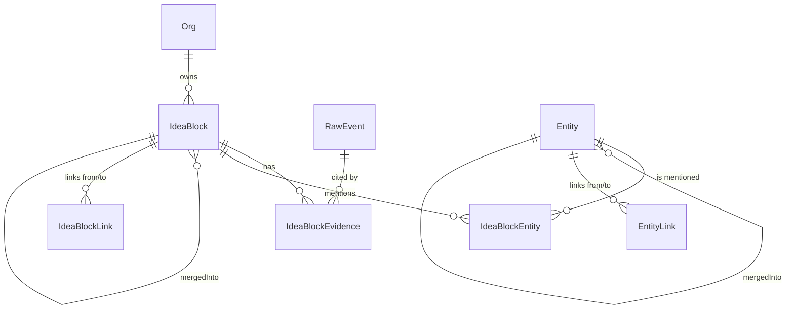

# Knowledge core

Единое информационное ядро Z: пайплайн `RawEvent → IdeaBlock` с дедупликацией
блоков и сущностей через KNN cosine + LLM-арбитр, поверх — гибридный поиск
(pgvector cosine + ts_vector BM25).

> Источник истины — этот документ + ТЗ `plans/tz/2026-05-10-knowledge-core-tz.md`.
> Бизнес-контекст и зачем оно — `01_projects/ingest-and-sources.md` (Фаза 1)
> и сам ТЗ (введение).

## Pipeline

```
RawEvent (Фаза 1)
   ↓ enqueue core.raw-events
block-ingest.worker
   ├─ SegmentBuilder      — разбивает payload на скользящие окна (≤2000 токенов)
   ├─ BlockExtraction     — LLM вызов с JSON Schema strict, taskType='block-ingest'
   ├─ KnowledgeEmbedding  — батч-эмбеддинг (text-embedding-3-small, 1536-dim)
   └─ persist             — Prisma transaction: IdeaBlock(draft) + Evidence + Entity (findOrCreate)
   ↓ enqueueBlockDistill (debounce 30s)
block-distill.worker
   ├─ BlockMerge.knnCandidates  — top-5 canonical того же tenant'а, cosine > 0.92
   ├─ BlockMerge.judgeMerge     — LLM 'block-distill', verdict ∈ {merge, distinct}
   └─ apply                     — либо canonical (новый), либо merged_into (перенос evidence/entity)
   ↓ enqueueBlockLinker  (Фаза 3 — block-linker.worker, см. ниже)
   ↓ enqueueEntityResolver (опц., on-event для отдельных Entity)
entity-resolver.worker (consumer core.entity-resolver, concurrency=1)
entity-resolver.cron     (раз в 5 мин — ищет пары и enqueue'ит)
   ├─ EntityMerge.findCandidates — KNN cosine top-5 entities того же type, > 0.88
   └─ EntityMerge.judgeMerge     — LLM 'entity-merge-arbiter', metadata + контекст 5 блоков
                                   → перенос IdeaBlockEntity на canonical (skip P2002)
   ↓
Search API (POST /api/v1/knowledge/search)
   └─ гибрид cosine (0.7) + BM25 (0.3) → top-10

──── Граф (Фаза 3) ────
block-linker.worker (consumer core.block-linker, concurrency=2)
   ├─ Гейт LINKER_MIN_BLOCKS=50 — пропускает Org с малым числом canonical
   ├─ BlockLink.findLinkCandidates — KNN top-10 canonical того же tenant'а
   ├─ BlockLink.judgeLink          — LLM 'block-linker', verdict ∈ 7 типов + 'none'
   └─ upsert IdeaBlockLink         — confidence >= LINK_MIN_CONFIDENCE (0.75)

entity-graph-builder.cron (раз в час)
   ├─ EntityGraph.findCoMentionedPairs — пары сущностей, упомянутые в одних блоках
   │                                     >= ENTITY_GRAPH_MIN_COMENTIONS (3)
   ├─ EntityGraph.judgeRelation        — LLM 'entity-graph-builder', 6 типов + 'none'
   └─ upsert EntityLink

reframing.cron (раз в сутки в 3:00)
   ├─ архивация слабых связей confidence<0.5 старше 7 дней (block + entity)
   ├─ dynamicScore decay — для canonical-блоков старше 90 дней
   │                       (`dynamicScore = max(0.1, dynamicScore - 0.1)`)
   └─ LLM 'reframing'    — анализ свежих блоков (>=10 за 7 дней):
                           splitCandidates, mergeCandidates, themeShifts (в лог)
```

### Идемпотентность и дебаунсы

- `block-ingest.worker` — jobId=`raw_<rawEventId>`. Пропускает
  `processingStatus !== 'received'`.
- `block-distill.worker` — jobId=`block_distill_<blockId>`, BullMQ delay
  обновляет окно 30s. Пропускает `status !== 'draft'`.
- `entity-resolver.worker` — jobId=`entity_resolver_<entityId>`. Пропускает
  `mergedIntoId !== null`.
- В каждом merge — re-load под транзакцией + проверка `mergedIntoId === null`,
  чтобы исключить race с параллельным merge.

## Хранение

Prisma-модели (см. `backend/prisma/schema.prisma`):

```
IdeaBlock {
  id, tenantId, name, criticalQuestion, trustedAnswer,
  tags[], signalType (enum 14 значений),
  confidence Decimal(4,3), dataClass, embedding vector(1536),
  status (draft | canonical | merged_into | archived),
  mergedIntoId? → IdeaBlock,
  evidenceCount, dynamicScore, createdAt, updatedAt,
  search_tsv tsvector  -- generated column (см. postgres-init.sql)
}

IdeaBlockEvidence { id, blockId → IdeaBlock, rawEventId → RawEvent,
                    sourceType, sourceTimestamp?, quote @Text, startMs?, endMs? }

Entity { id, tenantId, type (client | person | project | product | topic
                            | location | custom),
         canonicalName, aliases[], mergedIntoId? → Entity,
         mentionsCount, embedding vector(1536), metadata Json? }

IdeaBlockEntity { @@id(blockId, entityId), mentionContext @Text,
                  role (subject | object | mentioned) }

# ── Фаза 3 ──
IdeaBlockLink {
  id, tenantId, fromBlockId → IdeaBlock, toBlockId → IdeaBlock,
  relationType (develops | contradicts | causes | consequences_of |
                shares_topic | shares_entity | question_answered_by),
  confidence Decimal(4,3), explanation @Text,
  createdBy (linker | reframing | manual),
  status (active | archived),
  @@unique(fromBlockId, toBlockId, relationType)
}

EntityLink {
  id, tenantId, fromEntityId → Entity, toEntityId → Entity,
  relationType (works_at | belongs_to | part_of | opposes |
                depends_on | mentions_with),
  confidence Decimal(4,3), explanation @Text,
  createdBy, status,
  @@unique(fromEntityId, toEntityId, relationType)
}
```

ER-диаграмма (Mermaid):



### Postgres extras (НЕ в Prisma schema)

См. `backend/scripts/postgres-init.sql`:
- pgvector extension.
- HNSW индексы `IdeaBlock_embedding_hnsw_cosine_idx`,
  `Entity_embedding_hnsw_cosine_idx` (cosine ops).
- Generated column `IdeaBlock.search_tsv` =
  `setweight(name, 'A') || setweight(criticalQuestion, 'B') || setweight(trustedAnswer, 'C')`.
- GIN индекс `IdeaBlock_search_tsv_gin_idx`.

Применить: `bun run apply-postgres-init`.

## Search

`POST /api/v1/knowledge/search` — гибрид pgvector cosine + ts_vector BM25.

Request:
```ts
{ query: string,
  signalTypes?: SignalType[],
  entityIds?: string[],
  dateFrom?: Date,  // фильтр через IdeaBlockEvidence.sourceTimestamp
  dateTo?: Date,
  limit?: number   // default 10, max 50
}
```

Response:
```ts
{ results: Array<{
    block: { id, name, criticalQuestion, trustedAnswer, signalType, ... },
    evidence: Evidence[],   // top-3
    entities: Entity[],
    scores: { cosine, bm25, combined }
  }>,
  tookMs: number
}
```

Веса: `SEARCH_COSINE_WEIGHT=0.7`, `SEARCH_BM25_WEIGHT=0.3`. Reqs только
`status='canonical'` и `embedding IS NOT NULL` (для cosine).

Дополнительные эндпоинты:
- `GET /api/v1/knowledge/blocks/:id` — деталка блока + evidence + entities;
  если `merged_into` — следуем по `mergedIntoId` один шаг до canonical.
- `GET /api/v1/knowledge/blocks/:id/links` (Фаза 3) — outgoing + incoming
  IdeaBlockLink (только status=active), отсортировано по confidence desc.
- `GET /api/v1/knowledge/entities?type=&q=&limit=&offset=` — список с ILIKE
  по `canonicalName` + `aliases.has(q)`.
- `GET /api/v1/knowledge/entities/:id` — сущность + top-20 связанных
  canonical блоков.
- `GET /api/v1/knowledge/entities/:id/links` (Фаза 3) — outgoing + incoming
  EntityLink (status=active), сортировка по confidence.
- `GET /api/v1/knowledge/graph/neighbors?nodeType=block|entity&id=…&depth=1..3`
  (Фаза 3) — BFS-обход графа, depth до 3, лимит 100 nodes (`truncated=true`
  при превышении). Edges трёх типов: `block-link`, `entity-link`, `block-entity`
  (упоминание).

RBAC: новые resource type'ы `block` / `entity` в `policy.csv`. Все member'ы
Org (включая manager:strict) получают `read` — knowledge-core это shared
knowledge внутри Org, без per-user owner'а.

## LLM-инфра

`LlmRouterService` (Фаза 0) маршрутизирует через `LlmTaskRoute`. Семейства
задач knowledge-core:
- `block-ingest` — извлечение блоков из сегментов (JSON Schema strict).
- `block-distill` — арбитр merge / distinct (JSON Schema strict).
- `entity-merge-arbiter` — арбитр сущностей (JSON Schema strict, metadata +
  recentMentions[] контекст из IdeaBlockEntity).
- `block-linker` (Фаза 3) — типизированные связи блоков (7 типов + 'none').
- `entity-graph-builder` (Фаза 3) — связи сущностей (6 типов + 'none').
- `reframing` (Фаза 3) — ночной анализ свежих блоков (split/merge/themeShifts).
- `theme-classify` — Фаза 4.

Primary провайдер по политике 2026-05 — DeepSeek V4-flash. Fallback:
gpt-5.4-mini (через OpenAI proxy), Ollama qwen3:30b. Provider-цепочки задаются
через сидер `seed-llm-task-routes-knowledge-core.ts`.

## ENV

```
DISTILL_MERGE_THRESHOLD=0.92          # cosine threshold для merge кандидатов
DISTILL_DEBOUNCE_MS=30000             # дебаунс enqueueBlockDistill
DISTILL_KNN_TOP_K=5                   # сколько candidate'ов берём в LLM-judge
ENTITY_MERGE_THRESHOLD=0.88           # cosine threshold для entity-resolver
ENTITY_RESOLVER_CRON='*/5 * * * *'    # расписание сканирования пар сущностей
BLOCK_INGEST_WINDOW_SEGMENTS=5        # размер скользящего окна сегментов
BLOCK_INGEST_MAX_TOKENS_PER_SEGMENT=2000
SEARCH_COSINE_WEIGHT=0.7
SEARCH_BM25_WEIGHT=0.3

# Фаза 3
LINK_MIN_CONFIDENCE=0.75              # порог записи IdeaBlockLink / EntityLink
LINKER_MIN_BLOCKS=50                  # минимум canonical блоков в Org для линкера
LINK_KNN_TOP_K=10                     # сколько KNN-кандидатов на LLM в block-linker
REFRAMING_CRON='0 3 * * *'            # ночной reframing (3:00)
BLOCK_DYNAMIC_SCORE_DECAY_DAYS=90     # после скольких дней без updates падает score
ENTITY_GRAPH_BUILDER_CRON='0 * * * *' # entity-graph-builder — раз в час
ENTITY_GRAPH_MIN_COMENTIONS=3         # минимум co-mentions, чтобы пара попала в LLM
```

Все читаются через `cfg.knowledgeCore.*` в `TypedConfigService`.

## Что вне Фазы 3

- `Theme` + `theme-clusterer.worker` — Фаза 4.
- Tasks-2.0 / Chapters-2.0 / Summary-2.0 (агенты поверх блоков) — Фаза 5.
- chat-v2 — Фаза 6 (на Фазе 2 старый chat остаётся работать поверх
  `MeetingTranscriptChunk`).

## Бенчмарк / smoke

- `backend/scripts/smoke-knowledge-core-fase2.ts` — программный smoke
  (degraded-mode без LLM), проверяет создание/запросы IdeaBlock + Entity
  + Search SQL.
- `backend/scripts/benchmark-knowledge-core.ts` — печатает структурные
  метрики (count'ы IdeaBlock / Entity / Evidence + canonicalRatio).
- TODO baseline (golden-set, top-3 hit rate, сравнение с chunk-RAG) —
  `docs/benchmarks/knowledge-core-baseline.md`.

[[../index|← index]] · [[../01_projects/ingest-and-sources|Фаза 1: ingest]] ·
[[../01_projects/llm-router|LLM Router]]
