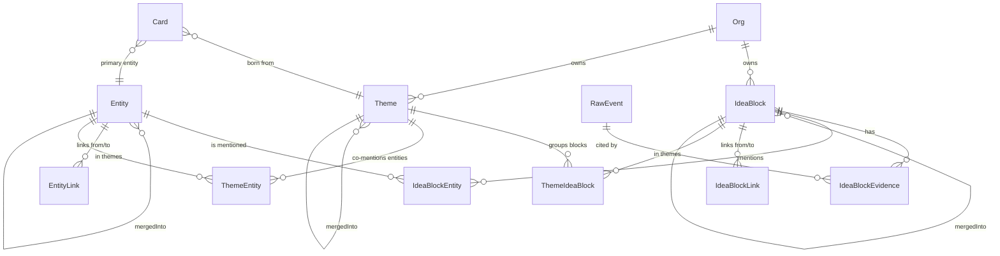

# Knowledge core

Единое информационное ядро Z: пайплайн `RawEvent → IdeaBlock` с дедупликацией
блоков и сущностей через KNN cosine + LLM-арбитр, поверх — гибридный поиск
(pgvector cosine + ts_vector BM25).

> Источник истины — этот документ + ТЗ `plans/archive/2026-05-10-knowledge-core-tz.md`.
> Бизнес-контекст и зачем оно — `01_projects/ingest-and-sources.md` (Фаза 1)
> и сам ТЗ (введение).

## Pipeline

```
RawEvent (Фаза 1)
   ↓ enqueue core.raw-events
block-ingest.worker
   ├─ SegmentBuilder      — разбивает payload на скользящие окна (≤2000 токенов)
   ├─ BlockExtraction     — LLM вызов с JSON Schema strict, taskType='block-ingest'
   ├─ KnowledgeEmbedding  — батч-эмбеддинг (text-embedding-3-small, 1536-dim)
   └─ persist             — Prisma transaction: IdeaBlock(draft) + Evidence + Entity (findOrCreate)
   ↓ enqueueBlockDistill (debounce 30s)
block-distill.worker
   ├─ BlockMerge.knnCandidates  — top-5 canonical того же tenant'а, cosine > 0.92
   ├─ BlockMerge.judgeMerge     — LLM 'block-distill', verdict ∈ {merge, distinct}
   └─ apply                     — либо canonical (новый), либо merged_into (перенос evidence/entity)
   ↓ enqueueBlockLinker  (Фаза 3 — block-linker.worker, см. ниже)
   ↓ enqueueEntityResolver (опц., on-event для отдельных Entity)
entity-resolver.worker (consumer core.entity-resolver, concurrency=1)
entity-resolver.cron     (раз в 5 мин — ищет пары и enqueue'ит)
   ├─ EntityMerge.findCandidates — KNN cosine top-5 entities того же type, > 0.88
   └─ EntityMerge.judgeMerge     — LLM 'entity-merge-arbiter', metadata + контекст 5 блоков
                                   → перенос IdeaBlockEntity на canonical (skip P2002)
   ↓
Search API (POST /api/v1/knowledge/search)
   └─ гибрид cosine (0.7) + BM25 (0.3) → top-10

──── Граф (Фаза 3) ────
block-linker.worker (consumer core.block-linker, concurrency=2)
   ├─ Гейт LINKER_MIN_BLOCKS=50 — пропускает Org с малым числом canonical
   ├─ BlockLink.findLinkCandidates — KNN top-10 canonical того же tenant'а
   ├─ BlockLink.judgeLink          — LLM 'block-linker', verdict ∈ 7 типов + 'none'
   └─ upsert IdeaBlockLink         — confidence >= LINK_MIN_CONFIDENCE (0.75)

entity-graph-builder.cron (раз в час)
   ├─ EntityGraph.findCoMentionedPairs — пары сущностей, упомянутые в одних блоках
   │                                     >= ENTITY_GRAPH_MIN_COMENTIONS (3)
   ├─ EntityGraph.judgeRelation        — LLM 'entity-graph-builder', 6 типов + 'none'
   └─ upsert EntityLink

reframing.cron (раз в сутки в 3:00)
   ├─ архивация слабых связей confidence<0.5 старше 7 дней (block + entity)
   ├─ dynamicScore decay — для canonical-блоков старше 90 дней
   │                       (`dynamicScore = max(0.1, dynamicScore - 0.1)`)
   ├─ LLM 'reframing'    — анализ свежих блоков (>=10 за 7 дней):
   │                       splitCandidates, mergeCandidates, themeShifts (в лог)
   └─ reflectOnThemes (Фаза 4) — split/merge/archive Theme'ов:
                                 themeMerges → перенос ThemeIdeaBlock/ThemeEntity на target;
                                 themesToArchive → status='archived';
                                 themeSplits → только лог-сигнал.

──── Темы (Фаза 4) ────
theme-clusterer.cron (каждый час в :15)
   ├─ Гейт THEME_CLUSTERING_MIN_BLOCKS=100 — пропускает Org с малым числом блоков
   ├─ Загрузка до 1000 canonical-блоков без ThemeIdeaBlock с embedding'ом
   ├─ ClusteringService.clusterByEmbedding (KNN-greedy union-find,
   │  threshold=0.78, minSize=3) → массив кластеров
   ├─ Top-10 entities по mentionsCount внутри кластера
   ├─ ThemeClassificationService.classifyTheme (LLM 'theme-classify',
   │  JSON Schema strict) → name/description/branch/tags/weight/confidence
   ├─ Embedding темы (`name + ' ' + description`)
   └─ Theme + ThemeIdeaBlock × N + ThemeEntity × M (skipDuplicates)

card-rollup-v2.worker (consumer core.card-rollup-v2, concurrency=2)
   ├─ Дебаунс 60s по jobId='card_rollup_v2_<cardId>'
   ├─ Источники блоков карточки:
   │    1) через meetings: RawEvent.sourceExternalId = meeting.id
   │    2) через сущности: IdeaBlockEntity.entityId IN (Card.entityId ∪ relatedEntityIds)
   ├─ Top-3 темы — `ThemeIdeaBlock` по подсчёту блоков в наборе карточки
   ├─ personSubjectIds — Person'ы с ролью subject в блоках-источниках (для γ-1 SkillProfile)
   ├─ LLM 'card-rollup-v2' (6 kind-промптов: client/deal/project/topic/vendor/custom)
   ├─ CurationService.triage(card) — auto / light / deep (SBA α-6)
   │    ├─ auto → CardVersion(changeReason='auto-rollup') + update Card
   │    │         (summaryCache + cachedTopThemeIds + sourceBlockIds + confidence
   │    │          + currentVersionId + personSubjectIds + lastConfirmedAt)
   │    └─ light/deep → CurationItem (Card не обновляется до approve)
   ├─ Conflict detection: regex «закрыт ↔ активен» → ConflictService.report
   └─ Specialist34ProbeService.checkAndEmitProbes(card) — 4 trigger'а

specialist-3-4-project-customer.worker (consumer core.specialist-routing, jobName='3-4-project-customer')
   ├─ Концепция SBA α-6 — эталонный референс §5 контракта зонтичного
   ├─ Триггер: блок canonical с signalType='fact' + упомянутый Customer/Vendor/Project entity
   ├─ Логика: блок → entities → Card'ы с этими entityIds → enqueueCardRollupV2 каждой
   └─ Сам не вызывает LLM и не пишет в Card — это card-rollup-v2.worker

   * Старый card-rollup.worker помечен @deprecated (SBA α-6) — удаление β/γ.

specialist-3-1-regulations.worker (consumer core.specialist-routing, jobName='3-1-regulations')
   ├─ SBA α-7 — Specialist 3.1 (Regulations) — закрывает Regulation/Process/Policy уровня Phase 0b
   ├─ Триггер: блок canonical с signalType ∈ {'regulation', 'process_step'}
   ├─ Specialist31Service.processRegulationBlock / processProcessStepBlock:
   │    1. LLM `regulation-extract` (JSON Schema strict) → draft {kind, name, statement, scope?, ownerHint?, severity?}
   │    2. KNN top-5 same-kind через cosine (fallback ILIKE) → KnnCandidate[]
   │    3. LLM-арбитр `regulation-dedupe` → {decision: 'new'|'merge'|'extension'|'contradicts', targetId?}
   │    4. Upsert в Process / Regulation / Policy (in-place расширение Phase 0b)
   │    5. CurationService.triage({resourceType: 'regulation'|'process'|'policy'}) — critical → всегда deep
   │    6. Если 'contradicts' → ConflictService.report({relationType:'contradicts'})
   │    7. Specialist31ProbeService.checkAndEmitProbesRegulation/Process/Policy — 4 trigger'а:
   │         · regulation.missing_owner (active без ownerPersonId)
   │         · regulation.process_no_steps (Process без ProcessStep)
   │         · regulation.stale (lastConfirmedAt > 6 мес + свежие блоки)
   │         · regulation.scope_unclear (Regulation/важная Policy без scope)
   │    8. Embedding записи (best-effort) через KnowledgeEmbeddingService + UPDATE ... SET embedding = $::vector
   ├─ Структурный компилятор `compile-org-document` (StructuredDocumentCompilerService.tryCompileContent):
   │    с 2026-06-17 вызывается НЕ только на merge/extension, но и на СОЗДАНИИ карточки (ветка 'new')
   │    для ВСЕХ 4 типов вкл. instruction (раньше у instruction не вызывался вообще). При успехе
   │    пишем compiled.contentMd (у process — в description) + снимок CardVersion v1 одной транзакцией
   │    (trustTier='auto', changeReason='create', previousVersionId=null). Fallback (kill-switch
   │    AdminSetting docCompilerEnabled OFF / ошибка LLM / пусто) → сырой draft.statement, CardVersion не пишется.
   └─ Параллельно живёт legacy block-ingest.worker (Phase 0b extraction) — не переписываем,
     обогащаем existing записи через merge-арбитра.

   * Починка модуля регламентов/процессов/инструкций (2026-06-20, ветка feature/regulations-process-fix):
     ├─ Гейт «чья норма» в Specialist31Service.extractDraft: экстракторы regulation-extract /
     │    process-template-extract несут ownerCompany (наша/клиент/гость/неизвестно — материализуется
     │    только «наша») + isKeepableOrgNorm/notabilityReason (демо-кнопки самой Коры / тривиальное /
     │    разовое → не норма) + явное дерево выбора kind. Гибридный приор «чья сторона»
     │    (resolveOwnerCompanyPrior по Person.relationship='external' без employee-субъекта) → skip
     │    not_our_org (в т.ч. при extractionStatus «нужен»/«обсуждается»); isKeepableOrgNorm=false →
     │    skip not_keepable. Порог материализации — дин. ключ aiFeatures.regulationMinMaterializeConfidence (0.6).
     ├─ Надёжность dedupeArbiter: явный maxTokens=2500 (против обрезки JSON) + один ретрай +
     │    fail-open (decision:'new' + метрика incCoreSpecialistExtractionFailure(reason:'dedupe_fallback_new'),
     │    БЕЗ очереди к человеку). extractDraft maxTokens=4096. Маршрут regulation-dedupe→deepseek-v4-pro.
     ├─ KNN_TOP_K → дин. ключ knowledgeCore.regulationDedupeTopK (fallback 12).
     ├─ upsertInstruction теперь проходит дедуп через арбитр (knnCandidates({table:'instruction'}) →
     │    dedupeArbiter → new/merge/extension), как регламенты.
     ├─ Процессы: каноничен ProcessTemplate от ProcessDetector — processProcessStepBlock при kind='process'
     │    БОЛЬШЕ НЕ создаёт Process-карточку (skip-метрика process_canonical_template); ветки переклассификации
     │    (regulation/policy/instruction) сохранены, router не тронут. regulations.getSummary отдаёт
     │    processTemplates (count активных ProcessTemplate); хаб /regulations вход «Процессы» → ProcessTemplatesClient.
     └─ Крон-консолидатор дублей ВНУТРИ типа: RegulationConsolidatorService + RegulationConsolidatorCronService
        (@Cron('*/30 * * * *'), per-Org × 4 типа) + RegulationConsolidatorWorker (очередь
        core.regulation-consolidator) — арбитр → CardVersion(changeReason:'consolidate') + deprecate loser.
        Защита: НЕ трогает карточку с currentVersion.trustTier='human'; negative-cache (Redis) +
        человеко-решение CurationDecision reject/split исключают пару навсегда. kill-switch
        aiFeatures.regulationConsolidatorEnabled (ON). См. [[../01_projects/workers-queues]], [[../01_projects/ai-jobs]].

specialist-3-2-knowledge-clone.worker (consumer core.specialist-routing, jobName='3-2-knowledge-clone')
   ├─ SBA β-2 — Specialist 3.2 (Knowledge Clone) — фундамент SkillProfile γ-1.
   ├─ Триггер: блок canonical с signalType ∈ {'fact', 'knowledge_gap'} И упомянут Person (relationship='employee')
   ├─ Логика: блок → entities{type=person} → Person.findMany(relationship='employee') →
   │     для каждого: coreQueue.enqueueRebuildKnowledgeProfile (debounce 60s через jobId
   │     `rebuild-knowledge-profile_<personId>`)
   └─ Сам не вызывает LLM и не пишет в Person — это knowledge-clone-rebuild.worker

knowledge-clone-rebuild.worker (consumer core.knowledge-clone-rebuild, concurrency=1)
   ├─ SBA β-2 — Specialist32Service.rebuildForPerson:
   │    1. Загрузить блоки Person'а через IdeaBlockEntity → Person.entityId (role∈['subject','mentioned'])
   │       за окно `cfg.knowledgeClone.lookbackMonths` (default 12); status='canonical'.
   │       ⤷ Если `Person.entityId=null` (нет авто-линковки) — `loadBlocksForPerson` больше НЕ молчит:
   │         `warn` + counter `knowledge_clone_person_no_entity_total{tenant}` + lazy-резолв через
   │         `resolveSubjectEntityId({authorPersonId})` и запись ОБОИХ полей композитного FK
   │         (`entityId`+`entityTenantId`); не разрешилось → `[]`. Backfill
   │         `backfill-knowledge-clone-person-entity.ts` (`--apply`, идемпотентен). (C1-#4)
   │    2. Если блоков < `minBlocksForProfile` (default 10) → skip.
   │    3. LLM `knowledge-clone-extract` (JSON Schema strict) → draft {categories[], experienceHighlights[]}.
   │    4. Если есть старый профиль → LLM `knowledge-clone-merge` (decay для категорий >6 мес без observation).
   │    5. Conflict detection (heuristic: «X не знает Y» vs «X знает Y» в одной категории) →
   │       ConflictService.report({relationType:'contradicts'}).
   │    6. CurationService.triage({resourceType:'knowledge_profile'}) — НЕ critical → auto-canonical при confidence≥0.85.
   │    7. На 'auto' → Person.update({knowledgeProfile, lastProfileBuildAt, profileBuildVersion++}).
   │    8. Specialist32ProbeService.checkAndEmitProbes — 2 trigger'а:
   │         · knowledge.new_expertise_detected (новая категория confidence='high')
   │         · knowledge.contradiction_detected (противоречие в одной категории)
   └─ Метрики: core_specialist_*{type='knowledge_profile'} + knowledge_clone_categories_per_profile / knowledge_clone_profile_size_kb.

knowledge-clone-rebuild.cron (`0 */6 * * *`)
   ├─ Для каждой Org находит employee-Person'ов с свежей активностью за неделю
   │  и `lastProfileBuildAt > 6 ч назад`.
   └─ enqueueRebuildKnowledgeProfile (delay=0).

specialist-3-3-decisions.worker (consumer core.specialist-routing, jobName='3-3-decisions')
   ├─ SBA β-3 — Specialist 3.3 (Decisions Registry) — главная сущность бизнеса.
   ├─ Триггер: блок canonical с signalType ∈ {'decision', 'rationale', 'decision_basis'}.
   ├─ Логика (Specialist33Service.processBlock):
   │    1. Загрузить блок + evidence + контекст ±2 минуты той же RawEvent (для извлечения rationale из reasoning-блоков).
   │    2. LLM `decision-extract` (JSON Schema strict) → draft {statement, rationale, alternatives,
   │       decidedByPersonHints, affectsEntityHints, decidedAt?, deadline?, status, confidence}.
   │    3. Резолв decidedByPersonIds (name-match по Person.name, приоритет employee; fallback — subject-Person'ы блока).
   │    4. Резолв affectsEntityIds (EntityResolutionService.findOrCreate для customer/project/product/vendor;
   │       process — skip, не Entity).
   │    5. KNN cosine top-5 по embedding (fallback ILIKE по statement/text) — Decision того же tenant,
   │       status NOT IN ('rejected','cancelled','superseded').
   │    6. LLM `decision-supersede-detect` (JSON Schema strict) → verdict {new|merge|supersedes, targetId?, evolvingMeta?}.
   │    7. Apply:
   │         · new — create новый Decision.
   │         · merge — update existing (alternatives merge case-insensitive, sourceBlockIds/decidedByPersonIds/
   │           affectsEntityIds union; rationale append-only).
   │         · supersedes — create новый с supersedesId+validFrom; старый помечается superseded+validUntil;
   │           ConflictService.report(resourceType='decision', relationType='supersedes',
   │           evidence.suggestedResolution='evolving', evidence.evolvingMeta).
   │           observeDecisionSupersedeChainLength.
   │    8. Embedding (best-effort raw SQL UPDATE).
   │    9. CurationService.triage(resourceType='decision') — decision в CURATION_CRITICAL_TYPES_DEFAULT →
   │       ВСЕГДА deep review.
   │   10. Specialist33ProbeService.checkAndEmitForDecision — 2 синхронных probe-trigger'а:
   │         · decision.missing_decider (decidedByPersonIds=[] AND status=approved)
   │         · decision.no_deadline_critical (approved + null deadline + блок с тегом 'critical')
   └─ Метрики: core_specialist_*{type='decision'} + core_specialist_conflict_evolving_total{type='decision'} +
     decision_supersede_chain_length (histogram).

specialist-3-3-probe.cron (`0 5 * * *` — Specialist33ProbeService.runDailyChecks)
   ├─ Для каждой Org проверяет:
   │    · decision.overdue — deadline < now AND status ∉ {implemented, cancelled, rejected, superseded}.
   │    · decision.outcome_unknown — status='implemented' AND actualOutcomes=null AND decidedAt < now − 3 мес.
   ├─ Лимит — 100 Decision на Org за проход (защита от взрывного fan-out'а).
   └─ Probe через ConversationalService.sendNotification(eventType='specialist.probe', dataClass='sensitive').

specialist-3-5-insights.worker (consumer core.specialist-routing, jobName='3-5-insights')
   ├─ SBA β-4 — Specialist 3.5 (Insights Radar) — повторяющиеся проблемы / риски / блокеры / неэффективности.
   ├─ Триггер: блок canonical с signalType ∈ {'pain', 'risk', 'churn_risk', 'objection'}.
   ├─ Логика (Specialist35Service.processBlock):
   │    1. Загрузить блок + evidence.
   │    2. Считать embedding query из name + trustedAnswer.
   │    3. KNN cosine top-10 поверх insights.embedding (порог INSIGHT_CLUSTER_THRESHOLD=0.78).
   │    4. Match → updateExistingInsight(sourceBlockIds.push, lastObservedAt) + recalcMetrics
   │       (frequency/dynamic + probe escalation_suggested / recurring_after_mitigation).
   │    5. Нет match → LLM `insight-extract` (JSON Schema strict) → draft {kind, statement,
   │       severity, affectedEntityHints, mitigationSuggestion?, confidence}.
   │    6. Резолв affectedEntityIds (EntityResolutionService.findOrCreate для customer/project/product/vendor;
   │       process — skip).
   │    7. Резолв personSubjectIds (subject-Person через IdeaBlockEntity).
   │    8. createInsight (dataClass = max(block.dataClass, 'internal')).
   │    9. Embedding (best-effort raw SQL UPDATE).
   │   10. LLM `insight-link-to-decisions` (опц.) — top-10 KNN-Decision того же Org, отбор тех,
   │       что могли спровоцировать сигнал. Валидация: id ∈ candidate-список.
   │   11. Дополнительно — Decision'ы из IdeaBlockLink.relationType='consequences_of'
   │       (для блоков-источников Insight'а).
   │   12. Triage: severity='critical' → confidence сбрасывается до 0.3 (форс deep review);
   │       иначе — обычный triage (insight НЕ в CURATION_CRITICAL_TYPES_DEFAULT).
   │   13. Probe-events:
   │         · insight.linked_decision_question (если LLM нашёл candidate Decision'ы).
   │         · insight.escalation_suggested (если новый dynamicLabel='spike').
   └─ Метрики: core_specialist_*{type='insight'}.

insight-clusterer.cron (`0 *‎/6 * * *` — InsightClustererCron.sweep)
   ├─ Для каждой Org → recalcMetrics на всех active/mitigating Insight'ах (batch 500).
   │    · count7d / count30d / avgWeekly30d / ratio.
   │    · dynamicLabel: ratio > INSIGHT_SPIKE_RATIO (3.0) → spike; > 1.3 → growing;
   │      < 0.5 → declining; иначе stable.
   │    · frequencyScore = min(1, count30d / totalOrg30d).
   │    · При переходе в spike (новый ≠ старый) → probe insight.escalation_suggested.
   ├─ Specialist35ProbeService.checkNoMitigationPlanForOrg — для всех Insight'ов
   │  severity ∈ {high, critical} AND mitigationPlan=null AND firstObservedAt < now-7д
   │  AND status=active — probe insight.no_mitigation_plan admin'ам.
   └─ Обновление gauge insights_dynamic_label_count{label} (groupBy на active/mitigating).

specialist-3-15-tasks.worker (consumer core.specialist-routing, jobName='3-15-tasks') — ТЗ unified-task-extraction Ф1 (2026-06-23)
   ├─ Триггер: блок canonical с signalType='action_item' И источник НЕ meeting/meeting_report
   │           (встречи извлекает meeting-extract-actions; гард + source-block guard на ретрае).
   ├─ Specialist315TasksService.processBlock:
   │    1. LLM `task-extract` (стабильный SYSTEM, json_schema strict, injection guard) → draft задачи.
   │    2. Гейт уверенности `tracker.taskExtractMinConfidence` (0.45) — ниже = «не задача», skip.
   │    3. Исполнитель — единый `tracker/AssigneeResolverService.resolve` (текстовые каналы; probe org-owner при not_found).
   │    4. LINK-семантика дедупа (kill-switch tracker.taskDedupLinkSemantics): дедуп против ОТКРЫТЫХ Issue
   │       (TaskDedupService.evaluate + task-dedup-matcher.util, серая зона tracker.taskDedupGrayBand) — вне лока.
   │    5. Конкурентный guard: pg_advisory_xact_lock(tenantId+normTitle) вокруг evaluate→create + in-lock
   │       exact-title re-check против Issue + pending-IntakeIssue (LLM вне лока).
   │    6. 'same' → источник линкуется к Issue через TaskSource{issueId} БЕЗ дубль-Issue; иначе → IntakeIssue
   │       → IntakeAutoTriageQueue (промоут в Issue существующим триажом).
   ├─ Kill-switch tracker.taskExtractionMode (spine|legacy, ON=spine; legacy = аварийный откат на старые
   │  кустарные пути извлечения, в т.ч. chatbox task-extraction).
   └─ Метрики: core_specialist_*{type='task'}.

specialist-3-6-ideas.worker (consumer core.specialist-routing, jobName='3-6-ideas') — SBA β-5
   ├─ idea | feature_request блоки.
   ├─ Specialist36Service.processBlock:
   │    1. Загрузить block + evidence.
   │    2. KNN cosine top-10 existing Idea (threshold IDEA_CLUSTER_THRESHOLD=0.80).
   │    3. Match → updateExistingIdea (supporters add, sourceBlockIds.push, weight recompute).
   │    4. Miss → LLM idea-extract → resolveSupportersAndOwner (employee Person для internal;
   │       mentioned Customer Entity для client_request).
   │    5. Compute weight: supporterCount + recency_factor + specificity_factor.
   │    6. createIdea (status='captured').
   │    7. tryWriteEmbedding + CurationService.triage.
   │    8. EventEmitter 'idea.created' + enqueueIdeaClusterer.

idea-clusterer.cron (`30 *‎/4 * * *` — IdeaClustererCron.sweep) — SBA β-5
   ├─ Для каждой Org → Idea без clusterId (batch 100).
   ├─ KNN cosine attach к существующему IdeaCluster (threshold 0.80) — recompute clusterWeight.
   └─ На критической массе (IDEA_MIN_SUPPORTERS_FOR_CLUSTER=2) → LLM idea-cluster-merge →
      verdict 'add_to_existing' | 'new_cluster' | 'standalone' → создание/привязка кластера.

probe-dispatcher.worker (consumer core.probe-events) — SBA β-5 Layer 6
   ├─ ProbeService.suggest(...) — единая входная точка для специалистов Слоя 3:
   │    1. contentHash = sha256(reason + sorted contextIds + message).
   │    2. Redis dedup SET NX EX (TTL=PROBE_DEDUP_TTL_HOURS=72ч).
   │    3. Per-user rate-limit (часовой 5 + суточный 20).
   │    4. Cold-start mode crook.
   │    5. priority = severity_weight × 100.
   │    6. INSERT ProbeEvent(status='pending') + enqueue core.probe-events.
   ├─ Dispatcher:
   │    1. Re-check rate-limit.
   │    2. Round-robin select recipient.
   │    3. LLM probe-formulate → {question, options}.
   │       Fallback: payload.suggestedQuestion/message + suggestedActions.
   │    4. ConversationalService.sendNotification(eventType='probe.question').
   │    5. INC rate-limit counters; ProbeEvent.status='dispatched'.

probe-priority.cron (`*/15 * * * *` — ProbePriorityCron.sweep) — SBA β-5
   ├─ updateMany ProbeEvent SET status='expired' WHERE expiresAt < now AND status='pending'.
   └─ Per-user engagement_rate gauge: probe_recipient_engagement_rate{user_id}.

ideas-closing-loop (IdeasClosingLoopHandler — @OnEvent 'idea.status_changed') — SBA β-5
   ├─ LLM idea-status-summarize → {title, body}.
   ├─ Для каждого supporter: person → User.id через Person.userId; customer → admin fallback.
   ├─ ConversationalService.sendNotification(eventType='idea.status_changed').
   └─ INC idea_status_change_notifications_total{new_status}.
```

### Идемпотентность и дебаунсы

- `block-ingest.worker` — jobId=`raw_<rawEventId>`. Пропускает
  `processingStatus !== 'received'`.
- `block-distill.worker` — jobId=`block_distill_<blockId>`, BullMQ delay
  обновляет окно 30s. Пропускает `status !== 'draft'`.
- `entity-resolver.worker` — jobId=`entity_resolver_<entityId>`. Пропускает
  `mergedIntoId !== null`.
- В каждом merge — re-load под транзакцией + проверка `mergedIntoId === null`,
  чтобы исключить race с параллельным merge.

### Целостность Person↔Entity при мерже (Пакет A, 2026-07-02)

Инвариант: *«id составного ключа никогда не пишется без tenant-компаньона; человек не сливается автоматически; мерж мигрирует ВСЕ ссылки на сущность; читатель по entityId устойчив к merged-away»*.

- **Companion-инвариант.** Составные FK `Person.entity [entityId, entityTenantId]`, `Entity.mergedInto [mergedIntoId, mergedIntoTenantId]`, `IdeaBlock.mergedInto [mergedIntoId, mergedIntoTenantId]` пишутся ТОЛЬКО через хелперы `setPersonEntity` / `markEntityMerged` / `markBlockMerged` ([entity-companion.helpers.ts](../../backend/src/modules/knowledge-core/services/entity-companion.helpers.ts)) — id без tenant-компаньона написать нельзя (иначе relation тихо рвётся в null).
- **Единый мержер `EntityMergeService.mergeEntities(from,into)`** — один путь для ручного endpoint'а и авто-worker'а (`entity-resolver.worker.applyMerge` теперь зовёт его, а не свою урезанную копию). В одной транзакции мигрирует ВСЕ ссылки: `IdeaBlockEntity`, `EntityLink` (in/out, полиморфно с учётом fromType/toType), `SourceEntity`, `ThemeEntity`, `Card.entityId`+`relatedEntityIds[]`, `Person.entityId`(+companion) — переиспользуемый `migrateEntityRefs`; затем flatten 2-хоп цепочки + обновление `into` (mentionsCount/aliases) + `markEntityMerged`. Типизированные 1:1-сабрекорды (vendor/customer/…) вне scope миграции → `warn` (видимый over-merge, не тихий сирота).
- **Person вне авто-мержа.** `entity-resolver.cron.findCandidatePairs` исключает `type='person'` — идентичности людей сливает только ручной путь (человек подтверждает). Снимает клон-коллапс (S-C3) у источника.
- **Read-side транзитивный canonicalize.** Читатели по `entityId` следуют за `mergedIntoId` к канону (`canonicalizeEntityId`/`canonicalizeEntityIds`, cap 16 hops + cycle-guard): `loadBlocksForPerson`, `knowledge-clone-rebuild.cron`, `narrowByContextEntities`. Belt поверх write-side re-point.
- **F-1.** `resolvePersonByEmbedding` чинён: `FROM "Person"` → `persons` (@@map); тихий `catch→[]` теперь логирует warn.
- **Прод-лечение (idempotent):** `backfill-entity-tenant-companions` (заполнить NULL-компаньоны) + `backfill-reconcile-merged-entity-refs` (перепривязать осиротевшие ссылки на уже-слитые к канону через тот же `migrateEntityRefs`). ТЗ [`plans/tz/2026-07-01-package-a-person-entity-integrity.md`](../../plans/tz/2026-07-01-package-a-person-entity-integrity.md).

### Диагностика сбоя: AGE vs LLM-extract (F7, 2026-06-22)

`block-ingest.worker` теперь разводит throw-текст по реальному источнику отказа: провал LLM-извлечения → `llm_extraction`, недоступность графовой базы Apache AGE → `age_unavailable`. Раньше текст «системный отказ графа AGE» кидался и при провале LLM — диагностика ложно винила AGE; метрика `age_unavailable` теперь растёт только при реальном сбое AGE. ТЗ [`meeting-to-tracker-and-models-unified-fix`](../../plans/tz/2026-06-22-meeting-to-tracker-and-models-unified-fix.md) F7.

## Хранение

Prisma-модели (см. `backend/prisma/schema.prisma`):

```
IdeaBlock {
  id, tenantId, name, criticalQuestion, trustedAnswer,
  tags[], signalType (enum 19 значений — см. ниже),
  confidence Decimal(4,3), dataClass, embedding vector(1536),
  status (draft | canonical | merged_into | archived),
  mergedIntoId? → IdeaBlock,
  evidenceCount, dynamicScore, createdAt, updatedAt,
  search_tsv tsvector  -- generated column (см. postgres-init.sql)
}

IdeaBlockEvidence { id, blockId → IdeaBlock, rawEventId → RawEvent,
                    sourceType, sourceTimestamp?, quote @Text, startMs?, endMs? }

Entity { id, tenantId, type (client | person | project | product | topic
                            | location | custom),
         canonicalName, aliases[], mergedIntoId? → Entity,
         mentionsCount, embedding vector(1536), metadata Json? }

IdeaBlockEntity { @@id(blockId, entityId), mentionContext @Text,
                  role (subject | object | mentioned) }

# ── Фаза 3 ──
IdeaBlockLink {
  id, tenantId, fromBlockId → IdeaBlock, toBlockId → IdeaBlock,
  relationType (develops | contradicts | causes | consequences_of |
                shares_topic | shares_entity | question_answered_by),
  confidence Decimal(4,3), explanation @Text,
  createdBy (linker | reframing | manual | system),
  status (active | archived),
  @@unique(fromBlockId, toBlockId, relationType)
}

EntityLink {
  id, tenantId, fromEntityId → Entity, toEntityId → Entity,
  relationType (works_at | belongs_to | part_of | opposes |
                depends_on | mentions_with),
  confidence Decimal(4,3), explanation @Text,
  createdBy, status,
  @@unique(fromEntityId, toEntityId, relationType)
}

# ── Фаза 4 ──
Theme {
  id, tenantId, name, description @Text,
  weight Decimal(4,3) default 0.500,
  dynamic (growing | stable | declining) default 'stable',
  confidence Decimal(4,3) default 0.500,
  status (active | archived | merged_into),
  mergedIntoId? → Theme,
  branch? (strategy | clients | sales | marketing | product | operations |
           team | finance | technology | production | partnerships | legal),
  embedding vector(1536),
  lastSignalAt?, createdAt, updatedAt
}

ThemeIdeaBlock { @@id(themeId, blockId), weight Decimal(4,3) default 1.000 }
ThemeEntity    { @@id(themeId, entityId), mentionsCount Int default 0 }

# Card расширения (Фаза 4):
Card.entityId? → Entity            # primary-сущность
Card.relatedEntityIds[] String     # дополнительные сущности
Card.bornFromThemeId? → Theme      # при сохранении темы как карточки
Card.cachedTopThemeIds[] String    # кэш топ-3 связанных тем (card-rollup-v2)

# SBA α-2 (2026-05-22) — расширение Layer 1 разметки.
# Enum SignalType — добавлено 5 значений (всего 19):
#   reasoning      — обоснование «почему сделано так» (главный источник для SkillProfile γ-1)
#   rationale      — структурированное обоснование, привязанное к decision
#   decision_basis — фрагмент обоснования внутри блока-decision (узкий случай)
#   regulation     — фрагмент нормативного утверждения/регламента (источник для Specialist 3.1)
#   process_step   — шаг процесса (источник для Specialist 3.1)
# BlockExtractionService JSON Schema strict обновлён автоматически через SIGNAL_TYPE_VALUES.
# Промпт block-ingest расширен фразами-маркерами; TODO согласовать финальный текст
# с владельцем продукта (см. зонтичный SBA §10).
#
# Unified-task-extraction Ф1 (2026-06-23, миграция add_signaltype_action_item):
#   action_item — поручение/задача из НЕ-meeting-канала (chatbox/telegram/tracker/email/api);
#                 роутится в специалист 3-15-tasks → LLM task-extract → IntakeIssue (см. RouterService ниже).
```

ER-диаграмма (Mermaid):



### Postgres extras (НЕ в Prisma schema)

См. `backend/scripts/postgres-init.sql`:
- pgvector extension.
- HNSW индексы `IdeaBlock_embedding_hnsw_cosine_idx`,
  `Entity_embedding_hnsw_cosine_idx` (cosine ops).
- Generated column `IdeaBlock.search_tsv` =
  `setweight(name, 'A') || setweight(criticalQuestion, 'B') || setweight(trustedAnswer, 'C')`.
- GIN индекс `IdeaBlock_search_tsv_gin_idx`.

Применить: `bun run apply-postgres-init`.

## Search

`POST /api/v1/knowledge/search` — гибрид pgvector cosine + ts_vector BM25.

Request:
```ts
{ query: string,
  signalTypes?: SignalType[],
  entityIds?: string[],
  dateFrom?: Date,  // фильтр через IdeaBlockEvidence.sourceTimestamp
  dateTo?: Date,
  limit?: number   // default 10, max 50
}
```

Response:
```ts
{ results: Array<{
    block: { id, name, criticalQuestion, trustedAnswer, signalType, ... },
    evidence: Evidence[],   // top-3
    entities: Entity[],
    scores: { cosine, bm25, combined }
  }>,
  tookMs: number
}
```

Веса: `SEARCH_COSINE_WEIGHT=0.7`, `SEARCH_BM25_WEIGHT=0.3`. Reqs только
`status='canonical'` и `embedding IS NOT NULL` (для cosine).

### Структурный фильтр retrieval в chat-v2 (Query Understanding Волна 1, 2026-06-10)

**Источник:** [`plans/tz/2026-06-10-query-understanding-tier0-tier1.md`](../../plans/tz/2026-06-10-query-understanding-tier0-tier1.md) (Tier 0+1). Карта фичи — [[../01_projects/chat-v2]] §«Query Understanding Волна 1».

chat-v2 retrieval теперь умеет применять **recall-safe структурные фильтры** (дата по `IdeaBlockEvidence.sourceTimestamp` / `signalType` / entity / `themeBranch` через `ThemeIdeaBlock`+`Theme.branch` / bitemporal `validUntil IS NULL`) поверх смыслового сходства. Источник структуры — `QueryPlanExtractorService` (dialog-layer): один LLM-вызов `dialog-extract-plan` извлекает план запроса, период резолвится детерминированно (без date-библиотек), fail-open на любой ошибке. При наличии хотя бы одного фильтра `ChatV2RetrievalService.rankByStructuralFilter` делает **полный точный скан** WHERE-фильтрованного пула с `ORDER BY` вычисляемого cosine-score — НЕ HNSW-проба `embedding<=>qvec LIMIT` (та роняет recall на узком окне). Без фильтров путь прежний (без регрессии); пустой фильтрованный пул → честное «по заданным условиям ничего не нашлось» без LLM-синтеза. Kill-switch `QUERY_PLAN_EXTRACTION_ENABLED` (ON).

### Перестройка ингеста + умный поэтапный поиск (граф знаний v2, 2026-06-24)

Две связанные фичи: (А) перестройка ингеста — граф собирается точнее и связнее; (Б) умный поэтапный поиск Мастера (Concierge / Chat-v2) — ответ строится в несколько шагов с проверкой честности.

#### А. Граф знаний — перестройка ингеста

- **Эпизод-узел (`sourceTitle`).** `RawEvent` получил человекочитаемый заголовок эпизода (например «Созвон с клиентом, 2026-06-20») — заполняется meeting/report-адаптерами через `ingest/adapters/episode-title.util.ts`. Нужен, чтобы поиск группировал результаты по эпизоду и показывал понятный источник.
- **Провенанс-инвариант (machine-guard).** Блок без непустой evidence-цитаты **НЕ пишется** — `persistBlock` в `block-ingest.worker` режет блоки-«призраки» без подтверждения цитатой; метрика `kc_block_without_evidence_total`. Усиливает правило «нет цитаты — нет факта».
- **Контекст чанка перед извлечением.** В промпт `block-ingest` теперь подаются дата / тип / участники встречи (в USER, prompt-cache сохранён — стабильный SYSTEM не тронут); инвариант **R13** — многосторонний факт (автор + адресат + срок) не схлопывать в один обезличенный блок. Нарезка под-чанков: размер `knowledge.segment_max_tokens` (600) + overlap `knowledge.segment_overlap_ratio` (0.2).
- **`ChunkContextService`** (`services/chunk-context.service.ts`) — контекст-заголовок перед эмбеддингом блока (поднимает recall на узких запросах): детерминированная метастрока добавляется **всегда** + LLM-предложение заголовка за kill-switch `knowledge.contextual_header_enabled` (taskType `chunk-context`). Метод `embedBlocks(blocks, contextHeader)`.
- **«Суть встречи» как retrievable holistic-блок.** Для отчёта создаётся отдельный блок `signalType=fact` из `reportSummaryMarkdown`, освобождённый от report-confidence-cap (флаг `isMeetingSummary`) — служит parent-document'ом для поиска (запрос «о чём была встреча» находит сводку, а не осколок).
- **Cross-source идентичность (`EntityAlias`).** Новая таблица — per-Org кэш «псевдоним → Person/Entity». Каскад `resolvePersonByHint`: exact → alias-cache → fuzzy → эмбеддинг-склейка (порог `knowledge.entity_name_resolve_threshold` 0.9) → LLM-арбитр (taskType `entity-name-resolve`) → **fail-closed null** (инвариант **R-2**: разных людей не склеиваем — при сомнении не сливаем).
- **Гибрид рёбер графа.** Структурные рёбра без LLM: `shares_entity` (на ingest, `createdBy=system`) и `shares_topic` (при кластеризации тем). Смысловые рёбра `block-linker` с риск-тирингом (`knowledge.edge_confidence_high` 0.85 / `edge_confidence_low` 0.6, `linker_min_canonical`, `linker_candidate_topk`) и **композитным судьёй-скептиком** для опасных типов `contradicts` / `supersedes` / `causes` (taskType `block-link-confirm`, **fail-closed** — при сомнении ребро отвергаем; метрика `kc_risk_edge_total`). Fact-supersede тоже под скептиком (инвариант **R-1**: ложное «устарело» не должно прятать живой факт). enum `LinkCreatedBy` получил значение `system`.
- **Темы — авто-резюме.** `Theme.summary` / `summaryUpdatedAt` + cron `theme-summarize` (`workers/theme-summarize.cron.ts`, `@Cron`, taskType `theme-summarize`, kill-switch `knowledge.theme_summary_enabled`) — пересчитывает резюме **инкрементально**, только для изменившихся тем.
- **bi-temporal включён (Ship-On).** Флаги `BITEMPORAL_ENABLED` / `BITEMPORAL_SUPERSEDE_ENABLED` / `BI_TEMPORAL_EDGES_ENABLED` = `true` — устаревшие версии фактов имеют `validUntil != NULL` и скрыты из выдачи.

#### Поиск с обходом рёбер + RRF (`search.service`)

После гибридного входа (cosine + BM25) поиск делает **1-hop обход рёбер** графа (`knowledge.search_expand_hops`) → **RRF-слияние** результатов (Reciprocal Rank Fusion — слияние рангов нескольких списков, утилита `knowledge-core/utils/rank-fusion.util.ts`, параметр `knowledge.search_rrf_k`) → **группировку по эпизоду**. Superseded-блоки скрыты (bi-temporal `validUntil IS NULL`). Это поднимает связность ответа: вопрос находит не только прямое совпадение, но и соседние по графу блоки.

#### Б. Умный поэтапный поиск Мастера — ⚠️ ЗАМЕНЁН single-pass (2026-06-25, «Единый помощник»)

> **Описанная ниже многошаговая ветка изъята из горячего пути chat-v2** при упрощении ассистента — см. §«Единый помощник» ниже. Текст оставлен как историческая справка о методе; промпты `RAG_ROUTE`/`RAG_PLAN`/`RAG_SUFFICIENCY` законсервированы как exports для будущей фичи «Большой анализ» ([`plans/analysis/2026-06-25-iterative-rag-method-parked.md`](../../plans/analysis/2026-06-25-iterative-rag-method-parked.md)).

Многошаговая ветка ответа (была за гейтом `rag.iterative_enabled` + cold-start `rag.cold_start_min_blocks`, **fail-open до одношагового**):

1. **Роутер сложности** (`rag-route`) — простой вопрос коротким путём, сложный — поэтапным.
2. **ReWOO-план** (`rag-plan`) — раскладывал сложный вопрос на под-вопросы заранее (Reasoning WithOut Observation).
3. **Пошаговый retrieval с судьёй достаточности** (`rag-sufficiency`) — после каждого шага судья решал, хватает ли собранного.
4. RRF-слияние подзапросов + условный LLM-реранк (`rag-rerank`).
5. Синтез → гейт честности (`rag-groundedness`).

#### Б′. Единый помощник: single-pass Мастер + chat-v2 (4 вызова) — 2026-06-25

ТЗ [`plans/tz/2026-06-25-edinyy-pomoshnik-arhitektura.md`](../../plans/tz/2026-06-25-edinyy-pomoshnik-arhitektura.md) (Ф2–Ф6). Профили — [[../01_projects/concierge-agent]] / [[../01_projects/chat-v2]] / [[../01_projects/ai-jobs]]. Убраны обе петли (ReAct Мастера + route/plan/sufficiency внутри chat-v2).

**Мастер (`concierge.service.ts`) — single-pass, без ReAct-петли.** Удалены `for i<maxSteps`, loop-guard, `buildPartialAnswer`, сырой JSON-дамп (корень прод-бага), крутилки `concierge.max_steps` / `rag.loop_guard_threshold`. Поток:
- **Слой 1 (детерм. перехват ДО LLM):** открытый probe → probe-handler; pending confirm → выполнить/отменить; **pending clarify → вернуть реплику в исходный вопрос chat-v2** (`isClarifyPending(history)` → `resumeClarify` → `askEphemeral`); ждём чек-ин → handler. Канальный Слой-1: Redis-ключ `concierge:clarify:<bindingId>` (bridge ставит/снимает; telegram+max адаптеры читают первым → форсят `assistant_turn`).
- **Слой 2 (один LLM-вызов `concierge-respond`):** диспетчер → `answer | action{tool,args} | note | checkin_self`.
- **Слой 3 (один проход):** `answer` → chat-v2 `askEphemeral` **в процессе** (история+summary треда Мастера), ответ **слово-в-слово** (passthrough — правило для всего `answer`-пути, чтобы не порвать `[BLOCK:id]` и не вернуть выдумку); `action` → один инструмент (мутация → confirm) + один **render-вызов** (отдельный `CONCIERGE_RENDER_SYSTEM_PROMPT`, без JSON-утечки); `note` → ingest; `checkin_self` → DailyCheckIn.

**chat-v2 (`chat-v2.service.ts`) — движок-ответчик single-pass, 4 LLM-вызова, memoryless.** Тред один и принадлежит Мастеру; `askEphemeral({history,summary,intent,scope?,scopeRefId?})` — без своей `ChatV2Conversation`. Цепочка:
1. **Понимание** (`dialog-understand`, DeepSeek pro) — `dialog-multi-query` + `dialog-extract-plan` СЛИТЫ в один вызов (3 переформулировки + фильтры дата/сущность/тип + флаг `aggregation`); kill-switch `rag.understanding_merged` (ON; OFF → два прежних вызова). `AskInput.intent` пропускает `dialog-classify`.
2. **Поиск+RRF** — на каждую формулировку кандидаты (вектор+граф), слияние RRF; счёт «сколько» — настоящим COUNT/табличной веткой.
3. **Переранжировщик** (`rag-rerank`, DeepSeek flash) — ОЖИВЛЁН: `topK` разнесён на `rag.k_retrieve` (30) / `rag.k_context` (18), реранк работает всегда когда пул > `rag.rerank_min_pool` (12), сужает 30→18; кормится summary+история+вопрос+3 формулировки (раньше видел голый вопрос, был мёртв при срезе 12).
4. **Синтез** (`chat-v2`, DeepSeek pro) — ответ из 18 блоков; переспрос-при-вариантах помечает первую строку токеном `[[CLARIFY]]` → `needsClarification` течёт `ChatV2Output→SynthesisResult→ChatAnswer→контроллер/SSE`.
5. **Контролёр заземления** (`rag-groundedness`, DeepSeek flash, режим `rag.groundedness_mode`) — анти-выдумка; при `needsClarification` **пропускается**, и оркестратор НЕ кэширует переспрос (`applyGroundednessGate` / `answerCache.set` обходятся).

Модели по агентам — через `LlmTaskRoute` (сид `seed-llm-task-routes-edinyy-pomoshnik.ts`, diag `diag-llm-routes.ts`), не код. Промпты — `knowledge-core/prompts/rag-pipeline.prompts.ts`.

Дополнительные эндпоинты:
- `GET /api/v1/knowledge/blocks/:id` — деталка блока + evidence + entities;
  если `merged_into` — следуем по `mergedIntoId` один шаг до canonical.
- `GET /api/v1/knowledge/blocks/:id/links` (Фаза 3) — outgoing + incoming
  IdeaBlockLink (только status=active), отсортировано по confidence desc.
- `GET /api/v1/knowledge/entities?type=&q=&limit=&offset=` — список с ILIKE
  по `canonicalName` + `aliases.has(q)`.
- `GET /api/v1/knowledge/entities/:id` — сущность + top-20 связанных
  canonical блоков.
- `GET /api/v1/knowledge/entities/:id/links` (Фаза 3) — outgoing + incoming
  EntityLink (status=active), сортировка по confidence.
- `GET /api/v1/knowledge/graph/neighbors?nodeType=block|entity&id=…&depth=1..3`
  (Фаза 3) — BFS-обход графа, depth до 3, лимит 100 nodes (`truncated=true`
  при превышении). Edges трёх типов: `block-link`, `entity-link`, `block-entity`
  (упоминание).
- `GET /api/v1/knowledge/themes?branch=&status=&q=&limit=&offset=` (Фаза 4) —
  список тем Org. По умолчанию `status=active`, сорт `weight DESC, lastSignalAt DESC`.
- `GET /api/v1/knowledge/themes/:id` (Фаза 4) — тема + до 20 блоков + до 50 entities.
- `POST /api/v1/knowledge/themes/:id/save-as-card` (Фаза 4) — Card(kind='topic',
  bornFromThemeId=themeId). Body: `{name?: string}`.
- `GET /api/v1/cards/:id/themes` (Фаза 4) — топ-3 темы карточки через её блоки.

RBAC: новые resource type'ы `block` / `entity` / `theme` (Фаза 4) в `policy.csv`.
Все member'ы Org (включая manager:strict) получают `read` — knowledge-core это
shared knowledge внутри Org, без per-user owner'а.

## LLM-инфра

`LlmRouterService` (Фаза 0) маршрутизирует через `LlmTaskRoute`. Семейства
задач knowledge-core:
- `block-ingest` — извлечение блоков из сегментов (JSON Schema strict).
- `block-distill` — арбитр merge / distinct (JSON Schema strict).
- `entity-merge-arbiter` — арбитр сущностей (JSON Schema strict, metadata +
  recentMentions[] контекст из IdeaBlockEntity).
- `block-linker` (Фаза 3) — типизированные связи блоков (7 типов + 'none').
- `entity-graph-builder` (Фаза 3) — связи сущностей (6 типов + 'none').
- `reframing` (Фаза 3+4) — ночной анализ свежих блоков (split/merge/themeShifts)
  + рефлексия Theme'ов (Фаза 4: themeMerges/themeSplits/themesToArchive).
- `theme-classify` (Фаза 4) — классификация кластера блоков (name/description/branch/tags).
- `card-rollup-v2` (Фаза 4) — rollup `Card.summaryCache` поверх IdeaBlock'ов
  (5 промптов по `Card.kind`).

Primary провайдер по политике 2026-05 — DeepSeek V4-flash. Fallback:
gpt-5.4-mini (через OpenAI proxy), Ollama qwen3:30b. Provider-цепочки задаются
через сидер `seed-llm-task-routes-knowledge-core.ts`.

## ENV

```
DISTILL_MERGE_THRESHOLD=0.92          # cosine threshold для merge кандидатов
DISTILL_DEBOUNCE_MS=30000             # дебаунс enqueueBlockDistill
DISTILL_KNN_TOP_K=5                   # сколько candidate'ов берём в LLM-judge
ENTITY_MERGE_THRESHOLD=0.88           # cosine threshold для entity-resolver
ENTITY_RESOLVER_CRON='*/5 * * * *'    # расписание сканирования пар сущностей
BLOCK_INGEST_WINDOW_SEGMENTS=5        # размер скользящего окна сегментов
BLOCK_INGEST_MAX_TOKENS_PER_SEGMENT=2000
SEARCH_COSINE_WEIGHT=0.7
SEARCH_BM25_WEIGHT=0.3

# Фаза 3
LINK_MIN_CONFIDENCE=0.75              # порог записи IdeaBlockLink / EntityLink
LINKER_MIN_BLOCKS=50                  # минимум canonical блоков в Org для линкера
LINK_KNN_TOP_K=10                     # сколько KNN-кандидатов на LLM в block-linker
REFRAMING_CRON='0 3 * * *'            # ночной reframing (3:00)
BLOCK_DYNAMIC_SCORE_DECAY_DAYS=90     # после скольких дней без updates падает score
ENTITY_GRAPH_BUILDER_CRON='0 * * * *' # entity-graph-builder — раз в час
ENTITY_GRAPH_MIN_COMENTIONS=3         # минимум co-mentions, чтобы пара попала в LLM

# Фаза 4
THEME_CLUSTERER_CRON='15 * * * *'     # theme-clusterer — каждый час в :15
THEME_CLUSTERING_MIN_BLOCKS=100       # порог пропуска маленьких Org
THEME_CLUSTER_MIN_SIZE=3              # минимальный размер устойчивого кластера
THEME_COSINE_THRESHOLD=0.78           # порог объединения блоков в один кластер
CARD_ROLLUP_V2_DEBOUNCE_MS=60000      # дебаунс enqueueCardRollupV2
```

Все читаются через `cfg.knowledgeCore.*` в `TypedConfigService`.

## Что вне Фазы 4

- Frontend `/themes` (UI-список + страница темы + кнопка save-as-card) — следующая сессия.
- Tasks-2.0 / Chapters-2.0 / Summary-2.0 (агенты поверх блоков) — Фаза 5.
- chat-v2 — Фаза 6 (на Фазе 2 старый chat остаётся работать поверх
  `MeetingTranscriptChunk`).
- Переключение pipeline'а на `card-rollup-v2` (отказ от старого `card-rollup.worker`) — Фаза 5/6.

## Бенчмарк / smoke

- `backend/scripts/smoke-knowledge-core-fase2.ts` — программный smoke
  (degraded-mode без LLM), проверяет создание/запросы IdeaBlock + Entity
  + Search SQL.
- `backend/scripts/benchmark-knowledge-core.ts` — печатает структурные
  метрики (count'ы IdeaBlock / Entity / Evidence + canonicalRatio).
- TODO baseline (golden-set, top-3 hit rate, сравнение с chunk-RAG) —
  `docs/benchmarks/knowledge-core-baseline.md`.

## SBA α-3 — Layer 2 Ontology Extension (2026-05-21)

См. план: `plans/archive/2026-05-21-sba-alpha-3-layer2-ontology-extension.md`.

### Расширение онтологии

`enum EntityType` теперь содержит 12 значений (старые `client` и `custom` оставлены deprecated — Postgres не поддерживает DROP VALUE; в следующем релизе уберём после успешного применения patch-rename-client-to-customer):

| Категория | Значения EntityType | Подкреплены моделью |
|---|---|---|
| Категория A (есть Prisma-модель + entityId) | person, customer, vendor, project, product, document, goal, event | Person / Card / Vendor / Goal / Document / Event |
| Категория B (только Entity-узел в графе) | topic, location, technology, metric | — (graph-only) |
| @deprecated (будут удалены) | client, custom | — |

### Новые модели категории A

- **Vendor** — поставщик (юр.лицо/физлицо). Поля: `name`, `inn`, `segment` (software | hardware | consulting | logistics | other), `status` (active | evaluating | churned | banned), `responsibleUserId`, `contractIds[]`, `metadata`. Уникальный partial-index `(tenantId, inn) WHERE inn IS NOT NULL` — защита от дублей.
- **Event** — событие графа знаний. Поля: `kind` (meeting | incident | release | transition | milestone | other), `title`, `startAt`, `endAt`, `durationMin`, `location`, `participantsPersonIds[]`, `relatedMeetingId`, `outcomeSummary`. GIN на `participantsPersonIds`.

### Person.relationship

`enum PersonRelationship = employee | external | candidate | former`. Default `external`. `patch-person-relationship.ts` проставляет `employee` тем, у кого есть активный `Membership` в той же Org.

Зачем: специалисты Слоя 3 фильтруют — например, `3-7-skill` берёт reasoning только сотрудников (нет смысла учить навыки внешнему контакту).

### RouterService (Слой 2 → Слой 3)

`backend/src/modules/knowledge-core/services/router.service.ts` — диспатчер атомов в специалистов Слоя 3.

**Архитектурное решение (§11.2 зонтичного):** статический mapping signalType → specialist (быстрее, дешевле, прозрачнее — никакого LLM-роутинга).

**Mapping:**

| SignalType | Специалист |
|---|---|
| `decision` / `rationale` / `decision_basis` | 3-3-decisions |
| `regulation` / `process_step` | 3-1-regulations |
| `pain` / `risk` / `churn_risk` / `objection` | 3-5-insights |
| `idea` / `feature_request` | 3-6-ideas |
| `reasoning` (subject is employee) | 3-7-skill |
| `fact` (с Customer/Vendor/Project в блоке) | 3-4-project-customer |
| `knowledge_gap` | 3-2-knowledge-clone |
| `action_item` (НЕ meeting/meeting_report) | 3-15-tasks (PRIORITY 3.9, НЕ в `COMBINED_COVERED`; ТЗ unified-task-extraction Ф1, 2026-06-23) |

**Анти-fan-out:** `ROUTER_MAX_SPECIALISTS_PER_BLOCK` (default 4). Top-N по приоритету: decisions > regulations > insights > ideas > skill > project-customer > knowledge-clone.

**Очередь:** `core.specialist-routing` (BullMQ). `jobName = specialistName`. `jobId = <specialistName>_<blockId>` — идемпотентно. На α-3 consumer'ы ещё НЕ запущены — jobs накапливаются (специалисты появятся в α-6, α-7, β-2, β-3, γ-1).

**Метрики:**
- `core_router_dispatched_total{specialist, signal_type}` — counter.
- `core_router_fan_out` — histogram (количество специалистов на блок до trim'а).
- `core_router_trimmed_total{signal_type}` — counter (сработал лимит fan-out).

**Hook:** `block-ingest.worker.ts` вызывает `routerService.dispatch(block)` для каждого блока после persist'а (best-effort, не валит pipeline).

### EntityResolutionService extension

- `findOrCreateVendorEntity({tenantId, name, inn?})` — приоритет дедупа по `inn`, fallback на name (через `findOrCreateEntity`).
- `findOrCreateEventEntity({tenantId, title, startAt, kind?, relatedMeetingId?})` — дедуп по `(tenantId, title, startAt ±1 день)`.

Использовать из block-ingest / специалистов Слоя 3 — НЕ создавать `Vendor` / `Event` напрямую через `prisma.vendor.create`.

## Лестница доверия в курации (Часть A, 2026-06-03)

Источник: `plans/tz/2026-06-02-action-center-pending-confirmations.md` (Часть A), модуль
`backend/src/modules/curation`. Ключевой архитектурный сдвиг в триаже `CurationService.triage`:

- **Пер-типовые калиброванные пороги.** Триаж сравнивает калиброванную уверенность с
  `autoThresholdByType` / `deepReviewThresholdByType` (хранятся в `Org.curationSettings` Json,
  fallback на глобальные `autoThreshold` / `deepReviewThreshold`). Раньше пороги были едиными для
  всех типов.

- **Провизорный уровень доверия (`CardVersion.trustTier`, enum `TrustTier {auto | provisional | human}`).**
  Критические типы (`regulation` / `process` / `decision`) больше **НЕ** блокируются человеком
  безусловно. В «провизорной полосе» (`effectiveConfidence >= provisionalThreshold(ByType)`)
  вызывается AI-судья — `MultiAgentDebateService.judge({ taskFamily: 'curation-verify' })` (3 голоса
  разных провайдеров, см. [[../01_projects/ai-jobs]]):
  - accept-консенсус → **провизорная канонизация** (`trustTier='provisional'`, без человека);
  - reject / split / судья недоступен → deep `CurationItem` (человек, безопасный fallback).
  Не-критические auto-решения → `trustTier='auto'`; всё, что прошло человека → `trustTier='human'`.
  - **С 2026-06-23 (автономизация Блок A):** судья видит **первоисточник** — `CurationService.runAiVerifier` подаёт в `contextBlocks` цитаты через viewer-less `ProvenanceService.resolveQuotesForJudge` (было `[]`), голос по схеме `debate_vote_with_quote_v1` (обязательная цитата-обоснование). Плюс **серая зона**: некритичные карточки `[grayZoneMin..autoThreshold)` тоже прогоняются через судью (accept → `provisional`+аудит, иначе light к человеку) за kill-switch `knowledge.curationGrayZoneJudgeEnabled` (ON), крутилки `knowledge.curationGrayZoneJudge{MinConfidence(0.7),SampleRate(1.0)}`, метрика `curation_gray_zone_judged_total{outcome}`. См. [[../01_projects/curation]] §«ИИ-судья видит первоисточник + серая зона».

- **Аудит-выборка 5%.** Доля авто/провизорных решений (`auditSampleRate`, default 0.05) превращается в
  лёгкий `CurationItem(triageReason.reason='audit_sample')` — он **не блокирует** канонизацию, нужен
  только для измерения частоты ошибок.

- **Автоподстройка + kill-switch** — ночной `CurationAutotuneCron` (`@Cron('0 3 * * *')`,
  см. [[../01_projects/workers-queues]]):
  - **kill-switch (всегда активен):** если `provisionalWrongRate` (доля аудит-выборок с финалом
    reject/mark_as_misleading/supersede) превышает `maxProvisionalOverride` и данных достаточно —
    тип возвращается к человеку (`provisionalThresholdByType[type]=1.01`);
  - **автоподстройка (opt-in `autotuneEnabled`, default false):** двигает `autoThresholdByType` по
    override-rate в пределах guardrail'ов (`thresholdMin/Max`, `autotuneStep`, `minDecisionsForAutotune`).
  Все сдвиги порогов идут через `updateSettings` + `AuditLogService.log`.

Read-model: `CurationService.getOverrideStats(tenantId)` → эндпоинт
`GET /api/v1/curation/override-stats` (доля override = (reject+approve_with_edits)/decided per
resourceType). Метрики: `curation_provisional_total`, `curation_audit_sample_total`,
`curation_verifier_verdict_total`, `curation_kill_switch_total`, `curation_autotune_adjustment_total`.
Полная карта курации — [[../01_projects/curation]].

### Лестница доверия видна пользователю (A1, 2026-06-03)

Раньше `trustTier` был чисто бэкендовым полем `CardVersion` — пользователь не знал, проверена
карточка человеком или нет. Теперь уровень доверия **показывается в Карте знаний и в provenance
документа**:

- `trustTier` (из `CardVersion.currentVersion`) пробрасывается в read-DTO регуляций / решений /
  процессов / политик (`regulations.service`, `decisions.service` — включая supersede-цепочку
  решений) и в provenance документа (`documents.service`/dto + контроллер-мапперы).
- Фронт: компонент `TrustBadge` (`frontend/src/ui/components/shared/TrustBadge.tsx`) рендерит метку
  по уровню — `provisional` → предупреждающий чип **«Не проверено человеком»**, `auto` → нейтральный
  «Авто», `human` → без метки (доверие по умолчанию, шума не добавляем). Метка стоит на `/regulations`,
  `/decisions` (список + деталь) и на вкладке «Извлечённые сущности» документа.

Таким образом провизорно канонизированные карточки (AI-судья без человека) **явно помечены как
непроверенные** — пользователь видит границу автоматического и человеческого доверия прямо в
интерфейсе.

### Поправить карточку: исправить или оспорить (E1/E2, 2026-06-04)

Метка — половина петли; вторая половина — **действие**. На детали карточки regulation/process/policy/decision
(компонент `CardCorrectionActions`, `frontend/src/ui/components/knowledge/`) есть два действия:

- **«Исправить»** (`POST /regulations|decisions/:id/correct`, body `correctedPayload` + опц. `reason`).
  Ветка по правам (RBAC в контроллере): есть **write-право** (owner/admin) → правка применяется **сразу** —
  новая `CardVersion` с `trustTier='human'` + `currentVersionId` + обновлённый контент канонической таблицы;
  плашка «Не проверено человеком» снимается. Нет write-права → правка уходит **предложением**
  (`CurationService.submitProposal` → `CurationItem(level=light, status=pending, triageReason.via='user_correction',
  proposedPayload)`) — анти-вандализм, без 403. Обучающий сигнал — `recordDecision('approve_with_edits')`
  → `LlmPreferenceSample(label='correct')` с context `{before, after}` («как правильно»).
- **«Это неверно»** (`POST /.../:id/dispute`, опц. `reason`) → `recordDecision('mark_as_misleading')`
  → `LlmPreferenceSample(label='misleading')`. Сигнал-флаг (образец — `entities/:id/mark-wrong`).

> **Известный пробел (суб-ТЗ `2026-06-04-curation-canonical-writeback.md`, ждёт go):** одобрение куратором
> *предложения рядового сотрудника* через `decide(approve*)` пишет `CardVersion`, но НЕ переносит
> `proposedPayload` в каноническую таблицу (нет write-back-слушателя; затрагивает ядро `decide()`).
> Обходной путь: куратор (owner/admin) применяет правку сам через «Исправить».

> **Известный пробел:** карточки пока **не цитируются** в корпоративном чате — там нет ссылок на
> карточки как на источники, а значит и метки `trustTier` рядом с цитатами. Закрывается отдельным
> суб-ТЗ D (цитаты chat-v2 + метка доверия у цитат).

Полная карта курации — [[../01_projects/curation]].

## Детерминированная subject-атрибуция: «кто автор знания» (МТЗ №1 Фаза 1, 2026-06-05)

**Источник:** [`plans/tz/2026-06-04-meeting-identity-and-clones-attribution.md`](../../plans/tz/2026-06-04-meeting-identity-and-clones-attribution.md) Фаза 1, коммит `b4ac1ebd`.

**Проблема (до фикса).** Единственный продюсер `IdeaBlockEntity` хардкодил `role:'mentioned'` — `role:'subject'` (автор знания) **не писался нигде**. При этом клон-специалист (`specialist-3-2/3-7`), `router.hasEmployeeSubject` (роутинг reasoning'а в `3-7-skill`), `axis-classifier` (WHO-ось), `card-rollup-v2` (`personSubjectIds`) и дашборд-агенты читают именно `role:'subject'` — и получали **пустую** выборку. Клоны фактически не наполнялись из графа.

**Решение — `attributeSubject` в `block-ingest.worker`.** Для reasoning-семейства `signalType ∈ { reasoning, rationale, decision_basis, expertise, experience, competence }` после persist'а блоков пишется `IdeaBlockEntity{ role:'subject', mentionContext:'author' }` (upsert по composite PK `(blockId, entityId)`; если уже была `mentioned` — апгрейд до `subject`). Источник автора:
- **встречи** — сегмент по перекрытию времени `evidence` (по `speakerParticipantId` / `speakerName`; identity протянута через `DialogTurn`, см. [[data-model]] §Participant);
- **текстовые каналы** — `payload.userId` (Telegram/email/free-note).

**Ленивое создание person-Entity.** `entity-resolution.service` получил `ensurePersonEntity(tenantId, personId)` (лениво создаёт `Entity{type:person}` + проставляет `Person.entityId`) и `resolveSubjectEntityId(tenantId, {speakerParticipantId, speakerName, authorUserId})`. Создание person-Entity делается **лениво именно в `resolveSubjectEntityId`** — не проактивно в `persons`-сервисе: причины — tx-visibility hazard и риск циклического DI `persons ↔ knowledge-core` (решение оркестратора). Заодно починен баг `linkPersonEntity` (был `findFirst` без фильтра по имени → теперь `findMany` + match по имени).

`Segment` / `MeetingTurn` (`segment-builder`) теперь несут `speakerParticipantId` — чтобы по перекрытию времени найти автора.

**Kill-switch.** `AdminSetting knowledge.subjectAttributionEnabled` (code-fallback `true`).

**Backfill.** `backend/scripts/backfill-subject-attribution.ts` (`--dry-run`, идемпотентный upsert, в конце ре-enqueue `core.skill-profile-rebuild`; зарегистрирован в `apply-prod-deploy.ts` STEPS, `phase: backfill`). Демо-данные (`onboarding/demo-data/knowledge-graph.ts`) теперь тоже создают subject-связи.

**Эффект.** Клоны (specialist-3-7 / ExecutablePersona), `router.hasEmployeeSubject`, WHO-ось `axis-classifier`, `card-rollup-v2` и дашборд-агенты впервые получают непустую `role:'subject'` выборку. Грабля зафиксирована в [[code-pitfalls]].

## Устойчивость арбитра графа + router validate-fallback (ТЗ-3, 2026-06-06)

**Источник:** ТЗ-3 (устойчивость JSON-арбитра графа), ветка `feature/prod-stability-2026-06-06`. Грабли — [[code-pitfalls]].

Арбитр `entity-graph-builder` исторически был **слабее** `block-linker`: парсил ответ LLM голым `JSON.parse` без ретрая, и битый JSON ронял пару связей молча. Подняли до уровня block-linker:

- **`tryParseJson` вместо `JSON.parse` + ретрай ×2** в `entity-graph` — устойчивый парс ответа арбитра. Метрики `kc_entity_graph_invalid_json_total`, `kc_entity_graph_fallback_none_total` (видимость вместо тихого пропуска).
- **router `validate`-callback** — `LlmRouterService` получил колбэк валидации результата. Битый ответ primary-провайдера (HTTP 200 с мусором) больше **не считается успехом**: `validate` бросает `LlmInvalidOutputError` → router падает на **secondary**. Раньше мусорный 200 молча принимался, secondary не пробовался. Метрика статуса `invalid_output`.
- **Forced `tool_choice`** для не-thinking deepseek за флагом `LLM_DEEPSEEK_FORCE_TOOL_CHOICE_ENABLED` (дефолт OFF) — принудительный вызов tool вместо `'auto'` + guard-откат на `'auto'`, если модель не поддержала.

Полный реестр изменений AI-пайплайна — [[../01_projects/ai-jobs]] §«Устойчивость JSON-арбитра графа».

## Инвариант надёжной записи: класс «тихая потеря» закрыт (2026-06-20)

**Источник:** ТЗ `plans/tz/2026-06-20-decision-materialization-idempotency-fix.md` + `plans/tz/2026-06-20-knowledge-core-silent-loss-reliability.md` (коммиты `6e344b59`/`f899dcb4`/`3fcaa2df`/`c8bb549f`/`5657f5b2`). Реестр тестов — [`docs/testing/test-inventory.md`](../../docs/testing/test-inventory.md).

Раньше извлечённая сущность могла **не дойти до базы** без ошибки и без повтора (гонка/сбой записи проглатывались внешним catch как «успех»). Инвариант надёжной записи слоя специалистов теперь держится тремя гардами:

- **Идемпотентный писатель сущности.** Для `Decision` (несёт legacy `@unique sourceIdeaBlockId`) все три писателя — `graph.service.upsertDecision`, `specialist-3-3.createNewDecision`, `specialists-combined.persistDecisions` — делают `create` + `catch(P2002)` → re-find по `{tenantId, sourceIdeaBlockId}` → merge в существующий. `@unique` **оставлен осознанно** (миграции на снятие нет): после `create+catch` он работает как точка сериализации трёх писателей (кто проиграл гонку — обогащает существующий Decision), снятие вернуло бы кросс-писательские дубли. Для `Idea`/`Insight`/`Goal` (неуникальный `sourceBlockIds[]`) идемпотентность держит guard `findFirst` по `sourceBlockIds`. Cross-tenant коллизия → `ConflictException`, не тихий P2002.
- **Внешний catch писателя ПРОБРАСЫВАЕТ реальную ошибку.** `specialist-3-5/3-6/3-14` во внешнем `catch processBlock` различают recoverable-конфликт (`db_conflict` — метрика, не ошибка) и реальную ошибку записи — реальную **бросают** (`throw err`) → BullMQ retry; повтор идемпотентен по guard. Молчаливый `return`/`continue` на ошибке записи убран.
- **block-ingest не лжёт об «ingested».** При потере извлечения (LLM-окно вернуло пусто → `failedWindows`; `persistBlock` вернул `null` → `persistFailures`) пишется метрика `core_partial_loss_total{reason=extraction_window_failed|persist_null}`, событие НЕ помечается полностью `ingested`. Тотальная потеря (`failedWindows>0` и 0 блоков) → `RawEvent failed` (видимо), reconcile-cron (`block-distill-reconcile.cron`) добирает застрявшие блоки и canonical-без-проекций.

Бэкофилл пустых реестров решений — `backend/scripts/backfill-decisions-from-signals.ts` (re-dispatch decision-сигнальных блоков без Decision, идемпотентно). Логика гонки/идемпотентности покрыта детерминированными unit-гардами; real-DB e2e гонки (2 параллельных dispatch на живой БД) — CI-гейт (dev-postgres без Apache AGE), строка в [[../04_не-сделано/README]].

## Граница «идея ↔ решение» + связь realized_as (2026-06-20)

**Источник:** ТЗ [`plans/tz/2026-06-20-idea-vs-decision-disambiguation.md`](../../plans/tz/2026-06-20-idea-vs-decision-disambiguation.md). Анализ — [`plans/analysis/2026-06-20-idea-vs-decision-disambiguation.md`](../../plans/analysis/2026-06-20-idea-vs-decision-disambiguation.md).

Раньше конвейер путал предложение (idea) и принятый выбор (decision): один и тот же эпизод оседал и как idea, и как decision (дубль), а принятые решения иногда терялись. Развели по **акту принятия** на двух уровнях.

- **Различитель на экстракции — фиксация выбора.** В `block-ingest.prompt.ts` секция «Граница „идея ↔ решение"»: предложение/намерение без фиксации («давайте», «предлагаю», отложенное «вернёмся позже») → `signalType=idea`/`suggestion`; зафиксированный выбор («решили», «договорились», «принято», в т.ч. «решили НЕ делать») → `signalType=decision`. Анти-дубль: предложение И его принятие про одно и то же в окне → ровно ОДИН блок `decision`, без параллельного `idea`. Общий хелпер `withDecisionDiscriminator` (`DECISION_DISCRIMINATOR`) подключён в `block-ingest`, `decision-extract`, `specialists-combined`; `idea-extract.prompt.ts` получил отказной гейт «уже приняли» → `isIdea=false` на принятых решениях.
- **Capable-модель на развилке.** Маршрут `block-ingest` поднят с cheap до capable (`deepseek-v4-pro` primary, `gpt-5.4` secondary) — патч `backend/scripts/patch-block-ingest-capable-model.ts` (skip admin-edited без `--force`, деактивирует деградировавшие tier-записи). Различение idea/decision требует более сильной модели, чем простое извлечение блоков.
- **`specialists-combined`** (под рубильником `knowledge.specialists_combined_enabled`, **ВКЛ по дефолту** — основной путь разбора, см. §«Переписывание извлекающего слоя» ниже) получил право переноса idea↔decision: чек-лист §6 проверяет, что граница решена по акту принятия без дубля в оба массива.

### Связь realized_as: идея → решение (форма 5a)

Когда идея позже реализуется в решение — не плодим дубль, а **повышаем** идею в Decision со ссылкой:
- Новое поле `Idea.realizedAsDecisionId` (relation `IdeaRealizedAsDecision` → `Decision`, `onDelete: SetNull`, `@@index([tenantId, realizedAsDecisionId])`) + обратная `Decision.realizedFromIdeas`. Миграция `20260620120000_idea_realized_as_decision`.
- **`Specialist36Service.markRealizedByDecision`** — идемпотентная привязка идеи к решению (`updateMany WHERE realizedAsDecisionId IS NULL` — повтор no-op) + FSM: статус `captured`/`in_discussion` → `accepted`.
- **`Specialist36Service.reconcileIdeaForDecision`** — при материализации Decision (вызывается из `specialist-3-3-decisions`) делает KNN-сверку по `Idea.embedding` (только `realizedAsDecisionId IS NULL`, статус `captured`/`in_discussion`); при сходстве выше порога — `markRealizedByDecision`. Закрывает кейс «идея и её решение пришли разными блоками».

## Граница «задача ↔ решение» в извлечении (2026-06-25)

**Источник:** ТЗ [`plans/tz/2026-06-25-task-decision-disambiguation.md`](../../plans/tz/2026-06-25-task-decision-disambiguation.md). Анализ — [`plans/analysis/2026-06-25-tasks-vs-decisions-noise-audit.md`](../../plans/analysis/2026-06-25-tasks-vs-decisions-noise-audit.md).

Реестр решений накапливал переодетые поручения (~треть записей): извлечение путало «что выбрали» и «кто что делает», и поручение оседало как Decision. Развели по инварианту на уровне промптов всех трёх экстракторов.

- **Инвариант.** **Решение = ЧТО выбрали; задача = КТО что делает.** Одно решение может породить задачи — это разные сущности, не дубль. Различитель дополняет существующие хелперы `DECISION_DISCRIMINATOR` (решение ↔ пожелание/идея) и `NOT_A_TASK_DISCRIMINATOR` (задача ↔ вопрос) из `ai/services/prompts/common.ts` — те покрывали ДРУГИЕ границы; здесь закрыта непокрытая граница «задача ↔ решение».
- **Единый реестр контрастных пар.** `backend/src/modules/knowledge-core/prompts/task-decision-examples.ts` — 18 пар (домен · решение ↔ задача) из разных индустрий + правило `TASK_VS_DECISION_RULE` + 3 рендера-проекции (чистый TS без NestJS — импортируется и в проде, и в diag-скриптах). Проекции:
  - `decision-extract` видит примеры «решение → true / задача → false» + пункт самопроверки;
  - `task-extract` зеркально «задача → true / решение → false» + пункт самопроверки;
  - `block-ingest` классифицирует `signalType` — усилены описания `decision` (≠ задача) и `action_item` (слова-триггеры поручения) + секция «Граница задача ↔ решение».
- **Пороги извлечения — крутилки, не хардкод.** Прежний `MIN_EXTRACT_CONFIDENCE=0.4` вынесен в AdminSetting `knowledge.{decisions,ideas,insights}ExtractMinConfidence` (UNIT_INTERVAL, дефолт 0.4) — читается через `@Optional() AdminSettingsService` с code-fallback в specialist-3-3 / 3-5 / 3-6. Сид `backend/scripts/seed-admin-setting-knowledge-extract.ts` (зарегистрирован в `apply-prod-deploy.ts` STEPS). Подъём порога 0.4→0.5 регресс разведения НЕ лечит — он на уровне булева `isDecision`/`isTask`, не confidence; поэтому дефолт оставлен 0.4.
- **Дедуп решений — cosine-гейт перед LLM-арбитром.** `Specialist33Service.classifyDedupeGate(sim, threshold, grayBand)` отсекает LLM/debate-арбитр (`supersedeDetect`) на однозначных случаях: `sim ≥ 0.86` → авто-merge без LLM; `sim < 0.79` (= threshold − grayBand) → новое решение без LLM; серая зона → прежний арбитр. KNN-запрос теперь возвращает similarity (1 − cosine distance). Крутилки `knowledge.decisionsDedupe{Threshold(0.86),GrayBand(0.07)}` (AdminSetting, code-fallback).
- **Provenance на фронте «Откуда это».** IssueSidebar (ветка «Создано вручную — источника нет»), IssueDetailClient (`ProvenancePreviewSnippet` по `issue.provenancePreview`), IdeasListClient (`ProvenanceChip` entityType=block).

## Гигиена графа знаний + качество идей (2026-06-25)

**Источник:** ТЗ [`plans/tz/2026-06-25-knowledge-graph-hygiene.md`](../../plans/tz/2026-06-25-knowledge-graph-hygiene.md) (граф) + [`plans/tz/2026-06-25-idea-quality.md`](../../plans/tz/2026-06-25-idea-quality.md) (идеи). Ветка `feature/knowledge-graph-idea-quality`. Грабля `EntityLink` без FK — [[code-pitfalls]].

- **Гейт качества имени сущности на входе графа.** Эхо-блоки трекера (`signalType ∈ task_*`, набор `TRACKER_ECHO_SIGNALS` в `block-ingest.worker`) больше **не порождают сущности** — их `mentionedEntities` несут ID/служебные имена, а не понятия графа. Мусорные имена (ID задач `[A-ZА-ЯЁ]{2,6}-\d+`, email, телефон, обрывки <2 букв) отсекаются в `linkEntity` через pure-предикат `isJunkEntityName` (`services/entity-name-quality.ts`, без NestJS/Prisma) — сущность не создаётся (метрика `rejected_junk_name`). Накопленный мусор чистит idempotent-backfill `backfill-purge-junk-entities.ts` (dry-run → `--apply`), сущности с типизированными бизнес-связями (`customer`/`goal`/…) не трогает.
- **Provenance расширен на `entity` и `idea`.** `GET /api/v1/provenance/{entity|idea}/{id}` отдаёт узлы-источники (блоки → встречи + цитаты) с tenant-изоляцией: `entity` — через `ideaBlockEntity` (`block: { tenantId }`), `idea` — через `idea.sourceBlockIds` (`where { id, tenantId }`). С карточек сущности (`EntityDetailPane`) и идеи (`IdeasListClient`) — кликабельный drill-down `<ProvenanceChip>` (исправлен баг соседнего ТЗ: `IdeasListClient` передавал `entityType="block"` с id идеи → теперь `"idea"`).
- **Идея direct-path всегда дописывается специалистом 3.6.** В ветке `alreadyMaterialized` (`specialist-3-6-ideas.service.ts`) машинная идея (`createdByUserId=null`, `rationale=null`) прогоняется через `idea-extract` (`upgradeIdeaQuality` → перезапись `statement`+`rationale`), идемпотентно (повтор при наличии `rationale` LLM не дёргает) и с защитой человеческих правок. `idea-extract.prompt.ts` получил правило «задача ≠ идея» (поручение → `isIdea=false`).
- **Порог дедупа идей — крутилка `knowledge.ideaClusterThreshold`** (AdminSetting, ключ уже был в реестре+сиде — новый НЕ заводили), читается через `getDynamic` во всех 3 потребителях: `findMatchingIdea`, `reconcileIdeaForDecision`, `idea-clusterer.cron`. Порог уверенности — существующий `knowledge.ideasExtractMinConfidence`.

## Переписывание извлекающего слоя — заход A (2026-06-30)

**Источник:** ТЗ [`plans/tz/2026-06-30-extraction-layer-rewrite.md`](../../plans/tz/2026-06-30-extraction-layer-rewrite.md) (Ф1–Ф10 + Ф12a, ветка `work/2026-06-29`, коммиты `41736929`..`c8fef016`). Архитектура (одобрена владельцем, **Вариант A**) — [`plans/architecture/2026-06-30-extraction-layer-rewrite.md`](../../plans/architecture/2026-06-30-extraction-layer-rewrite.md). Карта изменений по коду — [`plans/analysis/2026-06-30-extraction-change-map-pre-tz.md`](../../plans/analysis/2026-06-30-extraction-change-map-pre-tz.md).

Объединённый разборщик `specialists-combined` стал **связным общим агентом** разбора разговора, а не A/B-экспериментом: тонкая «приёмная» (нарезка по репликам + сшивка нити) → один связный проход по полному разговору достаёт массу сущностей графа → несколько глубоких узких дериверов на ответственных темах. **Принцип build-then-delete:** новое строится сразу включённым, старое (раздельные специалисты / regex-крон конфликтов / per-block спайн задач) сносится только после доказанного паритета (отложено в пост-прод, см. [[../04_не-сделано/README]]).

- **Рубильник комбо — реально выключается (Ф1).** `SPECIALISTS_COMBINED_ENABLED` переведён `z.coerce.boolean`→`zBool` (баг `z.coerce('false')→true` глушил отключение через `.env`); сам флаг + `delayMs` + крутилки нарезки `blockIngest*` переведены с `this.get(ENV)` на `resolveSync` (admin→ENV→code) — раньше админка для них была мертва. Рубильник теперь AdminSetting `knowledge.specialists_combined_enabled` (**ВКЛ по дефолту**, kill-switch); сид-дефолт ON перебивает легаси `.env=false`. **Движок `block-ingest` НЕ менялся — остаётся `deepseek-v4-pro` primary** (Вариант A: постановка Opus отменена владельцем — стандарт «DeepSeek везде, НЕ anthropic», + `anthropic.maxDataClass='sensitive'`<`private` молча отфильтровывает Opus на private-данных, + это самый частый LLM-вызов). Качество извлечения даёт модель-агностичная связка Ф4+Ф5+Ф6.
- **Комбо канало-агностичен (Ф2).** `SpecialistsCombinedJobData` = `{tenantId, sourceType, externalId}`; контекст берётся из `RawEvent` (не из `Meeting`); `getCanonicalBlocksForSource` в `block-fetch`; `channelKind` в промпт. Чат (chat/chatbox/Bitrix) разбирается так же связно, как встреча, — раньше главный канал обслуживали слабые поблочные пути.
- **Комбо воспроизводит 4 побочки (Ф3).** При ON комбо снова: `enqueueRebuildKnowledgeProfile` + `enqueueRebuildSkillProfile` (1 раз на person из `Set<personId>`) → клон/навыки не «застывают» на 6 часов; `enqueueDecisionHygiene` per-decision (`@Optional` inject); `DashboardModule` добавлен в `imports` `KnowledgeCoreModule`. `PROCESS_DETECTOR` убран из `COMBINED_COVERED` (`router.service.ts`) — `process-detector` снова диспатчится **раздельно** и строит `ProcessTemplate.steps[]` (Вариант A; авто-`handoffs`/`decisionPoints` сознательно НЕ строим). Мёртвая embedding-запись с текущей version убрана (полагаемся на rebuild).
- **Few-shot реестр всех 57 типов (Ф4).** `signal-type-registry.ts` — `renderSignalTypeRegistry()` даёт на каждый из 57 `SIGNAL_TYPE_VALUES` определение + пример + анти-паттерн (раньше прозой объяснены 14, few-shot 3). 43 «немых» типа обучены; `team_friction`/`process_friction` теперь размечаются (контраст с pain/objection/blocker) — это оживляет граф-детектор конфликтов. Тест-страж enum↔реестр (каждый тип имеет строку). Enum `SignalType` в БД **не меняли** (Б1: смена ломает `Record<SignalType,…>` и снапшоты).
- **Сшивка нити, слой 0 (Ф5).** `extractFull` режет окна с **нахлёстом** (`step = windowSize − overlap`, монотонный `windowIndex`, `totalWindows`); позиция «фрагмент N из M» идёт в шапку промпта; **gleaning** N раундов («найди ТОЛЬКО пропущенное») с дедупом по `(signalType + evidenceQuote)`; дедуп на стыке окон (in-memory). Факт на стыке/в середине больше не теряется.
- **Скелет → шапка-карта, слой 1 (Ф6).** Новый `MeetingSkeletonService` — 1 дешёвый проход (taskType `meeting-skeleton`, fail-open) строит «Карту встречи», которая держится in-memory и подмешивается в шапку каждого окна → кореференции разрешаются, тема не дробится. См. [[../02_architecture/module-map]] §«Knowledge-core модули», [[../01_projects/ai-jobs]] §«meeting-skeleton».
- **Привязка регламентов/инструкций в combo: scope роли + владелец (Ф7б).** `persistRegulations`/`persistInstructions` раньше НЕ писали `scope`/`ownerPersonId` вообще — на боевом combo-пути привязка регламент↔роль **отсутствовала** (не «сломана нормализацией»). Теперь combo пишет `scope=role:<Role.id>` (через `resolveScope` поверх `resolveRoleByHint`, идемпотентность по `Role.id`, unresolved→сырьём+counter) + `ownerPersonId` (`resolvePersonByHint`, fail-closed на тёзках). Совпадает с уже задеплоенной читающей стороной «Способ C» → клон должности получает свои регламенты. Backfill `backfill-regulation-scope-normalize.ts` (legacy `role:<имя>` → `role:<cuid>`, идемпотентен). department-scope отложен.
- **Хроносверка-вердикт: факты И решения (Ф8).** `sourceTimestamp` идёт сигналом хронологии **во вход** арбитра фактов (`FactSupersedeService` — пред-фильтр KNN + `callLlm`) и в `supersedeDetect` решений (решения уже хроно-aware по `decidedAt`). **Второго писателя оси нет** (Б4: `validUntil`/`status` пишет только существующий владелец оси); хроносверка — поставщик вердикта через `ConflictService.report` (`evolvingMeta` в поле `evidence`). Рёбра графа по времени НЕ трогаем (ВР3).
- **Граф-детектор конфликтов (Ф9).** `PersonalRelationBuilder`: вторая сторона конфликта = `IdeaBlockEvidence.authorPersonId` (узкое определение «автор↔стороны»), а не клик на 5 человек в блоке. Пороги `conflict_min_confidence` (0.6) / `conflict_graph_confidence` (0.65) вынесены в AdminSetting. Метрика `personal_relation_builder_runs_total` получила label `source ∈ graph|regex` (видимость разметки источника). regex-крон `CheckInConflictDetectorCron` пока ЖИВ как активный фолбэк (снос — пост-прод после подтверждения, что граф ловит friction).
- **me-tasks дедуп-guard (Ф10).** Тесты дедуп-guard по `sourceBlockId`/контенту (сам гейт уже был) + метрика `task_dedup_suggested_total`.
- **Метрики наблюдения (Ф12a):** `kc_meeting_skeleton_total{outcome}`, `kc_block_gleaning_rounds_total`, `kc_block_gleaning_blocks_total`, `kc_block_overlap_dedup_total` (+ существующие `task_dedup_suggested_total`, `regulation_scope_role_unresolved_total`, `regulation_owner_hint_unresolved_total`, `personal_relation_builder_runs_total{source}`).
- **Миграций БД НЕТ** (enum не трогали, скелет in-memory, scope-колонки регламентов уже были). Только AdminSetting-сиды + LlmTaskRoute `meeting-skeleton`.

**Не входит в заход A (отложено, см. [[../04_не-сделано/README]]):** снос раздельных COMBINED_COVERED-специалистов и regex-крона конфликтов (Ф11, после прод-паритета); общий агент эмитит `tasks[]` (Ф7) — это **заход B**, зависит от трекер-машинерии ТЗ задач (`task-extraction-pipeline-unification`, ещё не реализована); кросс-анализ по типу (WP-H, derive-by-signalType).

## Группы доступа к знаниям при ingest + расширение провенанса (knowledge-access, 2026-06-06)

**Источник:** [`plans/tz/2026-06-06-knowledge-access-groups-and-provenance.md`](../../plans/tz/2026-06-06-knowledge-access-groups-and-provenance.md). Полная модель доступа и резолвер — [[../01_projects/rbac-access-control]]; разведение с `dataClass` — [[security-and-152fz]] §6.

### Привязка блок↔группа при ingest (`IdeaBlockAccess`, Ф3)
После `AxisClassifier.classify` в `block-ingest.worker` шаг `deriveBlockAccess` (сервис [`BlockAccessDeriverService`](../../backend/src/modules/knowledge-core/services/block-access-deriver.service.ts)) детерминированно выводит группы блока и пишет `IdeaBlockAccess` (m:n, `via='department'|'closed'`):
- **department** — из (а) functional-метки → `FunctionalDomain`→`DepartmentDomainLink`→`Department` и (б) отделов участников (`payload.participants[].userId/personId`→`Person.primaryDepartmentId`).
- **closed** — из источника-события: `Meeting.closedGroupKind` / `MeetingTypeConfig.defaultClosedGroupKind` (`interview`→personal). Метка приходит в payload адаптера встречи.
- Блок без домена/участников/closed → без access-строк = **открыт всей Org** (дефолт памяти). Историческое знание задним числом в closed НЕ переводится (бэкфилл `backfill-block-access.ts --departments` только проставляет department).

### Субъект-атрибуция на ВСЕ типы знания (Ф1)
Узкий гейт reasoning-семейства снят: `attributeSubject` вызывается для блоков **любого** `signalType` (флаг `AdminSetting knowledge.subjectAttributionAllTypes`, code-fallback `true`; master-выключатель `knowledge.subjectAttributionEnabled` сохранён). Добавлена per-adapter identity (tracker/chatbox/dump/email), метрика `kc_subject_attribution_total{via}`. Бэкфилл — `backfill-subject-attribution-all-types.ts`. Эффект: WHO-ось непуста и для не-reasoning, «что Иван говорил по факту» работает для клонов.

### Выходной шлюз retrieval (Ф4)
При `KNOWLEDGE_ACCESS_ENFORCEMENT='enforce'` финальный набор блоков фильтруется на **выходном шлюзе** `loadContextBlocks`/`loadContradictingBlocks` (chat-v2) + pre-filter в pool/SQL во всех поверхностях retrieval (chat/search/snapshot/graph/reasoning-chain/проекции/контекст клонов). Defense-in-depth: даже precomputed-путь и кэш перефильтровываются на шлюзе. При `off` выдача байт-в-байт текущая.

## Источники графа (sourceType `RawEvent`)

Граф знаний наполняется из нескольких каналов — каждый пишет `RawEvent` через `IngestService.ingest`, а `block-ingest.worker` обрабатывает их единообразно (источник прозрачен для пайплайна). Текущие `sourceType`:

- `meeting` — видеовстреча (мост `MeetingIngestService.ingestMeeting`).
- `chatbox` — сессия клиентского чата ChatBox (мост `ChatboxIngestService`, см. [[../01_projects/chatbox-integration]]).
- `tracker_event` — события трекера задач (`TrackerAdapter`).
- `conversational` — свободные заметки из каналов общения (free_note; `ConversationalIngestAdapter`, см. [[../01_projects/conversational-channels]]).
- `daily_checkin` (2026-06-10) — ежедневный чек-ин сотрудника (план/отчёт) → `RawEvent` через `CheckinIngestService`, событийный мост по образцу chatbox (`@OnEvent('checkin.created')`, `dataClass='sensitive'`, идемпотентность по `checkInId`, kill-switch `CHECKIN_GRAPH_INGEST_ENABLED`). Детали — [[../01_projects/ai-jobs]] §«Ежедневный чек-ин — источник графа знаний».

- `meeting_report` (2026-06-11) — **вторичный** источник: чистая выжимка AI-отчёта встречи (без ASR-шума). Подробно — §«Отчёт встречи → граф (вторичный источник)» ниже.

Полный enum `SourceType` и контракт `RawEvent` — [[data-model]] §«Source / RawEvent».

## Отчёт встречи → граф (вторичный источник, `meeting_report`, 2026-06-11)

**Источник:** ТЗ [`plans/tz/2026-06-11-report-to-graph-phase2.md`](../../plans/tz/2026-06-11-report-to-graph-phase2.md) (Фаза 2 «отчёт встречи → граф», вариант Б — решение владельца) + головное ТЗ [`plans/tz/2026-06-11-meeting-report-consolidation-graph-and-prompts.md`](../../plans/tz/2026-06-11-meeting-report-consolidation-graph-and-prompts.md) §2. Коммит `13a6ac69`. Гарды/код — [[code-pitfalls]].

Раньше граф наполнялся **только** сырым транскриптом встречи; чистая выжимка AI-отчёта (`summaryFast` + структурные выводы по типу) в память НЕ попадала. Теперь после готовности быстрого отчёта она тоже идёт в граф — как **вторичный** источник (после транскрипта), с детерминированной защитой от галлюцинаций.

### Путь данных

```
meeting-report-fast.worker (status='ready'|'partial')
   ↓ событие EventEmitter2 'meeting.report-fast-ready' {meetingId, tenantId, status}  (try/catch best-effort)
ReportIngestListener (@OnEvent, в ingest/knowledge-core)
   ↓ ReportIngestAdapter.ingestReport(meetingId)
      ├─ читает Meeting + AiResult.structuredData + fast-блок (chapters/tasks/summary)
      ├─ report-fact-mapper.ts — switch(meeting.type) раскладывает ТОЛЬКО реально присутствующие
      │  по Zod-схеме типа поля в плоские reportFacts[] (decision/risk/pain/task/next_step/blocker/summary_point)
      └─ IngestService.ingest({ sourceExternalId:'report_'+meetingId, occurredAt:meeting.endedAt, dataClass:'internal' })
   ↓ отдельный RawEvent(sourceType='meeting_report')   — НЕ дописывается к транскриптному RawEvent
штатный pipeline: block-ingest → IdeaBlock(draft) → block-distill → canonical → специалисты/граф
```

- **Отдельный `Source(type='meeting_report', name='Отчёты встреч Z')`** (не переиспользуем `meeting`): так `IdeaBlockEvidence.sourceType` бесплатно получает `'meeting_report'`, источник машинно различим на уровне evidence.
- **Гранулярность.** В `SegmentBuilderService.buildSegments` ветка `payload.kind==='meeting_report'` строит **по одному сегменту на каждый факт** (+ отдельные на `summaryFast` и каждую chapter) — block-ingest получает гранулярные блоки, а не один склеенный текст.
- **D6 — граница конфиденциальности.** Клиентский протокол `client_protocol_md` **НИКОГДА** не попадает в граф (whitelist внутренних полей в `report-fact-mapper`, unit-тест на отсутствие подстроки). Протокол — нейтральный документ для клиента без внутренней аналитики, его факты не должны стать внутренними блоками.
- **Что в граф из отчёта (вариант Б):** `summaryFast` + структурные выводы по типу встречи (`decisions`/`risks`/`pains`/`tasks`/…) — каждый отдельным гранулярным блоком с правильным `signalType`. Вариант А (плоский текст саммари) отклонён — теряет структуру/тип сигнала.

### `IdeaBlock.primarySource` — trust на уровне блока

Новое поле `IdeaBlock.primarySource String? @db.VarChar(16)` — значения `'transcript'` | `'report'`, `null` трактуется как `'transcript'` (исторические блоки). Источник нужен **на уровне блока** (а не только evidence), потому что LLM-арбитр дедупа (`summariseBlock`) слеп к источнику, а evidence может быть мульти-source. Это детерминированный признак для merge/distill-гардов, **не** soft-tag (тег + порог уверенности рушится при первой правке порога админом).

### Защита от галлюцинаций (детерминированные гарды)

Линза — **не доверять LLM-арбитру в вопросе провенанса**: `parseVerdict` защищает только от галлюцинации ИМЕНИ кандидата, не от неверного выбора при равном similarity. Поэтому каждый инвариант закрыт детерминированным гардом:

- **ГАРД A — пониженный trust report на входе** (`block-ingest.worker` persistBlock). Report-блоки: `confidence` ограничивается сверху крутилкой `knowledge.reportBlockConfidenceCap` (AdminSetting, code-fallback `0.6`) + `primarySource='report'` + заниженный стартовый `dynamicScore` (≈0.7 vs 1.0) — report виден в поиске, но ранжируется НИЖЕ транскриптного primary. Синтетику для report-пути НЕ создаём. **Транскриптная ветка не затронута** (`primarySource='transcript'`, поведение побитово прежнее).
- **ГАРД B — транскрипт ПОБЕЖДАЕТ при дедупе** (`block-distill.worker` между `judgeMerge` и `mergeInto`). При дедупе, когда НОВЫЙ блок `primarySource='transcript'`, а выбранный canonical `primarySource='report'` → `swapDirection(transcriptBlock, reportCanonicalId)`: транскрипт становится canonical-носителем, report → `merged_into`; **confidence нового canonical = `max(...)`, НЕ усреднение** (иначе высокоуверенный транскрипт просел бы). Срабатывает **СТРОГО** при `new=transcript && canonical=report` — случаи transcript↔transcript и report↔report **не затронуты** (обязательный регресс-тест). `summariseBlock` дополнен полем `primarySource`, +1 стабильная строка в SYSTEM `block-distill` (cache-friendly).
- **ГАРД C упрощён** — report-only факт (без транскрипта-дубля) идёт штатным `markCanonical` (становится canonical, обогащает граф per Б), но остаётся **вторичным по весу**: capped confidence ≤ 0.6 + низкий `dynamicScore` + видимый `primarySource='report'`. Отдельного cron/TTL-archival НЕТ (удалено из scope как over-engineering).

### ⚠️ Правило для любого будущего вторичного источника

**ЛЮБОЙ новый вторичный источник графа ОБЯЗАН явно выставлять `primarySource`.** Дефолт `null→'transcript'` пропускает блок через авто-canonical как первичный — то есть необъявленный вторичный источник перехватит canonical у настоящего транскрипта. `block-distill` и `SegmentBuilder` — глобальные пути (дедуп всего графа); транскриптная ветка должна оставаться побитово прежней.

### Ограничение (зафиксировано в реестре не-сделанного)

Регенерация отчёта (тот же `idempotencyKey` по `occurredAt=meeting.endedAt`) **НЕ обновляет** граф — обновлённые факты не попадут. Для MVP приемлемо (отчёт завершённой встречи стабилен). Строка — [[../04_не-сделано/README|04_не-сделано]]; контракт — суб-ТЗ phase2 §4.2.

### Консолидация отчётного слоя (Фаза 1, коммит `2501d72b`)

Единое ядро отчёта встречи теперь делает **только** `meeting-report-fast` (один LLM-вызов): главы, задачи, резюме И качество. Дублирующие воркеры `chapters` / `tasks-extract` / `quality-score` (+ их очереди `ai.chapters`/`ai.tasks`/`ai.quality-score` и enqueue-методы) **удалены**. `meeting-report-fast.worker` пишет качество в каноничную таблицу `MeetingQualityScore` (+ `Meeting.qualityScoreStatus='ready'`) — читатели `QualityScoreService` без изменений. Перегенерация глав/качества/полного отчёта перенаправлена на `CoreQueueService.enqueueMeetingReportFast`. `LlmTaskType` `chapters`/`tasks`/`meeting-quality-score` оставлены в union мёртвыми (как мёртвые колонки). Деталь — [[../01_projects/ai-jobs]] и [[../01_projects/workers-queues]].

## Слой источника + многомаршрутный retrieval (2026-06-27)

**Источник:** ТЗ [`plans/tz/2026-06-27-sloy-istochnika-i-marshrutizator-poiska-tz.md`](../../plans/tz/2026-06-27-sloy-istochnika-i-marshrutizator-poiska-tz.md) (Ф1–Ф10, ветка `feature/sloy-istochnika-marshrutizator`). Анализ — [`plans/analysis/2026-06-27-sloy-istochnika-i-marshrutizator-poiska.md`](../../plans/analysis/2026-06-27-sloy-istochnika-i-marshrutizator-poiska.md).

Поиск памяти перестал отвечать на любой вопрос плоским векторным top-k по `IdeaBlock`. Добавлены: партиционирование векторных индексов по тенанту, **слой источника как первоклассный объект**, **роутер 5 классов запроса** с confidence-gated both-ways, и **синтез ответа по классу**. Половина инфраструктуры (гибрид dense+BM25+RRF, recall-safe структурный путь, эпизод-узел встречи) уже была — это достройка связок.

### Слой источника (`SourceEpisode` / `SourceParticipant` / `SourceEntity`)

Источник (встреча / документ / чат-тред) материализован как первоклассный объект поиска — параллельно поблочному `IdeaBlock`. Модели — [[data-model]] §«Слой источника». Заполняется при ingest в `block-ingest.worker.persistSourceLayer` (best-effort, идемпотентно — upsert по составному PK); для старых `RawEvent` — backfill `scripts/backfill-source-layer.ts`. `SourceEntity` собирается только из извлечённых `IdeaBlockEntity` источника (НЕ из текста summary — защита от ложных сущностей).

- `SourceEpisode` — один на `RawEvent`: `kind` (`meeting`/`document`/`chat`), `title`, `occurredAt`, `summary`, собственный `embedding`+HNSW (партиц. по `tenantId`) для семантики ПО ИСТОЧНИКУ (К2/К4).
- `SourceParticipant` — ребро «человек присутствовал в источнике» на уровне источника (НЕ линк на каждый блок) — детерминированный фундамент К1.
- `SourceEntity` — ребро «компания/сущность упомянута в источнике» (агрегат, `mentionsCount`) для К1/К4.

### Роутер 5 классов + both-ways (Ф3)

`understand` (общий промпт `query-understand`) выделяет `QueryClass = list | topic | temporal | overview | fact` (К1–К5) + ось `personIds` + переформулировки в ОДНОМ вызове. Классификация **детерминированная** (`classifyQueryClass` поверх regex-эвристик, LLM-тай-брейк только ниже порога). Шаг понимания+переформулировки (history-aware) выполняется для ВСЕХ классов (разрешение анафоры — «найди по нему встречи» → самодостаточный вопрос); параллельный семантический фан-аут по блокам — только для К2/К5.

**both-ways в `runRetrieval`:** при `confidence < knowledge.router_confidence_threshold` (0.6) ИЛИ К1/К3/К4 — структурный И семантический маршруты параллельно (`Promise.allSettled`) + слияние `fuseRankedLists` (RRF). Уверенный К2/К5 → один путь. Инвариант: пустой структурный → семантический fallback подмешан всегда (никогда не пусто). Kill-switch `knowledge.router_v2_enabled` (ON), метрики `router_query_class`/`router_both_ways`.

### Маршруты К1 / К3 / К4

- **К1 (список/агрегат по человеку/группе)** — `resolvePersonCandidates`: нечёткий резолвинг имени (нормализация → `EntityAlias` → триграммы `pg_trgm` на `Entity.canonicalName`/`Person.name` → близость `Entity.embedding`, merged-канон, контекст-сущность сужает выбор). Точное равенство имени запрещено — детерминизм в ОБХОДЕ по разрешённым id: `runStructuralAggregate` (SQL `SourceParticipant`/`SourceEntity` → `IdeaBlockEvidence` → `blockId`). ≥2 равноуверенных кандидата → уточняющий вопрос (`needsClarification`); резолвинг пуст → семантическая страховка. Крутилки `person_resolve_trgm_threshold` (0.3) / `person_resolve_ambiguity_delta` (0.1).
- **К3 (временной итог)** — `runTemporalBranch` читает `WeeklyOperationsDigest`/`ValueRecapSnapshot` по периоду тенанта → markdown-свёртка в синтез. Фикс tz-бага `period-resolver` (реальный IANA-tz организации через `Intl`, не жёсткий МСК+180).
- **К4 (обзор/карта тем)** — `selectTopThemes` (top-N тем по `Theme.embedding <=> qvec`, lazy, query-time, крутилка `overview_top_themes` 5) → `runOverviewBranch` подаёт `Theme.summary` в синтез + погружение в блоки выбранных тем (`poolByThemes` в RRF). Без предрасчитанной community-иерархии — вязка на embedding-близость.

### Contextual-header v2 (Ф7)

`buildMetaLine` обогащён упомянутыми компаниями (`SourceEntity`), полным составом участников (`SourceParticipant`), `RawEvent.sourceTitle` — встроено в эмбеддинг блока для recall класса К2. Header — стабильный префикс (prompt-cache). Поле `IdeaBlock.contextHeaderVersion` — гейт идемпотентности ре-эмбеддинга. Backfill `scripts/backfill-context-header-reembed.ts` (ре-эмбеддинг старых блоков + REINDEX HNSW-партиций).

### Документы как первоклассный объект (Ф8)

Документ получает AI-`title`+`summary` (taskType `document-summarize`, code-fallback `ai/services/prompts/document-summarize.prompt.ts`, `DocumentSummaryService`, крутилка `document_summary_input_chars` 12000); `sourceTitle` передаётся в ingest; гейт summary-узла (`maybePersistMeetingSummary`) обобщён с `meeting` на `document`/`chat`. Битрикс-чат (`kind='chat'`) — код-способность готова, наполнение данными вне scope (внешний блокер — см. [[../04_не-сделано/README]]).

### Синтез ответа по классу — контракт `answerKind` (Ф10)

Сборка контекста перед LLM ветвится по `QueryClass`: К1 → список эпизодов (`listEpisodesByActors`, крутилка `list_episodes_limit` 30), К3 → markdown-свёртка, К4 → карта тем (`Theme.summary`), К2/К5 → блочный синтез. Результат `ask` несёт `answerKind = list | recap | overview | prose` + структурную часть `episodes[]` (id эпизодов для кликабельных ссылок) — течёт `ChatV2Output → SynthesisResult → ChatAnswer → API DTO контроллера`, чтобы UI «Мастера» отрисовал список/карту, а не только текст. Системный промпт chat-v2 (`BASE_SYSTEM_PROMPT`) описывает структуру памяти (источники-объекты, участники, карта тем, итоги периодов) + режимы ответа по классу. UI-рендер форм `answerKind` отложен (vNext-ТЗ фронта — [[../04_не-сделано/README]]).

### Rerank-доводка (Ф9)

`conditionalRerank` (LLM-as-reranker) применяется к both-ways-merged-результату; размер пула вынесен из хардкода в крутилку `rag.rerank_pool_size` (30, registry + сид smart-search).

### Партиционирование + HNSW (Ф1)

`IdeaBlock`/`Entity` HASH-партиционированы по `tenantId` (64 партиции, составной PK) — снят scale-killer «глобальный HNSW + `WHERE tenantId`». HNSW-параметры `m=16, ef_construction=128` на IdeaBlock/Entity + новые HNSW на `Theme.embedding` и `SourceEpisode.embedding`, `ef_search` — крутилка `knowledge.hnsw_ef_search` (100). Все в `postgres-init.sql` (Prisma 7 их не умеет). Детали схемы/FK-рефактора — [[data-model]] §«Партиционирование IdeaBlock/Entity по tenantId».

[[../index|← index]] · [[../01_projects/ingest-and-sources|Фаза 1: ingest]] ·
[[../01_projects/llm-router|LLM Router]]
