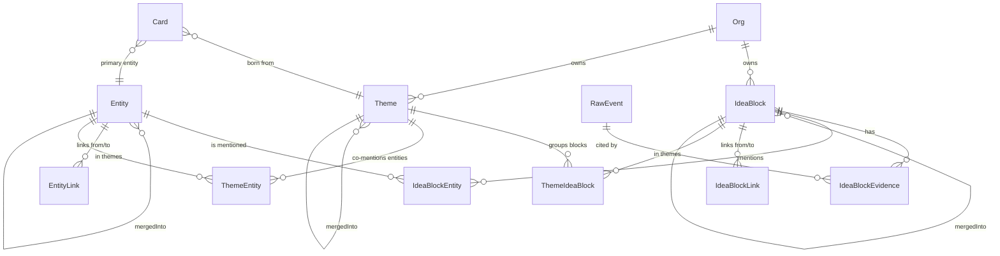

# Knowledge core

Единое информационное ядро Z: пайплайн `RawEvent → IdeaBlock` с дедупликацией
блоков и сущностей через KNN cosine + LLM-арбитр, поверх — гибридный поиск
(pgvector cosine + ts_vector BM25).

> Источник истины — этот документ + ТЗ `plans/tz/2026-05-10-knowledge-core-tz.md`.
> Бизнес-контекст и зачем оно — `01_projects/ingest-and-sources.md` (Фаза 1)
> и сам ТЗ (введение).

## Pipeline

```
RawEvent (Фаза 1)
   ↓ enqueue core.raw-events
block-ingest.worker
   ├─ SegmentBuilder      — разбивает payload на скользящие окна (≤2000 токенов)
   ├─ BlockExtraction     — LLM вызов с JSON Schema strict, taskType='block-ingest'
   ├─ KnowledgeEmbedding  — батч-эмбеддинг (text-embedding-3-small, 1536-dim)
   └─ persist             — Prisma transaction: IdeaBlock(draft) + Evidence + Entity (findOrCreate)
   ↓ enqueueBlockDistill (debounce 30s)
block-distill.worker
   ├─ BlockMerge.knnCandidates  — top-5 canonical того же tenant'а, cosine > 0.92
   ├─ BlockMerge.judgeMerge     — LLM 'block-distill', verdict ∈ {merge, distinct}
   └─ apply                     — либо canonical (новый), либо merged_into (перенос evidence/entity)
   ↓ enqueueBlockLinker  (Фаза 3 — block-linker.worker, см. ниже)
   ↓ enqueueEntityResolver (опц., on-event для отдельных Entity)
entity-resolver.worker (consumer core.entity-resolver, concurrency=1)
entity-resolver.cron     (раз в 5 мин — ищет пары и enqueue'ит)
   ├─ EntityMerge.findCandidates — KNN cosine top-5 entities того же type, > 0.88
   └─ EntityMerge.judgeMerge     — LLM 'entity-merge-arbiter', metadata + контекст 5 блоков
                                   → перенос IdeaBlockEntity на canonical (skip P2002)
   ↓
Search API (POST /api/v1/knowledge/search)
   └─ гибрид cosine (0.7) + BM25 (0.3) → top-10

──── Граф (Фаза 3) ────
block-linker.worker (consumer core.block-linker, concurrency=2)
   ├─ Гейт LINKER_MIN_BLOCKS=50 — пропускает Org с малым числом canonical
   ├─ BlockLink.findLinkCandidates — KNN top-10 canonical того же tenant'а
   ├─ BlockLink.judgeLink          — LLM 'block-linker', verdict ∈ 7 типов + 'none'
   └─ upsert IdeaBlockLink         — confidence >= LINK_MIN_CONFIDENCE (0.75)

entity-graph-builder.cron (раз в час)
   ├─ EntityGraph.findCoMentionedPairs — пары сущностей, упомянутые в одних блоках
   │                                     >= ENTITY_GRAPH_MIN_COMENTIONS (3)
   ├─ EntityGraph.judgeRelation        — LLM 'entity-graph-builder', 6 типов + 'none'
   └─ upsert EntityLink

reframing.cron (раз в сутки в 3:00)
   ├─ архивация слабых связей confidence<0.5 старше 7 дней (block + entity)
   ├─ dynamicScore decay — для canonical-блоков старше 90 дней
   │                       (`dynamicScore = max(0.1, dynamicScore - 0.1)`)
   ├─ LLM 'reframing'    — анализ свежих блоков (>=10 за 7 дней):
   │                       splitCandidates, mergeCandidates, themeShifts (в лог)
   └─ reflectOnThemes (Фаза 4) — split/merge/archive Theme'ов:
                                 themeMerges → перенос ThemeIdeaBlock/ThemeEntity на target;
                                 themesToArchive → status='archived';
                                 themeSplits → только лог-сигнал.

──── Темы (Фаза 4) ────
theme-clusterer.cron (каждый час в :15)
   ├─ Гейт THEME_CLUSTERING_MIN_BLOCKS=100 — пропускает Org с малым числом блоков
   ├─ Загрузка до 1000 canonical-блоков без ThemeIdeaBlock с embedding'ом
   ├─ ClusteringService.clusterByEmbedding (KNN-greedy union-find,
   │  threshold=0.78, minSize=3) → массив кластеров
   ├─ Top-10 entities по mentionsCount внутри кластера
   ├─ ThemeClassificationService.classifyTheme (LLM 'theme-classify',
   │  JSON Schema strict) → name/description/branch/tags/weight/confidence
   ├─ Embedding темы (`name + ' ' + description`)
   └─ Theme + ThemeIdeaBlock × N + ThemeEntity × M (skipDuplicates)

card-rollup-v2.worker (consumer core.card-rollup-v2, concurrency=2)
   ├─ Дебаунс 60s по jobId='card_rollup_v2_<cardId>'
   ├─ Источники блоков карточки:
   │    1) через meetings: RawEvent.sourceExternalId = meeting.id
   │    2) через сущности: IdeaBlockEntity.entityId IN (Card.entityId ∪ relatedEntityIds)
   ├─ Top-3 темы — `ThemeIdeaBlock` по подсчёту блоков в наборе карточки
   ├─ personSubjectIds — Person'ы с ролью subject в блоках-источниках (для γ-1 SkillProfile)
   ├─ LLM 'card-rollup-v2' (6 kind-промптов: client/deal/project/topic/vendor/custom)
   ├─ CurationService.triage(card) — auto / light / deep (SBA α-6)
   │    ├─ auto → CardVersion(changeReason='auto-rollup') + update Card
   │    │         (summaryCache + cachedTopThemeIds + sourceBlockIds + confidence
   │    │          + currentVersionId + personSubjectIds + lastConfirmedAt)
   │    └─ light/deep → CurationItem (Card не обновляется до approve)
   ├─ Conflict detection: regex «закрыт ↔ активен» → ConflictService.report
   └─ Specialist34ProbeService.checkAndEmitProbes(card) — 4 trigger'а

specialist-3-4-project-customer.worker (consumer core.specialist-routing, jobName='3-4-project-customer')
   ├─ Концепция SBA α-6 — эталонный референс §5 контракта зонтичного
   ├─ Триггер: блок canonical с signalType='fact' + упомянутый Customer/Vendor/Project entity
   ├─ Логика: блок → entities → Card'ы с этими entityIds → enqueueCardRollupV2 каждой
   └─ Сам не вызывает LLM и не пишет в Card — это card-rollup-v2.worker

   * Старый card-rollup.worker помечен @deprecated (SBA α-6) — удаление β/γ.

specialist-3-1-regulations.worker (consumer core.specialist-routing, jobName='3-1-regulations')
   ├─ SBA α-7 — Specialist 3.1 (Regulations) — закрывает Regulation/Process/Policy уровня Phase 0b
   ├─ Триггер: блок canonical с signalType ∈ {'regulation', 'process_step'}
   ├─ Specialist31Service.processRegulationBlock / processProcessStepBlock:
   │    1. LLM `regulation-extract` (JSON Schema strict) → draft {kind, name, statement, scope?, ownerHint?, severity?}
   │    2. KNN top-5 same-kind через cosine (fallback ILIKE) → KnnCandidate[]
   │    3. LLM-арбитр `regulation-dedupe` → {decision: 'new'|'merge'|'extension'|'contradicts', targetId?}
   │    4. Upsert в Process / Regulation / Policy (in-place расширение Phase 0b)
   │    5. CurationService.triage({resourceType: 'regulation'|'process'|'policy'}) — critical → всегда deep
   │    6. Если 'contradicts' → ConflictService.report({relationType:'contradicts'})
   │    7. Specialist31ProbeService.checkAndEmitProbesRegulation/Process/Policy — 4 trigger'а:
   │         · regulation.missing_owner (active без ownerPersonId)
   │         · regulation.process_no_steps (Process без ProcessStep)
   │         · regulation.stale (lastConfirmedAt > 6 мес + свежие блоки)
   │         · regulation.scope_unclear (Regulation/важная Policy без scope)
   │    8. Embedding записи (best-effort) через KnowledgeEmbeddingService + UPDATE ... SET embedding = $::vector
   └─ Параллельно живёт legacy block-ingest.worker (Phase 0b extraction) — не переписываем,
     обогащаем existing записи через merge-арбитра.

specialist-3-2-knowledge-clone.worker (consumer core.specialist-routing, jobName='3-2-knowledge-clone')
   ├─ SBA β-2 — Specialist 3.2 (Knowledge Clone) — фундамент SkillProfile γ-1.
   ├─ Триггер: блок canonical с signalType ∈ {'fact', 'knowledge_gap'} И упомянут Person (relationship='employee')
   ├─ Логика: блок → entities{type=person} → Person.findMany(relationship='employee') →
   │     для каждого: coreQueue.enqueueRebuildKnowledgeProfile (debounce 60s через jobId
   │     `rebuild-knowledge-profile_<personId>`)
   └─ Сам не вызывает LLM и не пишет в Person — это knowledge-clone-rebuild.worker

knowledge-clone-rebuild.worker (consumer core.knowledge-clone-rebuild, concurrency=1)
   ├─ SBA β-2 — Specialist32Service.rebuildForPerson:
   │    1. Загрузить блоки Person'а через IdeaBlockEntity → Person.entityId (role∈['subject','mentioned'])
   │       за окно `cfg.knowledgeClone.lookbackMonths` (default 12); status='canonical'.
   │    2. Если блоков < `minBlocksForProfile` (default 10) → skip.
   │    3. LLM `knowledge-clone-extract` (JSON Schema strict) → draft {categories[], experienceHighlights[]}.
   │    4. Если есть старый профиль → LLM `knowledge-clone-merge` (decay для категорий >6 мес без observation).
   │    5. Conflict detection (heuristic: «X не знает Y» vs «X знает Y» в одной категории) →
   │       ConflictService.report({relationType:'contradicts'}).
   │    6. CurationService.triage({resourceType:'knowledge_profile'}) — НЕ critical → auto-canonical при confidence≥0.85.
   │    7. На 'auto' → Person.update({knowledgeProfile, lastProfileBuildAt, profileBuildVersion++}).
   │    8. Specialist32ProbeService.checkAndEmitProbes — 2 trigger'а:
   │         · knowledge.new_expertise_detected (новая категория confidence='high')
   │         · knowledge.contradiction_detected (противоречие в одной категории)
   └─ Метрики: core_specialist_*{type='knowledge_profile'} + knowledge_clone_categories_per_profile / knowledge_clone_profile_size_kb.

knowledge-clone-rebuild.cron (`0 */6 * * *`)
   ├─ Для каждой Org находит employee-Person'ов с свежей активностью за неделю
   │  и `lastProfileBuildAt > 6 ч назад`.
   └─ enqueueRebuildKnowledgeProfile (delay=0).

specialist-3-3-decisions.worker (consumer core.specialist-routing, jobName='3-3-decisions')
   ├─ SBA β-3 — Specialist 3.3 (Decisions Registry) — главная сущность бизнеса.
   ├─ Триггер: блок canonical с signalType ∈ {'decision', 'rationale', 'decision_basis'}.
   ├─ Логика (Specialist33Service.processBlock):
   │    1. Загрузить блок + evidence + контекст ±2 минуты той же RawEvent (для извлечения rationale из reasoning-блоков).
   │    2. LLM `decision-extract` (JSON Schema strict) → draft {statement, rationale, alternatives,
   │       decidedByPersonHints, affectsEntityHints, decidedAt?, deadline?, status, confidence}.
   │    3. Резолв decidedByPersonIds (name-match по Person.name, приоритет employee; fallback — subject-Person'ы блока).
   │    4. Резолв affectsEntityIds (EntityResolutionService.findOrCreate для customer/project/product/vendor;
   │       process — skip, не Entity).
   │    5. KNN cosine top-5 по embedding (fallback ILIKE по statement/text) — Decision того же tenant,
   │       status NOT IN ('rejected','cancelled','superseded').
   │    6. LLM `decision-supersede-detect` (JSON Schema strict) → verdict {new|merge|supersedes, targetId?, evolvingMeta?}.
   │    7. Apply:
   │         · new — create новый Decision.
   │         · merge — update existing (alternatives merge case-insensitive, sourceBlockIds/decidedByPersonIds/
   │           affectsEntityIds union; rationale append-only).
   │         · supersedes — create новый с supersedesId+validFrom; старый помечается superseded+validUntil;
   │           ConflictService.report(resourceType='decision', relationType='supersedes',
   │           evidence.suggestedResolution='evolving', evidence.evolvingMeta).
   │           observeDecisionSupersedeChainLength.
   │    8. Embedding (best-effort raw SQL UPDATE).
   │    9. CurationService.triage(resourceType='decision') — decision в CURATION_CRITICAL_TYPES_DEFAULT →
   │       ВСЕГДА deep review.
   │   10. Specialist33ProbeService.checkAndEmitForDecision — 2 синхронных probe-trigger'а:
   │         · decision.missing_decider (decidedByPersonIds=[] AND status=approved)
   │         · decision.no_deadline_critical (approved + null deadline + блок с тегом 'critical')
   └─ Метрики: core_specialist_*{type='decision'} + core_specialist_conflict_evolving_total{type='decision'} +
     decision_supersede_chain_length (histogram).

specialist-3-3-probe.cron (`0 5 * * *` — Specialist33ProbeService.runDailyChecks)
   ├─ Для каждой Org проверяет:
   │    · decision.overdue — deadline < now AND status ∉ {implemented, cancelled, rejected, superseded}.
   │    · decision.outcome_unknown — status='implemented' AND actualOutcomes=null AND decidedAt < now − 3 мес.
   ├─ Лимит — 100 Decision на Org за проход (защита от взрывного fan-out'а).
   └─ Probe через ConversationalService.sendNotification(eventType='specialist.probe', dataClass='sensitive').

specialist-3-5-insights.worker (consumer core.specialist-routing, jobName='3-5-insights')
   ├─ SBA β-4 — Specialist 3.5 (Insights Radar) — повторяющиеся проблемы / риски / блокеры / неэффективности.
   ├─ Триггер: блок canonical с signalType ∈ {'pain', 'risk', 'churn_risk', 'objection'}.
   ├─ Логика (Specialist35Service.processBlock):
   │    1. Загрузить блок + evidence.
   │    2. Считать embedding query из name + trustedAnswer.
   │    3. KNN cosine top-10 поверх insights.embedding (порог INSIGHT_CLUSTER_THRESHOLD=0.78).
   │    4. Match → updateExistingInsight(sourceBlockIds.push, lastObservedAt) + recalcMetrics
   │       (frequency/dynamic + probe escalation_suggested / recurring_after_mitigation).
   │    5. Нет match → LLM `insight-extract` (JSON Schema strict) → draft {kind, statement,
   │       severity, affectedEntityHints, mitigationSuggestion?, confidence}.
   │    6. Резолв affectedEntityIds (EntityResolutionService.findOrCreate для customer/project/product/vendor;
   │       process — skip).
   │    7. Резолв personSubjectIds (subject-Person через IdeaBlockEntity).
   │    8. createInsight (dataClass = max(block.dataClass, 'internal')).
   │    9. Embedding (best-effort raw SQL UPDATE).
   │   10. LLM `insight-link-to-decisions` (опц.) — top-10 KNN-Decision того же Org, отбор тех,
   │       что могли спровоцировать сигнал. Валидация: id ∈ candidate-список.
   │   11. Дополнительно — Decision'ы из IdeaBlockLink.relationType='consequences_of'
   │       (для блоков-источников Insight'а).
   │   12. Triage: severity='critical' → confidence сбрасывается до 0.3 (форс deep review);
   │       иначе — обычный triage (insight НЕ в CURATION_CRITICAL_TYPES_DEFAULT).
   │   13. Probe-events:
   │         · insight.linked_decision_question (если LLM нашёл candidate Decision'ы).
   │         · insight.escalation_suggested (если новый dynamicLabel='spike').
   └─ Метрики: core_specialist_*{type='insight'}.

insight-clusterer.cron (`0 *‎/6 * * *` — InsightClustererCron.sweep)
   ├─ Для каждой Org → recalcMetrics на всех active/mitigating Insight'ах (batch 500).
   │    · count7d / count30d / avgWeekly30d / ratio.
   │    · dynamicLabel: ratio > INSIGHT_SPIKE_RATIO (3.0) → spike; > 1.3 → growing;
   │      < 0.5 → declining; иначе stable.
   │    · frequencyScore = min(1, count30d / totalOrg30d).
   │    · При переходе в spike (новый ≠ старый) → probe insight.escalation_suggested.
   ├─ Specialist35ProbeService.checkNoMitigationPlanForOrg — для всех Insight'ов
   │  severity ∈ {high, critical} AND mitigationPlan=null AND firstObservedAt < now-7д
   │  AND status=active — probe insight.no_mitigation_plan admin'ам.
   └─ Обновление gauge insights_dynamic_label_count{label} (groupBy на active/mitigating).

specialist-3-6-ideas.worker (consumer core.specialist-routing, jobName='3-6-ideas') — SBA β-5
   ├─ idea | feature_request блоки.
   ├─ Specialist36Service.processBlock:
   │    1. Загрузить block + evidence.
   │    2. KNN cosine top-10 existing Idea (threshold IDEA_CLUSTER_THRESHOLD=0.80).
   │    3. Match → updateExistingIdea (supporters add, sourceBlockIds.push, weight recompute).
   │    4. Miss → LLM idea-extract → resolveSupportersAndOwner (employee Person для internal;
   │       mentioned Customer Entity для client_request).
   │    5. Compute weight: supporterCount + recency_factor + specificity_factor.
   │    6. createIdea (status='captured').
   │    7. tryWriteEmbedding + CurationService.triage.
   │    8. EventEmitter 'idea.created' + enqueueIdeaClusterer.

idea-clusterer.cron (`30 *‎/4 * * *` — IdeaClustererCron.sweep) — SBA β-5
   ├─ Для каждой Org → Idea без clusterId (batch 100).
   ├─ KNN cosine attach к существующему IdeaCluster (threshold 0.80) — recompute clusterWeight.
   └─ На критической массе (IDEA_MIN_SUPPORTERS_FOR_CLUSTER=2) → LLM idea-cluster-merge →
      verdict 'add_to_existing' | 'new_cluster' | 'standalone' → создание/привязка кластера.

probe-dispatcher.worker (consumer core.probe-events) — SBA β-5 Layer 6
   ├─ ProbeService.suggest(...) — единая входная точка для специалистов Слоя 3:
   │    1. contentHash = sha256(reason + sorted contextIds + message).
   │    2. Redis dedup SET NX EX (TTL=PROBE_DEDUP_TTL_HOURS=72ч).
   │    3. Per-user rate-limit (часовой 5 + суточный 20).
   │    4. Cold-start mode crook.
   │    5. priority = severity_weight × 100.
   │    6. INSERT ProbeEvent(status='pending') + enqueue core.probe-events.
   ├─ Dispatcher:
   │    1. Re-check rate-limit.
   │    2. Round-robin select recipient.
   │    3. LLM probe-formulate → {question, options}.
   │       Fallback: payload.suggestedQuestion/message + suggestedActions.
   │    4. ConversationalService.sendNotification(eventType='probe.question').
   │    5. INC rate-limit counters; ProbeEvent.status='dispatched'.

probe-priority.cron (`*/15 * * * *` — ProbePriorityCron.sweep) — SBA β-5
   ├─ updateMany ProbeEvent SET status='expired' WHERE expiresAt < now AND status='pending'.
   └─ Per-user engagement_rate gauge: probe_recipient_engagement_rate{user_id}.

ideas-closing-loop (IdeasClosingLoopHandler — @OnEvent 'idea.status_changed') — SBA β-5
   ├─ LLM idea-status-summarize → {title, body}.
   ├─ Для каждого supporter: person → User.id через Person.userId; customer → admin fallback.
   ├─ ConversationalService.sendNotification(eventType='idea.status_changed').
   └─ INC idea_status_change_notifications_total{new_status}.
```

### Идемпотентность и дебаунсы

- `block-ingest.worker` — jobId=`raw_<rawEventId>`. Пропускает
  `processingStatus !== 'received'`.
- `block-distill.worker` — jobId=`block_distill_<blockId>`, BullMQ delay
  обновляет окно 30s. Пропускает `status !== 'draft'`.
- `entity-resolver.worker` — jobId=`entity_resolver_<entityId>`. Пропускает
  `mergedIntoId !== null`.
- В каждом merge — re-load под транзакцией + проверка `mergedIntoId === null`,
  чтобы исключить race с параллельным merge.

## Хранение

Prisma-модели (см. `backend/prisma/schema.prisma`):

```
IdeaBlock {
  id, tenantId, name, criticalQuestion, trustedAnswer,
  tags[], signalType (enum 19 значений — см. ниже),
  confidence Decimal(4,3), dataClass, embedding vector(1536),
  status (draft | canonical | merged_into | archived),
  mergedIntoId? → IdeaBlock,
  evidenceCount, dynamicScore, createdAt, updatedAt,
  search_tsv tsvector  -- generated column (см. postgres-init.sql)
}

IdeaBlockEvidence { id, blockId → IdeaBlock, rawEventId → RawEvent,
                    sourceType, sourceTimestamp?, quote @Text, startMs?, endMs? }

Entity { id, tenantId, type (client | person | project | product | topic
                            | location | custom),
         canonicalName, aliases[], mergedIntoId? → Entity,
         mentionsCount, embedding vector(1536), metadata Json? }

IdeaBlockEntity { @@id(blockId, entityId), mentionContext @Text,
                  role (subject | object | mentioned) }

# ── Фаза 3 ──
IdeaBlockLink {
  id, tenantId, fromBlockId → IdeaBlock, toBlockId → IdeaBlock,
  relationType (develops | contradicts | causes | consequences_of |
                shares_topic | shares_entity | question_answered_by),
  confidence Decimal(4,3), explanation @Text,
  createdBy (linker | reframing | manual),
  status (active | archived),
  @@unique(fromBlockId, toBlockId, relationType)
}

EntityLink {
  id, tenantId, fromEntityId → Entity, toEntityId → Entity,
  relationType (works_at | belongs_to | part_of | opposes |
                depends_on | mentions_with),
  confidence Decimal(4,3), explanation @Text,
  createdBy, status,
  @@unique(fromEntityId, toEntityId, relationType)
}

# ── Фаза 4 ──
Theme {
  id, tenantId, name, description @Text,
  weight Decimal(4,3) default 0.500,
  dynamic (growing | stable | declining) default 'stable',
  confidence Decimal(4,3) default 0.500,
  status (active | archived | merged_into),
  mergedIntoId? → Theme,
  branch? (strategy | clients | sales | marketing | product | operations |
           team | finance | technology | production | partnerships | legal),
  embedding vector(1536),
  lastSignalAt?, createdAt, updatedAt
}

ThemeIdeaBlock { @@id(themeId, blockId), weight Decimal(4,3) default 1.000 }
ThemeEntity    { @@id(themeId, entityId), mentionsCount Int default 0 }

# Card расширения (Фаза 4):
Card.entityId? → Entity            # primary-сущность
Card.relatedEntityIds[] String     # дополнительные сущности
Card.bornFromThemeId? → Theme      # при сохранении темы как карточки
Card.cachedTopThemeIds[] String    # кэш топ-3 связанных тем (card-rollup-v2)

# SBA α-2 (2026-05-22) — расширение Layer 1 разметки.
# Enum SignalType — добавлено 5 значений (всего 19):
#   reasoning      — обоснование «почему сделано так» (главный источник для SkillProfile γ-1)
#   rationale      — структурированное обоснование, привязанное к decision
#   decision_basis — фрагмент обоснования внутри блока-decision (узкий случай)
#   regulation     — фрагмент нормативного утверждения/регламента (источник для Specialist 3.1)
#   process_step   — шаг процесса (источник для Specialist 3.1)
# BlockExtractionService JSON Schema strict обновлён автоматически через SIGNAL_TYPE_VALUES.
# Промпт block-ingest расширен фразами-маркерами; TODO согласовать финальный текст
# с владельцем продукта (см. зонтичный SBA §10).
```

ER-диаграмма (Mermaid):



### Postgres extras (НЕ в Prisma schema)

См. `backend/scripts/postgres-init.sql`:
- pgvector extension.
- HNSW индексы `IdeaBlock_embedding_hnsw_cosine_idx`,
  `Entity_embedding_hnsw_cosine_idx` (cosine ops).
- Generated column `IdeaBlock.search_tsv` =
  `setweight(name, 'A') || setweight(criticalQuestion, 'B') || setweight(trustedAnswer, 'C')`.
- GIN индекс `IdeaBlock_search_tsv_gin_idx`.

Применить: `bun run apply-postgres-init`.

## Search

`POST /api/v1/knowledge/search` — гибрид pgvector cosine + ts_vector BM25.

Request:
```ts
{ query: string,
  signalTypes?: SignalType[],
  entityIds?: string[],
  dateFrom?: Date,  // фильтр через IdeaBlockEvidence.sourceTimestamp
  dateTo?: Date,
  limit?: number   // default 10, max 50
}
```

Response:
```ts
{ results: Array<{
    block: { id, name, criticalQuestion, trustedAnswer, signalType, ... },
    evidence: Evidence[],   // top-3
    entities: Entity[],
    scores: { cosine, bm25, combined }
  }>,
  tookMs: number
}
```

Веса: `SEARCH_COSINE_WEIGHT=0.7`, `SEARCH_BM25_WEIGHT=0.3`. Reqs только
`status='canonical'` и `embedding IS NOT NULL` (для cosine).

Дополнительные эндпоинты:
- `GET /api/v1/knowledge/blocks/:id` — деталка блока + evidence + entities;
  если `merged_into` — следуем по `mergedIntoId` один шаг до canonical.
- `GET /api/v1/knowledge/blocks/:id/links` (Фаза 3) — outgoing + incoming
  IdeaBlockLink (только status=active), отсортировано по confidence desc.
- `GET /api/v1/knowledge/entities?type=&q=&limit=&offset=` — список с ILIKE
  по `canonicalName` + `aliases.has(q)`.
- `GET /api/v1/knowledge/entities/:id` — сущность + top-20 связанных
  canonical блоков.
- `GET /api/v1/knowledge/entities/:id/links` (Фаза 3) — outgoing + incoming
  EntityLink (status=active), сортировка по confidence.
- `GET /api/v1/knowledge/graph/neighbors?nodeType=block|entity&id=…&depth=1..3`
  (Фаза 3) — BFS-обход графа, depth до 3, лимит 100 nodes (`truncated=true`
  при превышении). Edges трёх типов: `block-link`, `entity-link`, `block-entity`
  (упоминание).
- `GET /api/v1/knowledge/themes?branch=&status=&q=&limit=&offset=` (Фаза 4) —
  список тем Org. По умолчанию `status=active`, сорт `weight DESC, lastSignalAt DESC`.
- `GET /api/v1/knowledge/themes/:id` (Фаза 4) — тема + до 20 блоков + до 50 entities.
- `POST /api/v1/knowledge/themes/:id/save-as-card` (Фаза 4) — Card(kind='topic',
  bornFromThemeId=themeId). Body: `{name?: string}`.
- `GET /api/v1/cards/:id/themes` (Фаза 4) — топ-3 темы карточки через её блоки.

RBAC: новые resource type'ы `block` / `entity` / `theme` (Фаза 4) в `policy.csv`.
Все member'ы Org (включая manager:strict) получают `read` — knowledge-core это
shared knowledge внутри Org, без per-user owner'а.

## LLM-инфра

`LlmRouterService` (Фаза 0) маршрутизирует через `LlmTaskRoute`. Семейства
задач knowledge-core:
- `block-ingest` — извлечение блоков из сегментов (JSON Schema strict).
- `block-distill` — арбитр merge / distinct (JSON Schema strict).
- `entity-merge-arbiter` — арбитр сущностей (JSON Schema strict, metadata +
  recentMentions[] контекст из IdeaBlockEntity).
- `block-linker` (Фаза 3) — типизированные связи блоков (7 типов + 'none').
- `entity-graph-builder` (Фаза 3) — связи сущностей (6 типов + 'none').
- `reframing` (Фаза 3+4) — ночной анализ свежих блоков (split/merge/themeShifts)
  + рефлексия Theme'ов (Фаза 4: themeMerges/themeSplits/themesToArchive).
- `theme-classify` (Фаза 4) — классификация кластера блоков (name/description/branch/tags).
- `card-rollup-v2` (Фаза 4) — rollup `Card.summaryCache` поверх IdeaBlock'ов
  (5 промптов по `Card.kind`).

Primary провайдер по политике 2026-05 — DeepSeek V4-flash. Fallback:
gpt-5.4-mini (через OpenAI proxy), Ollama qwen3:30b. Provider-цепочки задаются
через сидер `seed-llm-task-routes-knowledge-core.ts`.

## ENV

```
DISTILL_MERGE_THRESHOLD=0.92          # cosine threshold для merge кандидатов
DISTILL_DEBOUNCE_MS=30000             # дебаунс enqueueBlockDistill
DISTILL_KNN_TOP_K=5                   # сколько candidate'ов берём в LLM-judge
ENTITY_MERGE_THRESHOLD=0.88           # cosine threshold для entity-resolver
ENTITY_RESOLVER_CRON='*/5 * * * *'    # расписание сканирования пар сущностей
BLOCK_INGEST_WINDOW_SEGMENTS=5        # размер скользящего окна сегментов
BLOCK_INGEST_MAX_TOKENS_PER_SEGMENT=2000
SEARCH_COSINE_WEIGHT=0.7
SEARCH_BM25_WEIGHT=0.3

# Фаза 3
LINK_MIN_CONFIDENCE=0.75              # порог записи IdeaBlockLink / EntityLink
LINKER_MIN_BLOCKS=50                  # минимум canonical блоков в Org для линкера
LINK_KNN_TOP_K=10                     # сколько KNN-кандидатов на LLM в block-linker
REFRAMING_CRON='0 3 * * *'            # ночной reframing (3:00)
BLOCK_DYNAMIC_SCORE_DECAY_DAYS=90     # после скольких дней без updates падает score
ENTITY_GRAPH_BUILDER_CRON='0 * * * *' # entity-graph-builder — раз в час
ENTITY_GRAPH_MIN_COMENTIONS=3         # минимум co-mentions, чтобы пара попала в LLM

# Фаза 4
THEME_CLUSTERER_CRON='15 * * * *'     # theme-clusterer — каждый час в :15
THEME_CLUSTERING_MIN_BLOCKS=100       # порог пропуска маленьких Org
THEME_CLUSTER_MIN_SIZE=3              # минимальный размер устойчивого кластера
THEME_COSINE_THRESHOLD=0.78           # порог объединения блоков в один кластер
CARD_ROLLUP_V2_DEBOUNCE_MS=60000      # дебаунс enqueueCardRollupV2
```

Все читаются через `cfg.knowledgeCore.*` в `TypedConfigService`.

## Что вне Фазы 4

- Frontend `/themes` (UI-список + страница темы + кнопка save-as-card) — следующая сессия.
- Tasks-2.0 / Chapters-2.0 / Summary-2.0 (агенты поверх блоков) — Фаза 5.
- chat-v2 — Фаза 6 (на Фазе 2 старый chat остаётся работать поверх
  `MeetingTranscriptChunk`).
- Переключение pipeline'а на `card-rollup-v2` (отказ от старого `card-rollup.worker`) — Фаза 5/6.

## Бенчмарк / smoke

- `backend/scripts/smoke-knowledge-core-fase2.ts` — программный smoke
  (degraded-mode без LLM), проверяет создание/запросы IdeaBlock + Entity
  + Search SQL.
- `backend/scripts/benchmark-knowledge-core.ts` — печатает структурные
  метрики (count'ы IdeaBlock / Entity / Evidence + canonicalRatio).
- TODO baseline (golden-set, top-3 hit rate, сравнение с chunk-RAG) —
  `docs/benchmarks/knowledge-core-baseline.md`.

## SBA α-3 — Layer 2 Ontology Extension (2026-05-21)

См. план: `plans/tz/2026-05-21-sba-alpha-3-layer2-ontology-extension.md`.

### Расширение онтологии

`enum EntityType` теперь содержит 12 значений (старые `client` и `custom` оставлены deprecated — Postgres не поддерживает DROP VALUE; в следующем релизе уберём после успешного применения patch-rename-client-to-customer):

| Категория | Значения EntityType | Подкреплены моделью |
|---|---|---|
| Категория A (есть Prisma-модель + entityId) | person, customer, vendor, project, product, document, goal, event | Person / Card / Vendor / Goal / Document / Event |
| Категория B (только Entity-узел в графе) | topic, location, technology, metric | — (graph-only) |
| @deprecated (будут удалены) | client, custom | — |

### Новые модели категории A

- **Vendor** — поставщик (юр.лицо/физлицо). Поля: `name`, `inn`, `segment` (software | hardware | consulting | logistics | other), `status` (active | evaluating | churned | banned), `responsibleUserId`, `contractIds[]`, `metadata`. Уникальный partial-index `(tenantId, inn) WHERE inn IS NOT NULL` — защита от дублей.
- **Event** — событие графа знаний. Поля: `kind` (meeting | incident | release | transition | milestone | other), `title`, `startAt`, `endAt`, `durationMin`, `location`, `participantsPersonIds[]`, `relatedMeetingId`, `outcomeSummary`. GIN на `participantsPersonIds`.

### Person.relationship

`enum PersonRelationship = employee | external | candidate | former`. Default `external`. `patch-person-relationship.ts` проставляет `employee` тем, у кого есть активный `Membership` в той же Org.

Зачем: специалисты Слоя 3 фильтруют — например, `3-7-skill` берёт reasoning только сотрудников (нет смысла учить навыки внешнему контакту).

### RouterService (Слой 2 → Слой 3)

`backend/src/modules/knowledge-core/services/router.service.ts` — диспатчер атомов в специалистов Слоя 3.

**Архитектурное решение (§11.2 зонтичного):** статический mapping signalType → specialist (быстрее, дешевле, прозрачнее — никакого LLM-роутинга).

**Mapping:**

| SignalType | Специалист |
|---|---|
| `decision` / `rationale` / `decision_basis` | 3-3-decisions |
| `regulation` / `process_step` | 3-1-regulations |
| `pain` / `risk` / `churn_risk` / `objection` | 3-5-insights |
| `idea` / `feature_request` | 3-6-ideas |
| `reasoning` (subject is employee) | 3-7-skill |
| `fact` (с Customer/Vendor/Project в блоке) | 3-4-project-customer |
| `knowledge_gap` | 3-2-knowledge-clone |

**Анти-fan-out:** `ROUTER_MAX_SPECIALISTS_PER_BLOCK` (default 4). Top-N по приоритету: decisions > regulations > insights > ideas > skill > project-customer > knowledge-clone.

**Очередь:** `core.specialist-routing` (BullMQ). `jobName = specialistName`. `jobId = <specialistName>_<blockId>` — идемпотентно. На α-3 consumer'ы ещё НЕ запущены — jobs накапливаются (специалисты появятся в α-6, α-7, β-2, β-3, γ-1).

**Метрики:**
- `core_router_dispatched_total{specialist, signal_type}` — counter.
- `core_router_fan_out` — histogram (количество специалистов на блок до trim'а).
- `core_router_trimmed_total{signal_type}` — counter (сработал лимит fan-out).

**Hook:** `block-ingest.worker.ts` вызывает `routerService.dispatch(block)` для каждого блока после persist'а (best-effort, не валит pipeline).

### EntityResolutionService extension

- `findOrCreateVendorEntity({tenantId, name, inn?})` — приоритет дедупа по `inn`, fallback на name (через `findOrCreateEntity`).
- `findOrCreateEventEntity({tenantId, title, startAt, kind?, relatedMeetingId?})` — дедуп по `(tenantId, title, startAt ±1 день)`.

Использовать из block-ingest / специалистов Слоя 3 — НЕ создавать `Vendor` / `Event` напрямую через `prisma.vendor.create`.

## Лестница доверия в курации (Часть A, 2026-06-03)

Источник: `plans/tz/2026-06-02-action-center-pending-confirmations.md` (Часть A), модуль
`backend/src/modules/curation`. Ключевой архитектурный сдвиг в триаже `CurationService.triage`:

- **Пер-типовые калиброванные пороги.** Триаж сравнивает калиброванную уверенность с
  `autoThresholdByType` / `deepReviewThresholdByType` (хранятся в `Org.curationSettings` Json,
  fallback на глобальные `autoThreshold` / `deepReviewThreshold`). Раньше пороги были едиными для
  всех типов.

- **Провизорный уровень доверия (`CardVersion.trustTier`, enum `TrustTier {auto | provisional | human}`).**
  Критические типы (`regulation` / `process` / `decision`) больше **НЕ** блокируются человеком
  безусловно. В «провизорной полосе» (`effectiveConfidence >= provisionalThreshold(ByType)`)
  вызывается AI-судья — `MultiAgentDebateService.judge({ taskFamily: 'curation-verify' })` (3 голоса
  разных провайдеров, см. [[../01_projects/ai-jobs]]):
  - accept-консенсус → **провизорная канонизация** (`trustTier='provisional'`, без человека);
  - reject / split / судья недоступен → deep `CurationItem` (человек, безопасный fallback).
  Не-критические auto-решения → `trustTier='auto'`; всё, что прошло человека → `trustTier='human'`.

- **Аудит-выборка 5%.** Доля авто/провизорных решений (`auditSampleRate`, default 0.05) превращается в
  лёгкий `CurationItem(triageReason.reason='audit_sample')` — он **не блокирует** канонизацию, нужен
  только для измерения частоты ошибок.

- **Автоподстройка + kill-switch** — ночной `CurationAutotuneCron` (`@Cron('0 3 * * *')`,
  см. [[../01_projects/workers-queues]]):
  - **kill-switch (всегда активен):** если `provisionalWrongRate` (доля аудит-выборок с финалом
    reject/mark_as_misleading/supersede) превышает `maxProvisionalOverride` и данных достаточно —
    тип возвращается к человеку (`provisionalThresholdByType[type]=1.01`);
  - **автоподстройка (opt-in `autotuneEnabled`, default false):** двигает `autoThresholdByType` по
    override-rate в пределах guardrail'ов (`thresholdMin/Max`, `autotuneStep`, `minDecisionsForAutotune`).
  Все сдвиги порогов идут через `updateSettings` + `AuditLogService.log`.

Read-model: `CurationService.getOverrideStats(tenantId)` → эндпоинт
`GET /api/v1/curation/override-stats` (доля override = (reject+approve_with_edits)/decided per
resourceType). Метрики: `curation_provisional_total`, `curation_audit_sample_total`,
`curation_verifier_verdict_total`, `curation_kill_switch_total`, `curation_autotune_adjustment_total`.
Полная карта курации — [[../01_projects/curation]].

### Лестница доверия видна пользователю (A1, 2026-06-03)

Раньше `trustTier` был чисто бэкендовым полем `CardVersion` — пользователь не знал, проверена
карточка человеком или нет. Теперь уровень доверия **показывается в Карте знаний и в provenance
документа**:

- `trustTier` (из `CardVersion.currentVersion`) пробрасывается в read-DTO регуляций / решений /
  процессов / политик (`regulations.service`, `decisions.service` — включая supersede-цепочку
  решений) и в provenance документа (`documents.service`/dto + контроллер-мапперы).
- Фронт: компонент `TrustBadge` (`frontend/src/ui/components/shared/TrustBadge.tsx`) рендерит метку
  по уровню — `provisional` → предупреждающий чип **«Не проверено человеком»**, `auto` → нейтральный
  «Авто», `human` → без метки (доверие по умолчанию, шума не добавляем). Метка стоит на `/regulations`,
  `/decisions` (список + деталь) и на вкладке «Извлечённые сущности» документа.

Таким образом провизорно канонизированные карточки (AI-судья без человека) **явно помечены как
непроверенные** — пользователь видит границу автоматического и человеческого доверия прямо в
интерфейсе.

### Поправить карточку: исправить или оспорить (E1/E2, 2026-06-04)

Метка — половина петли; вторая половина — **действие**. На детали карточки regulation/process/policy/decision
(компонент `CardCorrectionActions`, `frontend/src/ui/components/knowledge/`) есть два действия:

- **«Исправить»** (`POST /regulations|decisions/:id/correct`, body `correctedPayload` + опц. `reason`).
  Ветка по правам (RBAC в контроллере): есть **write-право** (owner/admin) → правка применяется **сразу** —
  новая `CardVersion` с `trustTier='human'` + `currentVersionId` + обновлённый контент канонической таблицы;
  плашка «Не проверено человеком» снимается. Нет write-права → правка уходит **предложением**
  (`CurationService.submitProposal` → `CurationItem(level=light, status=pending, triageReason.via='user_correction',
  proposedPayload)`) — анти-вандализм, без 403. Обучающий сигнал — `recordDecision('approve_with_edits')`
  → `LlmPreferenceSample(label='correct')` с context `{before, after}` («как правильно»).
- **«Это неверно»** (`POST /.../:id/dispute`, опц. `reason`) → `recordDecision('mark_as_misleading')`
  → `LlmPreferenceSample(label='misleading')`. Сигнал-флаг (образец — `entities/:id/mark-wrong`).

> **Известный пробел (суб-ТЗ `2026-06-04-curation-canonical-writeback.md`, ждёт go):** одобрение куратором
> *предложения рядового сотрудника* через `decide(approve*)` пишет `CardVersion`, но НЕ переносит
> `proposedPayload` в каноническую таблицу (нет write-back-слушателя; затрагивает ядро `decide()`).
> Обходной путь: куратор (owner/admin) применяет правку сам через «Исправить».

> **Известный пробел:** карточки пока **не цитируются** в корпоративном чате — там нет ссылок на
> карточки как на источники, а значит и метки `trustTier` рядом с цитатами. Закрывается отдельным
> суб-ТЗ D (цитаты chat-v2 + метка доверия у цитат).

Полная карта курации — [[../01_projects/curation]].

[[../index|← index]] · [[../01_projects/ingest-and-sources|Фаза 1: ingest]] ·
[[../01_projects/llm-router|LLM Router]]
